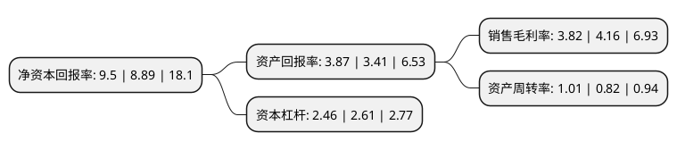

> 本页面由自动化程序生成于 2022年5月20日 01:03
> 内容可能存在错误，如有bug请提交issue至：https://github.com/Eroleice/doc-pi/issues
{.is-warning}

# 上市公司基本情况

## 基本资料

创维数字股份有限公司（以下简称“创维数字”）成立于2002年04月16日，遂宁市。于1998年06月02日在深交所主板上市。

创维数字注册资本106,325.587万元，主营业务:数字电视机顶盒及前端系统的研发，生产和销售以下是详细信息：

- 公司名称: 创维数字股份有限公司
- 股票代码: 000810.SZ
- 所在地: 四川 - 遂宁市
- 成立日期: 2002年04月16日
- 注册资本: 106,325.587万元
- 法定代表人: 赖伟德
- 主营业务: 主营业务:数字电视机顶盒及前端系统的研发，生产和销售
- 公司官网: www.skyworthdigital.com
- 公司介绍: 公司是专注于为全球用户提供全面系统的家庭娱乐解决方案与服务的国家级高新技术企业，致力于带给每个家庭新的娱乐生活方式。多年来，创维数字基于广电网、电信网、互联网，联合运营商、内容商、应用商、渠道商等战略伙伴，围绕“平台+内容+终端+应用”的生态体系打造智能生态链。公司推出了数字电视、智能网络、IPTV等全系列智能盒子终端、智能网络接入终端、汽车电子及车联网、物联网等系列产品及运营与服务，全面满足运营商与最终用户的个性化体验及需求。公司先后获得“国家规划布局内重点软件企业”、“国家火炬计划重点高新技术企业”、“国家高新技术企业”、“中国软件业务收入百强”、“广东省战略性新兴产业骨干企业”、“省级科技进步一等奖”、“深圳市科技进步奖”等资质与荣誉。

## 股东及高管情况

上市公司第一大股东为深圳创维-RGB电子有限公司，持股584,548,508股，占比54.98%，为上市公司实际控制人。

截至2022年03月31日，上市公司的前十大股东中，共有5名自然人股东，3名机构股东，1个产品账户，1名其他股东，其中5%以上大股东共有1名。上市公司前十大股东明细如下：

> 截至2022年03月31日，上市公司前十大股东信息如下：

| 股东名称 | 持股数量（股） | 持股比例 |
| --- | --- | --- |
| 深圳创维-RGB电子有限公司 | 584,548,508 | 54.98% |
| 施驰 | 36,770,524 | 3.46% |
| 遂宁兴业投资集团有限公司 | 21,916,008 | 2.06% |
| 谢雄清 | 20,350,000 | 1.91% |
| 创维液晶科技有限公司 | 19,864,751 | 1.87% |
| 林伟建 | 16,000,061 | 1.5% |
| 李普 | 11,583,310 | 1.09% |
| 华夏证券广州营业部 | 8,400,000 | 0.79% |
| 中国农业银行股份有限公司-上投摩根新兴动力混合型证券投资基金 | 6,791,798 | 0.64% |
| 汤燕 | 6,507,500 | 0.61% |

## 利润表分析

上市公司2021年总收入为108.46亿元，净利润为4.14亿元，实现盈利。

## 杜邦分析

> 数据列示周期：2021年 | 2020年 | 2019年
{.is-info}

上市公司的净资产收益率在近一年有所上升，上升幅度为6.86%，其变化情况分解如下：
- 上市公司的销售毛利率在近一年下降了-8.17%，可能是生产效率的下降、商品原材料价格上涨或商品价格的下跌所致。
- 上市公司的资产周转率在近一年上升了23.17%，可能是源自于更快的销售回款或库存管理效果提升。
- 上市公司的财务杠杆比率在近一年下降了-5.75%，可能是减少负债降低财务费用。

