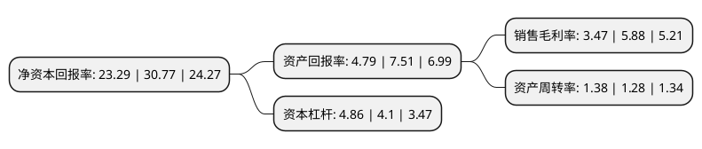

> 本页面由自动化程序生成于 2022年5月20日 01:04
> 内容可能存在错误，如有bug请提交issue至：https://github.com/Eroleice/doc-pi/issues
{.is-warning}

# 上市公司基本情况

## 基本资料

海信家电集团股份有限公司（以下简称“海信家电”）成立于1997年04月21日，佛山市。于1999年07月13日在深交所主板上市。

海信家电注册资本136,272.537万元，主要产品:冰箱，空调，冷柜。以下是详细信息：

- 公司名称: 海信家电集团股份有限公司
- 股票代码: 000921.SZ
- 所在地: 广东 - 佛山市
- 成立日期: 1997年04月21日
- 注册资本: 136,272.537万元
- 法定代表人: 代慧忠
- 主营业务: 主要产品:冰箱，空调，冷柜
- 公司官网: hxjd.hisense.cn
- 公司介绍: 公司是中国大型的白电产品制造企业之一，创立于1984年，主营业务涵盖了空调、冰箱、冷柜等白色家电领域产品的研发、制造、营销和售后服务，产品远销130多个国家和地区。2006年底，广东科龙电器股份有限公司(简称科龙电器)与海信重组成功，由此诞生了中国白色家电的新航母——海信科龙电器股份有限公司。公司主导产品涵盖空调、冰箱、洗衣机、冷柜、生活电器等多个领域，生产基地分布于顺德、青岛、北京、南京、扬州、湖州、成都、营口等多个城市，具有年产空调900万套、冰箱(含冷柜)1250万台、洗衣机200万台的能力。在顺德、青岛、南京三地设立了研发中心，并在美国、日本、英国等各地设立了科研机构，组成了规模较大、专业齐全的研发团队，时刻与世界主流家电技术保持同步，推进着研究成果的不断创新，致力提升人们的生活品质。

## 股东及高管情况

上市公司第一大股东为青岛海信空调有限公司，持股516,758,670股，占比37.92%，为上市公司实际控制人。

截至2022年03月31日，上市公司的前十大股东中，共有1名自然人股东，1名机构股东，6个产品账户，2个海外主体，其中5%以上大股东共有3名。上市公司前十大股东明细如下：

> 截至2022年03月31日，上市公司前十大股东信息如下：

| 股东名称 | 持股数量（股） | 持股比例 |
| --- | --- | --- |
| 青岛海信空调有限公司 | 516,758,670 | 37.92% |
| 香港中央结算(代理人)有限公司 | 457,763,567 | 33.59% |
| 香港中央结算有限公司(陆股通) | 89,020,200 | 6.53% |
| 上海高毅资产管理合伙企业(有限合伙)-高毅邻山1号远望基金 | 63,800,000 | 4.68% |
| 兴业银行股份有限公司-富国兴远优选12个月持有期混合型证券投资基金 | 13,347,832 | 0.98% |
| 全国社保基金一零二组合 | 13,240,636 | 0.97% |
| 中国建设银行股份有限公司-华夏兴和混合型证券投资基金 | 11,874,999 | 0.87% |
| 全国社保基金一零三组合 | 10,999,925 | 0.81% |
| 中国银行股份有限公司-招商瑞文混合型证券投资基金 | 7,346,681 | 0.54% |
| 张少武 | 7,200,000 | 0.53% |

## 利润表分析

上市公司2021年总收入为675.62亿元，净利润为23.42亿元，实现盈利。

## 杜邦分析

> 数据列示周期：2021年 | 2020年 | 2019年
{.is-info}

上市公司的净资产收益率在近一年有所下降，下降幅度为-24.31%，其变化情况分解如下：
- 上市公司的销售毛利率在近一年下降了-40.99%，可能是生产效率的下降、商品原材料价格上涨或商品价格的下跌所致。
- 上市公司的资产周转率在近一年上升了7.81%，可能是源自于更快的销售回款或库存管理效果提升。
- 上市公司的财务杠杆比率在近一年上升了18.54%，可能是增加负债扩大生产规模。

