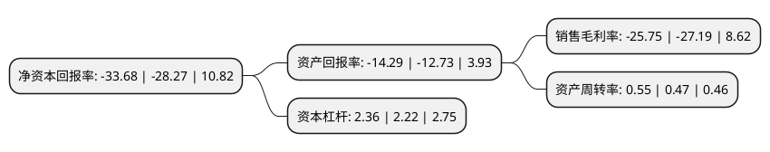

> 本页面由自动化程序生成于 2022年5月20日 01:05
> 内容可能存在错误，如有bug请提交issue至：https://github.com/Eroleice/doc-pi/issues
{.is-warning}

# 上市公司基本情况

## 基本资料

安徽德豪润达电气股份有限公司（以下简称“ST德豪”）成立于1996年05月14日，蚌埠市。于2004年06月25日在深交所中小板上市。

ST德豪注册资本175,242.486万元，主要产品:厨房电器产品，居家及个人护理产品以下是详细信息：

- 公司名称: 安徽德豪润达电气股份有限公司
- 股票代码: 002005.SZ
- 所在地: 安徽 - 蚌埠市
- 成立日期: 1996年05月14日
- 注册资本: 175,242.486万元
- 法定代表人: 吉学斌
- 主营业务: 主要产品:厨房电器产品，居家及个人护理产品
- 公司官网: www.electech.com.cn
- 公司介绍: 公司自设立以来一直从事小家电业务的研发与制造，主要产品包含面包机、烤箱、咖啡壶、搅拌器等西式小家电产品。公司的小家电业务以出口为主，在出口市场具有明显的竞争优势，总体规模上处于国内同行业前列，部分产品如面包机、电烤箱和电炸锅等西式小家电产品在欧美市场有较高的占有率。公司从2009年开始切入LED行业，通过对广东健隆达、深圳锐拓、雷士照明等行业内企业的收购、整合以及通过自有资金、银行贷款和非公开发行募集资金建立LED研发基地等方式，形成了“外延及芯片-封装及模组-LED应用产品(照明和显示)-品牌及渠道”的LED全产业链业务格局，整体规模处于国内同行业的前列。公司目前产品范围主要包括LED外延片、LED芯片、LED封装、LED照明、LED显示屏等。公司建成了珠海、中山、芜湖、扬州、蚌埠、大连等研发与制造基地，拥有庞大的国内、外销售网络，是中国优秀民营科技企业和国家火炬计划重点高新技术企业，在技术、渠道、品牌及规模等方面具有显著的行业竞争优势。

## 股东及高管情况

上市公司第一大股东为浙江乘泽科技有限责任公司，持股172,346,953股，占比9.83%，**疑似为**上市公司实际控制人。

截至2022年03月31日，上市公司的前十大股东中，共有1名自然人股东，5名机构股东，4个产品账户，其中5%以上大股东共有2名。上市公司前十大股东明细如下：

> 未能通过持股比例判定出上市公司实际控制人（持股30%以上）
> 可能存在通过间接持股、联合持股、协议控制等方式拥有实际控制权的主体，具体请参考上市公司定期公告！
{.is-warning}

> 上市公司第一大股东持股不超过10%，请检查是否存在公司控制权风险！
{.is-danger}

> 截至2022年03月31日，上市公司前十大股东信息如下：

| 股东名称 | 持股数量（股） | 持股比例 |
| --- | --- | --- |
| 浙江乘泽科技有限责任公司 | 172,346,953 | 9.83% |
| 国寿安保基金-广发银行-华鑫信托-华鑫信托·慧智投资105号集合资金信托计划 | 87,882,136 | 5.01% |
| 蚌埠高新投资集团有限公司 | 82,872,928 | 4.73% |
| 蚌埠鑫睿项目管理有限公司 | 74,434,947 | 4.25% |
| 陕西省国际信托股份有限公司-陕国投·聚宝盆5号证券投资集合资金信托计划 | 73,664,825 | 4.2% |
| 建信基金-兴业银行-华鑫信托-华鑫信托·慧智投资103号集合资金信托计划 | 71,325,966 | 4.07% |
| 北信瑞丰基金-招商银行-华鑫国际信托-华鑫信托·慧智投资104号集合资金信托计划 | 52,574,145 | 3% |
| 深圳市宝德昌投资有限公司 | 46,101,364 | 2.63% |
| 王晟 | 34,406,400 | 1.96% |
| 西藏林芝汇福投资有限公司 | 26,120,858 | 1.49% |

## 利润表分析

上市公司2021年总收入为20.78亿元，净利润为-5.36亿元，**未实现盈利**。

## 杜邦分析

> 数据列示周期：2021年 | 2020年 | 2019年
{.is-info}

上市公司的净资产收益率在近一年有所上升，上升幅度为19.14%，其变化情况分解如下：
- 上市公司的销售毛利率在近一年下降了-5.3%，可能是生产效率的下降、商品原材料价格上涨或商品价格的下跌所致。
- 上市公司的资产周转率在近一年上升了17.02%，可能是源自于更快的销售回款或库存管理效果提升。
- 上市公司的财务杠杆比率在近一年上升了6.31%，可能是增加负债扩大生产规模。

