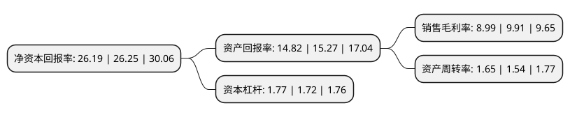

> 本页面由自动化程序生成于 2022年5月20日 01:05
> 内容可能存在错误，如有bug请提交issue至：https://github.com/Eroleice/doc-pi/issues
{.is-warning}

# 上市公司基本情况

## 基本资料

浙江苏泊尔股份有限公司（以下简称“苏泊尔”）成立于1998年07月17日，台州市。于2004年08月17日在深交所中小板上市。

苏泊尔注册资本80,867.848万元，主要产品:电器产品，炊具产品以下是详细信息：

- 公司名称: 浙江苏泊尔股份有限公司
- 股票代码: 002032.SZ
- 所在地: 浙江 - 台州市
- 成立日期: 1998年07月17日
- 注册资本: 80,867.848万元
- 法定代表人: Thierry de La Tour d’Artaise
- 主营业务: 主要产品:电器产品，炊具产品
- 公司官网: www.supor.com.cn
- 公司介绍: 公司是国内著名的炊具研发制造商，中国厨房小家电的领先品牌，专注于炊具及厨房小家电领域的产品研发、制造与销售。公司的主要业务包括明火炊具、厨房小家电、厨卫电器、生活家居电器四大领域。法国SEB集团与苏泊尔公司战略合作关系始于2006年，SEB集团拥有超过150年的历史，是世界知名的炊具研发制造商和小家电制造商。公司除了SUPOR品牌外，还引入了SEB集团旗下LAGOSTINA、KRUPS、WMF等高端品牌，从而完成了在厨房领域对中高端品牌的全覆盖。品质和创新是苏泊尔最重要的品牌价值，如今的苏泊尔已从厨房走进客厅，不断用智巧的产品让消费者的生活变得更美好。

## 股东及高管情况

上市公司第一大股东为SEB INTERNATIONALE S.A.S，持股666,681,904股，占比82.44%，为上市公司实际控制人。

截至2022年04月18日，上市公司的前十大股东中，共有7个产品账户，2个海外主体，1名其他股东，其中5%以上大股东共有2名。上市公司前十大股东明细如下：

> 截至2022年04月18日，上市公司前十大股东信息如下：

| 股东名称 | 持股数量（股） | 持股比例 |
| --- | --- | --- |
| SEB INTERNATIONALE S.A.S | 666,681,904 | 82.44% |
| 香港中央结算有限公司(陆股通) | 67,273,088 | 8.32% |
| 宁波银行股份有限公司-中泰星元价值优选灵活配置混合型证券投资基金 | 5,899,184 | 0.73% |
| 法国巴黎银行-自有资金 | 4,496,945 | 0.56% |
| 富达基金(香港)有限公司-客户资金 | 3,794,722 | 0.47% |
| 招商银行股份有限公司-中泰玉衡价值优选灵活配置混合型证券投资基金 | 1,927,903 | 0.24% |
| 兴业银行股份有限公司-中泰兴为价值精选混合型证券投资基金 | 1,749,167 | 0.22% |
| 中国工商银行-华安安信消费服务股票型证券投资基金 | 1,592,301 | 0.2% |
| 交通银行股份有限公司-易方达科瑞灵活配置混合型证券投资基金 | 1,375,000 | 0.17% |
| 全国社保基金五零二组合 | 1,124,400 | 0.14% |

## 利润表分析

上市公司2021年总收入为215.85亿元，净利润为19.41亿元，实现盈利。

## 杜邦分析

> 数据列示周期：2021年 | 2020年 | 2019年
{.is-info}

上市公司的净资产收益率在近一年有所下降，下降幅度为-0.23%，其变化情况分解如下：
- 上市公司的销售毛利率在近一年下降了-9.28%，可能是生产效率的下降、商品原材料价格上涨或商品价格的下跌所致。
- 上市公司的资产周转率在近一年上升了7.14%，可能是源自于更快的销售回款或库存管理效果提升。
- 上市公司的财务杠杆比率在近一年上升了2.91%，可能是增加负债扩大生产规模。

