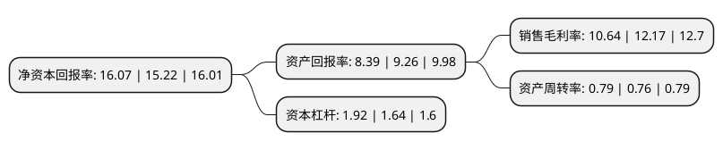

> 本页面由自动化程序生成于 2022年5月20日 01:05
> 内容可能存在错误，如有bug请提交issue至：https://github.com/Eroleice/doc-pi/issues
{.is-warning}

# 上市公司基本情况

## 基本资料

浙江三花智能控制股份有限公司（以下简称“三花智控”）成立于1994年09月10日，绍兴市。于2005年06月07日在深交所中小板上市。

三花智控注册资本359,109.022万元，主要产品:截止阀，电子膨胀阀，电磁阀。以下是详细信息：

- 公司名称: 浙江三花智能控制股份有限公司
- 股票代码: 002050.SZ
- 所在地: 浙江 - 绍兴市
- 成立日期: 1994年09月10日
- 注册资本: 359,109.022万元
- 法定代表人: 张亚波
- 主营业务: 主要产品:截止阀，电子膨胀阀，电磁阀
- 公司官网: www.zjshc.com
- 公司介绍: 公司是一家全球领先的生产和研发制冷空调控件元件和零部件的厂商。在汽车、电器和空调行业中，通过与全球著名企业的合作紧密，三花已成为世界领先的OEM供应商，提供高品质且最具竞争力的商品。三花牌制冷自控元器件已成为世界知名品牌之一，公司已成为松下、大金、三菱、东芝、日立、富士通、LG、三星、开利、特灵、约克、格力、美的、海尔等世界著名制冷、空调主机厂的战略供方和合作伙伴。公司参与并在某些领域主导制冷空调类产品有关的技术标准的讨论和制定，利用市场规模和技术领先的优势推向全世界，使三花“产品技术化、技术专利化、专利标准化、标准全球化”，以高标准构建制冷空调自控元器件产业发展新平台。

## 股东及高管情况

上市公司第一大股东为三花控股集团有限公司，持股1,057,245,749股，占比29.44%，**疑似为**上市公司实际控制人。

截至2022年03月31日，上市公司的前十大股东中，共有1名自然人股东，3名机构股东，3个产品账户，1个海外主体，2名其他股东，其中5%以上大股东共有3名。上市公司前十大股东明细如下：

> 未能通过持股比例判定出上市公司实际控制人（持股30%以上）
> 可能存在通过间接持股、联合持股、协议控制等方式拥有实际控制权的主体，具体请参考上市公司定期公告！
{.is-warning}

> 截至2022年03月31日，上市公司前十大股东信息如下：

| 股东名称 | 持股数量（股） | 持股比例 |
| --- | --- | --- |
| 三花控股集团有限公司 | 1,057,245,749 | 29.44% |
| 香港中央结算有限公司(陆股通) | 896,725,485 | 24.97% |
| 浙江三花绿能实业集团有限公司 | 742,747,954 | 20.68% |
| 张亚波 | 52,031,200 | 1.45% |
| 阿布达比投资局 | 29,994,554 | 0.84% |
| 中国工商银行股份有限公司-汇添富中证新能源汽车产业指数型发起式证券投资基金(LOF) | 13,855,755 | 0.39% |
| 东方贸易株式会社 | 13,446,245 | 0.37% |
| 中国建设银行股份有限公司-交银施罗德阿尔法核心混合型证券投资基金 | 12,233,217 | 0.34% |
| 朱雀基金-陕西煤业股份有限公司-陕煤朱雀新能源产业单一资产管理计划 | 12,120,388 | 0.34% |
| 新和成控股集团有限公司 | 11,895,321 | 0.33% |

## 利润表分析

上市公司2021年总收入为160.2亿元，净利润为17.04亿元，实现盈利。

## 杜邦分析

> 数据列示周期：2021年 | 2020年 | 2019年
{.is-info}

上市公司的净资产收益率在近一年有所上升，上升幅度为5.58%，其变化情况分解如下：
- 上市公司的销售毛利率在近一年下降了-12.57%，可能是生产效率的下降、商品原材料价格上涨或商品价格的下跌所致。
- 上市公司的资产周转率在近一年上升了3.95%，可能是源自于更快的销售回款或库存管理效果提升。
- 上市公司的财务杠杆比率在近一年上升了17.07%，可能是增加负债扩大生产规模。

