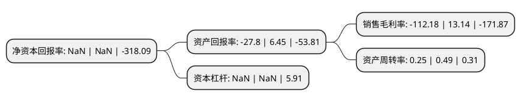

> 本页面由自动化程序生成于 2022年5月20日 01:05
> 内容可能存在错误，如有bug请提交issue至：https://github.com/Eroleice/doc-pi/issues
{.is-warning}

# 上市公司基本情况

## 基本资料

广东雪莱特光电科技股份有限公司（以下简称“*ST雪莱”）成立于1992年10月22日，佛山市。于2006年10月25日在深交所中小板上市。

*ST雪莱注册资本76,957.157万元，主要业务是节能灯，车用氙气金卤灯，紫外线杀菌灯及其他特种光源和配套电子镇流器的生产和销售。以下是详细信息：

- 公司名称: 广东雪莱特光电科技股份有限公司
- 股票代码: 002076.SZ
- 所在地: 广东 - 佛山市
- 成立日期: 1992年10月22日
- 注册资本: 76,957.157万元
- 法定代表人: 冼树忠
- 主营业务: 主要业务是节能灯，车用氙气金卤灯，紫外线杀菌灯及其他特种光源和配套电子镇流器的生产和销售
- 公司官网: www.cnlight.com
- 公司介绍: 公司是中国照明领域代表性上市企业之一。在LED照明、节能灯、HID汽车氙气灯、空气净化、水处理、紫外线杀菌灯等领域达到国际先进水平，先后荣获“广东省名牌产品”等荣誉称号。公司致力于探索光、应用光、创新光，紧跟光源革命浪潮，关注现代人们健康需求，划时代推出“健康LED照明”产品，同时将光的应用领域从照明拓展至杀菌消毒、空气净化与水处理，帮助人们打造全方位健康生活环境。产品畅销美国、日本、韩国、英国、俄罗斯、印度、澳大利亚、中国台湾等海内外数十个国家和地区。2018年公司通过重大资产重组收购卓誉自动化100%股权,标的公司锂电池生产设备业务注入上市公司运营体系中，公司形成传统LED板块业务为主、新能源汽车相关业务比重迅速提高的业务结构，在继续保持LED板块业务稳步发展的同时，上市公司将深化发展新能源汽车产业链的相关业务，重点突出锂电池生产设备以及新能源汽车充电桩业务，实现上市公司业务结构的优化，提升上市公司的整体盈利能力和核心竞争力。

## 股东及高管情况

上市公司第一大股东为柴国生，持股119,345,453股，占比15.51%，**疑似为**上市公司实际控制人。

截至2022年03月31日，上市公司的前十大股东中，共有10名自然人股东，其中5%以上大股东共有3名。上市公司前十大股东明细如下：

> 未能通过持股比例判定出上市公司实际控制人（持股30%以上）
> 可能存在通过间接持股、联合持股、协议控制等方式拥有实际控制权的主体，具体请参考上市公司定期公告！
{.is-warning}

> 截至2022年03月31日，上市公司前十大股东信息如下：

| 股东名称 | 持股数量（股） | 持股比例 |
| --- | --- | --- |
| 柴国生 | 119,345,453 | 15.51% |
| 柴国生 | 119,343,272 | 15.5078% |
| 柴国生 | 118,648,536 | 15.4175% |
| 陈建通 | 12,456,264 | 1.62% |
| 肖劲东 | 10,110,000 | 1.31% |
| 屈赛平 | 4,024,100 | 0.52% |
| 张胜敏 | 4,000,000 | 0.52% |
| 高敏江 | 3,288,800 | 0.43% |
| 邱淑瑜 | 3,152,601 | 0.41% |
| 张桃华 | 3,007,000 | 0.39% |

## 利润表分析

上市公司2021年总收入为1.55亿元，净利润为-1.75亿元，**未实现盈利**。

## 杜邦分析

> 数据列示周期：2021年 | 2020年 | 2019年
{.is-info}

上市公司的净资产收益率在近一年有所下降，下降幅度为NaN%，其变化情况分解如下：
- 上市公司的销售毛利率在近一年下降了-953.73%，可能是生产效率的下降、商品原材料价格上涨或商品价格的下跌所致。
- 上市公司的资产周转率在近一年下降了-48.98%，可能是源自于更慢的销售回款或库存管理效果下降。
- 上市公司的财务杠杆比率在近一年下降了NaN%，可能是减少负债降低财务费用。

