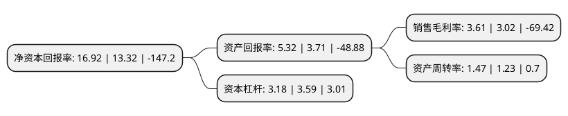

> 本页面由自动化程序生成于 2022年5月20日 01:07
> 内容可能存在错误，如有bug请提交issue至：https://github.com/Eroleice/doc-pi/issues
{.is-warning}

# 上市公司基本情况

## 基本资料

苏州禾盛新型材料股份有限公司（以下简称“禾盛新材”）成立于2002年11月15日，苏州市。于2009年09月03日在深交所中小板上市。

禾盛新材注册资本24,781.233万元，主营业务为家电外观复合材料(PCM/VCM)的生产和销售。主要产品:涂彩金属板材。以下是详细信息：

- 公司名称: 苏州禾盛新型材料股份有限公司
- 股票代码: 002290.SZ
- 所在地: 江苏 - 苏州市
- 成立日期: 2002年11月15日
- 注册资本: 24,781.233万元
- 法定代表人: 梁旭
- 主营业务: 主营业务为家电外观复合材料(PCM/VCM)的生产和销售主要产品:涂彩金属板材
- 公司官网: www.szhssm.com.cn
- 公司介绍: 公司是国内知名的家电用复合材料生产厂商之一，主营家电用外观复合材料的研发、生产和销售，产品主要为家电用外观复合材料(PCM/VCM)，广泛应用于冰箱、洗衣机、电视机等各类家电外观部件。公司客户网络已经覆盖圈内外多数白色家电品牌制造商，核心客户为国内外一流家电制造商。经过多年的业务积累，公司已发展成国内家电用复合材料行业最具研发实力和规模生产能力的专业服务商之一，产品主要用于冰箱、洗衣机、微波炉等白色家电外观部件。公司客户网络已经覆盖圈内外多数白色家电品牌制造商，核心客户为国内外一流家电制造商，在市场规模上处于国内同行业厂商的前列，核心客户包括LG、三星、西门子、松下、夏普、日立、美的、海信、三洋等家用电器行业内的知名厂商。

## 股东及高管情况

上市公司第一大股东为深圳市中科创资产管理有限公司，持股77,667,917股，占比31.34%，为上市公司实际控制人。

截至2022年03月31日，上市公司的前十大股东中，共有8名自然人股东，2名机构股东，其中5%以上大股东共有2名。上市公司前十大股东明细如下：

> 截至2022年03月31日，上市公司前十大股东信息如下：

| 股东名称 | 持股数量（股） | 持股比例 |
| --- | --- | --- |
| 深圳市中科创资产管理有限公司 | 77,667,917 | 31.34% |
| 赵东明 | 48,984,550 | 19.77% |
| 蒋学元 | 4,500,000 | 1.82% |
| 袁永刚 | 4,266,211 | 1.72% |
| 赵茜菁 | 3,800,000 | 1.53% |
| 杨燕红 | 3,010,000 | 1.21% |
| 严晓君 | 2,168,800 | 0.88% |
| 唐建柏 | 1,537,900 | 0.62% |
| 苏州和兴昌商贸有限公司 | 1,523,616 | 0.61% |
| 朱建华 | 1,500,000 | 0.61% |

## 利润表分析

上市公司2021年总收入为22.68亿元，净利润为0.81亿元，实现盈利。

## 杜邦分析

> 数据列示周期：2021年 | 2020年 | 2019年
{.is-info}

上市公司的净资产收益率在近一年有所上升，上升幅度为27.03%，其变化情况分解如下：
- 上市公司的销售毛利率在近一年上升了19.54%，可能是生产效率的提升、商品原材料价格下跌或商品价格的上涨所致。
- 上市公司的资产周转率在近一年上升了19.51%，可能是源自于更快的销售回款或库存管理效果提升。
- 上市公司的财务杠杆比率在近一年下降了-11.42%，可能是减少负债降低财务费用。

