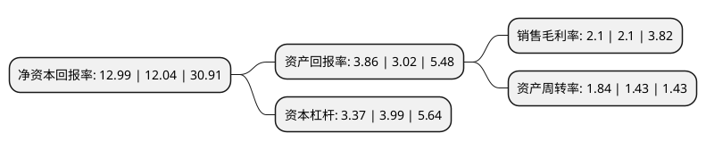

> 本页面由自动化程序生成于 2022年5月20日 01:09
> 内容可能存在错误，如有bug请提交issue至：https://github.com/Eroleice/doc-pi/issues
{.is-warning}

# 上市公司基本情况

## 基本资料

广州毅昌科技股份有限公司（以下简称“毅昌科技”）成立于1997年09月12日，广州市。于2010年06月01日在深交所中小板上市。

毅昌科技注册资本40,100万元，公司是以工业设计为核心，运用DMS经营模式，设计，生产和销售电视机外观结构件的供应商。公司的主要产品是电视机外观结构件。以下是详细信息：

- 公司名称: 广州毅昌科技股份有限公司
- 股票代码: 002420.SZ
- 所在地: 广东 - 广州市
- 成立日期: 1997年09月12日
- 注册资本: 40,100万元
- 法定代表人: 宁红涛
- 主营业务: 公司是以工业设计为核心，运用DMS经营模式，设计，生产和销售电视机外观结构件的供应商公司的主要产品是电视机外观结构件
- 公司官网: www.echom.com
- 公司介绍: 公司是中国著名的工业设计产业集团。公司是一家专业从事家电、汽车结构件的研发、生产和销售的企业，产品主要是数字智能终端，及应用于家电及汽车等的各类外观结构部件。毅昌科技坚持以“科技立国，设计兴国”的发展理念，探索出独具特色的将工业设计(Design)、三精制造(Manufacture)、五星服务(Service)相结合的DMS创新产业模式——即以工业设计为主导，融合信息化技术，对新兴科技、创新设计、先进工艺、自动化生产和现代化管理等多方面进行集成创新，为国内外数百多家客户提供工业设计及生产制造创新增值服务。公司成立多年来，一如既往地重视工业设计实力的打造，现已成为中国工业和信息化部认可的中国工业设计产业化示范基地领军企业。

## 股东及高管情况

上市公司第一大股东为高金技术产业集团有限公司，持股104,198,900股，占比25.98%，**疑似为**上市公司实际控制人。

截至2022年03月31日，上市公司的前十大股东中，共有8名自然人股东，2名机构股东，其中5%以上大股东共有1名。上市公司前十大股东明细如下：

> 未能通过持股比例判定出上市公司实际控制人（持股30%以上）
> 可能存在通过间接持股、联合持股、协议控制等方式拥有实际控制权的主体，具体请参考上市公司定期公告！
{.is-warning}

> 截至2022年03月31日，上市公司前十大股东信息如下：

| 股东名称 | 持股数量（股） | 持股比例 |
| --- | --- | --- |
| 高金技术产业集团有限公司 | 104,198,900 | 25.98% |
| 谢金成 | 10,906,343 | 2.72% |
| 广东毅昌投资有限公司 | 5,807,600 | 1.45% |
| 何宇飞 | 3,040,098 | 0.76% |
| 刘长春 | 2,073,590 | 0.52% |
| 钟湘莲 | 2,019,662 | 0.5% |
| 瞿浙东 | 2,000,000 | 0.5% |
| 王象 | 1,904,242 | 0.47% |
| 吴昌晓 | 1,712,535 | 0.43% |
| 吴毓斌 | 1,653,300 | 0.41% |

## 利润表分析

上市公司2021年总收入为37.44亿元，净利润为0.78亿元，实现盈利。

## 杜邦分析

> 数据列示周期：2021年 | 2020年 | 2019年
{.is-info}

上市公司的净资产收益率在近一年有所上升，上升幅度为7.89%，其变化情况分解如下：
- 上市公司的销售毛利率在近一年下降了0%，可能是生产效率的下降、商品原材料价格上涨或商品价格的下跌所致。
- 上市公司的资产周转率在近一年上升了28.67%，可能是源自于更快的销售回款或库存管理效果提升。
- 上市公司的财务杠杆比率在近一年下降了-15.54%，可能是减少负债降低财务费用。

