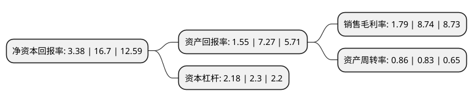

> 本页面由自动化程序生成于 2022年5月20日 01:09
> 内容可能存在错误，如有bug请提交issue至：https://github.com/Eroleice/doc-pi/issues
{.is-warning}

# 上市公司基本情况

## 基本资料

深圳市兆驰股份有限公司（以下简称“兆驰股份”）成立于2005年04月04日，深圳市。于2010年06月10日在深交所中小板上市。

兆驰股份注册资本452,694.061万元，公司的主营业务是家庭视听消费类电子产品的研发，设计，制造，销售。本公司主要产品为家庭视听消费类电子产品。公司生产的家庭视听消费类电子产品主要涉及液晶电视，数字机顶盒，视盘机和多媒体音响四大领域，且在每个领域都有齐全的产品线，形成了相对完整的产品体系，其中，多媒体音响为集成了数字机顶盒，视盘机，小尺寸液晶屏和音箱的多型号组合产品。以下是详细信息：

- 公司名称: 深圳市兆驰股份有限公司
- 股票代码: 002429.SZ
- 所在地: 广东 - 深圳市
- 成立日期: 2005年04月04日
- 注册资本: 452,694.061万元
- 法定代表人: 顾伟
- 主营业务: 公司的主营业务是家庭视听消费类电子产品的研发，设计，制造，销售本公司主要产品为家庭视听消费类电子产品公司生产的家庭视听消费类电子产品主要涉及液晶电视，数字机顶盒，视盘机和多媒体音响四大领域，且在每个领域都有齐全的产品线，形成了相对完整的产品体系，其中，多媒体音响为集成了数字机顶盒，视盘机，小尺寸液晶屏和音箱的多型号组合产品
- 公司官网: www.szmtc.com.cn
- 公司介绍: 公司是一家专业生产消费类电子产品的股份制高科技企业，是科技部认定的国家级高新技术企业和深圳市政府认定的市高新技术企业。公司主营业务方向为液晶电视、机顶盒、LED元器件及组件、网络通讯终端和互联网文娱等产品的设计、研发、生产和销售。公司通过持续技术创新，不断推陈出新，丰富产品结构，完善产品体系。后公司迈向更广阔的市场，从企业业务迈向消费者业务，从实业迈向互联网，并大力发展旗下两个自主品牌：风行互联网电视和兆驰照明。兆驰股份优秀的供应链管理能力和全产业链布局是风行互联网电视和兆驰照明坚实的后盾。同时，兆驰股份正积极进军半导体行业，布局LED外延片和芯片。随着兆驰南昌LED芯片产业园的顺利达产，兆驰股份将掌握核心技术并打通LED全产业链各个环节。

## 股东及高管情况

上市公司第一大股东为南昌兆驰投资合伙企业(有限合伙)，持股1,782,249,627股，占比39.37%，为上市公司实际控制人。

截至2022年03月31日，上市公司的前十大股东中，共有3名自然人股东，5名机构股东，1个产品账户，1个海外主体，其中5%以上大股东共有3名。上市公司前十大股东明细如下：

> 截至2022年03月31日，上市公司前十大股东信息如下：

| 股东名称 | 持股数量（股） | 持股比例 |
| --- | --- | --- |
| 南昌兆驰投资合伙企业(有限合伙) | 1,782,249,627 | 39.37% |
| 深圳市瑞诚睿投资合伙企业(有限合伙) | 360,000,000 | 7.95% |
| 东方明珠新媒体股份有限公司 | 286,276,900 | 6.32% |
| 南昌工控投资基金管理有限公司 | 226,347,100 | 5% |
| 共青城安芯投资合伙企业(有限合伙) | 70,000,000 | 1.55% |
| 香港中央结算有限公司(陆股通) | 47,537,049 | 1.05% |
| 姚向荣 | 46,428,698 | 1.03% |
| 北京国美咨询有限公司 | 37,598,476 | 0.83% |
| 王立群 | 20,242,619 | 0.45% |
| 周文祥 | 19,555,001 | 0.43% |

## 利润表分析

上市公司2021年总收入为225.38亿元，净利润为4.03亿元，实现盈利。

## 杜邦分析

> 数据列示周期：2021年 | 2020年 | 2019年
{.is-info}

上市公司的净资产收益率在近一年有所下降，下降幅度为-79.76%，其变化情况分解如下：
- 上市公司的销售毛利率在近一年下降了-79.52%，可能是生产效率的下降、商品原材料价格上涨或商品价格的下跌所致。
- 上市公司的资产周转率在近一年上升了3.61%，可能是源自于更快的销售回款或库存管理效果提升。
- 上市公司的财务杠杆比率在近一年下降了-5.22%，可能是减少负债降低财务费用。

