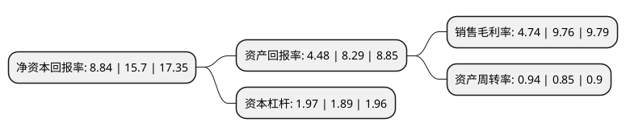

> 本页面由自动化程序生成于 2022年5月20日 01:10
> 内容可能存在错误，如有bug请提交issue至：https://github.com/Eroleice/doc-pi/issues
{.is-warning}

# 上市公司基本情况

## 基本资料

广东万和新电气股份有限公司（以下简称“万和电气”）成立于2003年12月29日，佛山市。于2011年01月28日在深交所中小板上市。

万和电气注册资本74,360万元，主营业务为厨卫电器产品的研发，生产和主售。公司的主要产品包括热水器系列(燃气热水器，燃气壁挂炉，电热水器和沼气，热泵，太阳能等新能源热水器)和配套厨房电器系列(吸油烟机，燃气灶具，消毒碗柜，以及燃气烤炉等)。以下是详细信息：

- 公司名称: 广东万和新电气股份有限公司
- 股票代码: 002543.SZ
- 所在地: 广东 - 佛山市
- 成立日期: 2003年12月29日
- 注册资本: 74,360万元
- 法定代表人: 叶远璋
- 主营业务: 主营业务为厨卫电器产品的研发，生产和主售公司的主要产品包括热水器系列(燃气热水器，燃气壁挂炉，电热水器和沼气，热泵，太阳能等新能源热水器)和配套厨房电器系列(吸油烟机，燃气灶具，消毒碗柜，以及燃气烤炉等)
- 公司官网: www.vanward.com
- 公司介绍: 公司一直围绕厨卫电器主业展开发展，致力于成为世界级品牌的燃气具专家和具高效、节能、环保的生活热水系统供应商，主营业务为厨卫电器产品的研发、生产和主售。公司的主要产品包括热水器系列和配套厨房电器系列。公司是国内规模最大的专业厨卫电器企业之一，在厨卫行业专业品牌中居于领先地位。“万和”品牌已成为厨卫电器行业公众认知度与美誉度都较高的主流品牌之一。公司多次主导或参与了燃气热水器、燃气灶具、消毒柜国家标准的起草和修订，取得了多项专利。代表中国燃气具技术前沿水平的“广东省级企业技术中心”和“广东省节能环保燃气具工程技术研究开发中心”，以及万和与政府、高校共建行业产学研结合的“节能环保燃气具研发中心”，省级院士专家企业工作站均落户在公司，为公司在技术上的持续创新和领先优势提供有力保障。公司获得过诸多殊荣：燃气具行业的“全国轻工行业先进集体”、“中国航天事业合作伙伴”等。

## 股东及高管情况

上市公司第一大股东为广东硕德投资发展有限公司，持股220,545,000股，占比29.66%，**疑似为**上市公司实际控制人。

截至2022年03月31日，上市公司的前十大股东中，共有7名自然人股东，3名机构股东，其中5%以上大股东共有6名。上市公司前十大股东明细如下：

> 未能通过持股比例判定出上市公司实际控制人（持股30%以上）
> 可能存在通过间接持股、联合持股、协议控制等方式拥有实际控制权的主体，具体请参考上市公司定期公告！
{.is-warning}

> 截至2022年03月31日，上市公司前十大股东信息如下：

| 股东名称 | 持股数量（股） | 持股比例 |
| --- | --- | --- |
| 广东硕德投资发展有限公司 | 220,545,000 | 29.66% |
| 卢础其 | 124,198,776 | 16.7% |
| 卢楚隆 | 68,318,250 | 9.19% |
| 广东万和集团有限公司 | 63,882,000 | 8.59% |
| 卢楚鹏 | 40,990,950 | 5.51% |
| 叶远璋 | 40,990,950 | 5.51% |
| 杨祖贵 | 14,982,240 | 2.01% |
| 曾旼 | 5,169,935 | 0.7% |
| 中航鑫港担保有限公司 | 3,718,000 | 0.5% |
| 蔡融 | 2,910,060 | 0.39% |

## 利润表分析

上市公司2021年总收入为75.27亿元，净利润为3.56亿元，实现盈利。

## 杜邦分析

> 数据列示周期：2021年 | 2020年 | 2019年
{.is-info}

上市公司的净资产收益率在近一年有所下降，下降幅度为-43.69%，其变化情况分解如下：
- 上市公司的销售毛利率在近一年下降了-51.43%，可能是生产效率的下降、商品原材料价格上涨或商品价格的下跌所致。
- 上市公司的资产周转率在近一年上升了10.59%，可能是源自于更快的销售回款或库存管理效果提升。
- 上市公司的财务杠杆比率在近一年上升了4.23%，可能是增加负债扩大生产规模。

