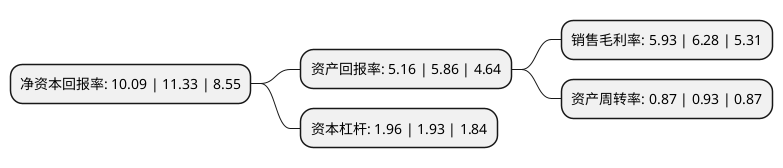

> 本页面由自动化程序生成于 2022年5月20日 01:10
> 内容可能存在错误，如有bug请提交issue至：https://github.com/Eroleice/doc-pi/issues
{.is-warning}

# 上市公司基本情况

## 基本资料

奥佳华智能健康科技集团股份有限公司（以下简称“奥佳华”）成立于1996年08月01日，厦门市。于2011年09月09日在深交所中小板上市。

奥佳华注册资本63,069.301万元，主要从事各类按摩器具的设计，研发，生产和销售工作。公司按摩器具产品按照功能特性可分为按摩小电器，按摩居室电器两大类别。以下是详细信息：

- 公司名称: 奥佳华智能健康科技集团股份有限公司
- 股票代码: 002614.SZ
- 所在地: 福建 - 厦门市
- 成立日期: 1996年08月01日
- 注册资本: 63,069.301万元
- 法定代表人: 邹剑寒
- 主营业务: 主要从事各类按摩器具的设计，研发，生产和销售工作公司按摩器具产品按照功能特性可分为按摩小电器，按摩居室电器两大类别
- 公司官网: www.easepal.com.cn
- 公司介绍: 公司是目前全国领先的按摩器材生产制造服务商。主要致力于按摩器具产品研发、生产及销售。公司所属的按摩器具行业系新兴产业，潜在国际国内市场容量巨大，中国按摩器具制造商已经成为全球按摩器具品牌商的主要供应商。公司拥有同行业最大的研发团队，具备同行业领先的可靠性强化试验技术、加速寿命试验技术和高应力筛选技术等测试平台；与北美、欧洲、东亚和东南亚地区领先健康产品品牌商HOMEDICS、ATEX、OGAWA、HOT、OSIM、CASADA、OTO等保持长期合作关系。公司拥有多项专利权，获有“厦门市百强企业”、“出口十佳企业”、“福建省著名商标”、“福建名牌产品”和“国家免检产品”等诸多荣誉和多项国家技术专利。

## 股东及高管情况

上市公司第一大股东为邹剑寒，持股127,620,000股，占比20.23%，**疑似为**上市公司实际控制人。

截至2022年03月31日，上市公司的前十大股东中，共有3名自然人股东，1名机构股东，5个产品账户，1个海外主体，其中5%以上大股东共有2名。上市公司前十大股东明细如下：

> 未能通过持股比例判定出上市公司实际控制人（持股30%以上）
> 可能存在通过间接持股、联合持股、协议控制等方式拥有实际控制权的主体，具体请参考上市公司定期公告！
{.is-warning}

> 截至2022年03月31日，上市公司前十大股东信息如下：

| 股东名称 | 持股数量（股） | 持股比例 |
| --- | --- | --- |
| 邹剑寒 | 127,620,000 | 20.23% |
| 李五令 | 112,420,091 | 17.82% |
| 招商银行股份有限公司-兴全合润混合型证券投资基金 | 21,114,951 | 3.35% |
| 中国光大银行股份有限公司-兴全商业模式优选混合型证券投资基金(LOF) | 19,219,104 | 3.05% |
| 招商银行股份有限公司-兴全合宜灵活配置混合型证券投资基金(LOF) | 17,679,741 | 2.8% |
| 珠海崇澜企业管理合伙企业(有限合伙) | 10,160,400 | 1.61% |
| 上海宁泉资产管理有限公司-宁泉致远58号私募证券投资基金 | 8,526,781 | 1.35% |
| 上海宁泉资产管理有限公司-宁泉致远39号私募证券投资基金 | 6,062,939 | 0.96% |
| 香港中央结算有限公司(陆股通) | 5,958,263 | 0.94% |
| 李飚 | 5,494,076 | 0.87% |

## 利润表分析

上市公司2021年总收入为79.26亿元，净利润为4.69亿元，实现盈利。

## 杜邦分析

> 数据列示周期：2021年 | 2020年 | 2019年
{.is-info}

上市公司的净资产收益率在近一年有所下降，下降幅度为-10.94%，其变化情况分解如下：
- 上市公司的销售毛利率在近一年下降了-5.57%，可能是生产效率的下降、商品原材料价格上涨或商品价格的下跌所致。
- 上市公司的资产周转率在近一年下降了-6.45%，可能是源自于更慢的销售回款或库存管理效果下降。
- 上市公司的财务杠杆比率在近一年上升了1.55%，可能是增加负债扩大生产规模。

