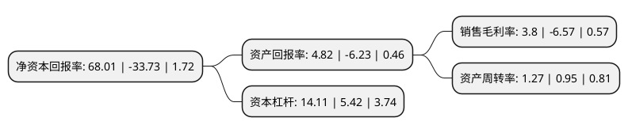

> 本页面由自动化程序生成于 2022年5月20日 01:11
> 内容可能存在错误，如有bug请提交issue至：https://github.com/Eroleice/doc-pi/issues
{.is-warning}

# 上市公司基本情况

## 基本资料

广东奥马电器股份有限公司（以下简称“ST奥马”）成立于2002年11月01日，中山市。于2012年04月16日在深交所中小板上市。

ST奥马注册资本108,411.143万元，主营业务:冰箱制造和销售业务，金融科技业务以下是详细信息：

- 公司名称: 广东奥马电器股份有限公司
- 股票代码: 002668.SZ
- 所在地: 广东 - 中山市
- 成立日期: 2002年11月01日
- 注册资本: 108,411.143万元
- 法定代表人: 胡殿谦
- 主营业务: 主营业务:冰箱制造和销售业务，金融科技业务
- 公司官网: www.homa.cn
- 公司介绍: 公司是以冰箱为核心产品的集研发、生产、销售、出口为一体的高新技术企业公司，国内最大的冰箱ODM生产基地。公司从创立之初即从事冰箱制造和销售，经过多年的发展，冰箱业务经营模式现为ODM业务与OBM业务并行发展的模式，公司冰箱业务由全资子公司奥马冰箱有限公司运营。公司以“场景+科技+新金融”的战略理念将旗下金融科技业务板块定位于理财、消费、信贷三大板块有机结合的一线金融科技服务平台。目前主要业务包括：平台服务、产品及技术服务、信贷业务、产业投资等。公司围绕“场景+科技+新金融”的发展战略，建立了良好品牌优势，产品及服务获得市场的高度认可，在金融科技邻域已处于行业较为领先的地位。

## 股东及高管情况

上市公司第一大股东为TCL家电集团有限公司，持股520,967,167股，占比48.05%，为上市公司实际控制人。

截至2022年03月31日，上市公司的前十大股东中，共有5名自然人股东，4名机构股东，1个产品账户，其中5%以上大股东共有2名。上市公司前十大股东明细如下：

> 截至2022年03月31日，上市公司前十大股东信息如下：

| 股东名称 | 持股数量（股） | 持股比例 |
| --- | --- | --- |
| TCL家电集团有限公司 | 520,967,167 | 48.05% |
| 武汉株信睿康科技有限责任公司 | 102,166,290 | 9.42% |
| 西藏金梅花投资有限公司 | 33,728,646 | 3.11% |
| 重庆中新融泽投资中心(有限合伙) | 23,138,065 | 2.13% |
| 赵国栋 | 17,405,622 | 1.61% |
| 前海开源基金-海通证券-前海开源定增二十二号资产管理计划 | 12,955,312 | 1.2% |
| 刘展成 | 12,892,964 | 1.19% |
| 林文尧 | 6,745,862 | 0.62% |
| 杨茜 | 4,430,003 | 0.41% |
| 张丽华 | 3,000,000 | 0.28% |

## 利润表分析

上市公司2021年总收入为101.22亿元，净利润为3.84亿元，实现盈利。

## 杜邦分析

> 数据列示周期：2021年 | 2020年 | 2019年
{.is-info}

上市公司的净资产收益率在近一年有所下降，下降幅度为-301.63%，其变化情况分解如下：
- 上市公司的销售毛利率在近一年下降了-157.84%，可能是生产效率的下降、商品原材料价格上涨或商品价格的下跌所致。
- 上市公司的资产周转率在近一年上升了33.68%，可能是源自于更快的销售回款或库存管理效果提升。
- 上市公司的财务杠杆比率在近一年上升了160.33%，可能是增加负债扩大生产规模。

