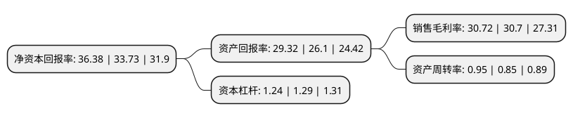

> 本页面由自动化程序生成于 2022年5月20日 01:11
> 内容可能存在错误，如有bug请提交issue至：https://github.com/Eroleice/doc-pi/issues
{.is-warning}

# 上市公司基本情况

## 基本资料

浙江美大实业股份有限公司（以下简称“浙江美大”）成立于2001年12月29日，嘉兴市。于2012年05月25日在深交所中小板上市。

浙江美大注册资本64,605.165万元，公司主营业务为集成灶产品的研发，生产和销售。主要产品为集成灶。以下是详细信息：

- 公司名称: 浙江美大实业股份有限公司
- 股票代码: 002677.SZ
- 所在地: 浙江 - 嘉兴市
- 成立日期: 2001年12月29日
- 注册资本: 64,605.165万元
- 法定代表人: 夏志生
- 主营业务: 公司主营业务为集成灶产品的研发，生产和销售主要产品为集成灶
- 公司官网: www.meida.com
- 公司介绍: 公司是中国集成灶行业的开创者和领导者。公司以科技和市场为导向，开创集成厨电系列健康环保产品，掌握核心技术和工艺，形成了完整的产业链；是一家集研发、生产、销售于一体的现代化新型高科技公司，是国内具有研发实力和规模化生产能力的集成灶专业制造商。公司拥有现代化制造设备，融汇精湛制造工艺；通过了ISO9001、14001管理体系认证，同时，公司集成灶产品取得中国环境标志产品认证和中国国家强制性产品认证(CCC产品认证)；获国家专利以及国际PCT专利多项；产品列入国家火炬计划项目，获浙江高新技术企业等殊荣。

## 股东及高管情况

上市公司第一大股东为夏志生，持股136,980,500股，占比21.2%，**疑似为**上市公司实际控制人。

截至2022年03月31日，上市公司的前十大股东中，共有7名自然人股东，2个产品账户，1个海外主体，其中5%以上大股东共有4名。上市公司前十大股东明细如下：

> 未能通过持股比例判定出上市公司实际控制人（持股30%以上）
> 可能存在通过间接持股、联合持股、协议控制等方式拥有实际控制权的主体，具体请参考上市公司定期公告！
{.is-warning}

> 截至2022年03月31日，上市公司前十大股东信息如下：

| 股东名称 | 持股数量（股） | 持股比例 |
| --- | --- | --- |
| 夏志生 | 136,980,500 | 21.2% |
| 夏鼎 | 135,616,000 | 20.99% |
| 夏兰 | 66,000,000 | 10.22% |
| 王培飞 | 35,860,026 | 5.55% |
| 钟传良 | 24,385,508 | 3.77% |
| 徐建龙 | 24,182,204 | 3.74% |
| 香港中央结算有限公司(陆股通) | 12,737,502 | 1.97% |
| 黄红 | 6,189,400 | 0.96% |
| 杭州纯阳资产管理有限公司-纯阳十号私募证券投资基金 | 3,704,152 | 0.57% |
| 中国民生银行股份有限公司-东方精选混合型开放式证券投资基金 | 2,699,979 | 0.42% |

## 利润表分析

上市公司2021年总收入为21.63亿元，净利润为6.64亿元，实现盈利。

## 杜邦分析

> 数据列示周期：2021年 | 2020年 | 2019年
{.is-info}

上市公司的净资产收益率在近一年有所上升，上升幅度为7.86%，其变化情况分解如下：
- 上市公司的销售毛利率在近一年上升了0.07%，可能是生产效率的提升、商品原材料价格下跌或商品价格的上涨所致。
- 上市公司的资产周转率在近一年上升了11.76%，可能是源自于更快的销售回款或库存管理效果提升。
- 上市公司的财务杠杆比率在近一年下降了-3.88%，可能是减少负债降低财务费用。

