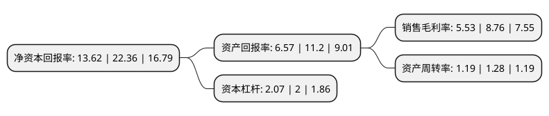

> 本页面由自动化程序生成于 2022年5月20日 01:11
> 内容可能存在错误，如有bug请提交issue至：https://github.com/Eroleice/doc-pi/issues
{.is-warning}

# 上市公司基本情况

## 基本资料

广东新宝电器股份有限公司（以下简称“新宝股份”）成立于1995年12月11日，佛山市。于2014年01月21日在深交所中小板上市。

新宝股份注册资本82,672.778万元，主营业务:设计研发，生产，销售小家电产品。以下是详细信息：

- 公司名称: 广东新宝电器股份有限公司
- 股票代码: 002705.SZ
- 所在地: 广东 - 佛山市
- 成立日期: 1995年12月11日
- 注册资本: 82,672.778万元
- 法定代表人: 郭建刚
- 主营业务: 主营业务:设计研发，生产，销售小家电产品
- 公司官网: www.donlim.com
- 公司介绍: 公司是国内最大的小家电产品ODM/OBM制造商之一，主营业务为设计研发、生产、销售电热水壶、电热咖啡机等小家电产品，拥有丰富的产品线，能够满足国际知名品牌商、零售商“一站式”采购的需要。“Donlim”商标为“中国驰名商标”。公司是中国工业设计协会常务理事单位，主导、参与了多项国家标准的制定，建立了(CNAS)及一系列国际权威机构认可的实验室，拥有一千余项专利，并先后获得中国创新设计“红星奖”、中国创新设计“红棉奖”、“省长杯”广东工业设计奖。

## 股东及高管情况

上市公司第一大股东为广东东菱凯琴集团有限公司，持股3,442,218,792股，占比41.64%，为上市公司实际控制人。

截至2022年03月31日，上市公司的前十大股东中，共有3名机构股东，6个产品账户，1个海外主体，其中5%以上大股东共有3名。上市公司前十大股东明细如下：

> 截至2022年03月31日，上市公司前十大股东信息如下：

| 股东名称 | 持股数量（股） | 持股比例 |
| --- | --- | --- |
| 广东东菱凯琴集团有限公司 | 3,442,218,792 | 41.64% |
| 广东东菱凯琴集团有限公司 | 344,221,879 | 41.64% |
| 东菱电器集团有限公司 | 183,816,782 | 22.23% |
| 中国建设银行股份有限公司-中欧悦享生活混合型证券投资基金 | 20,877,718 | 2.53% |
| 招商银行股份有限公司-华夏新兴成长股票型证券投资基金 | 19,279,748 | 2.33% |
| 中国工商银行股份有限公司-中欧消费主题股票型证券投资基金 | 9,592,370 | 1.16% |
| 香港中央结算有限公司(陆股通) | 8,474,125 | 1.03% |
| 全国社保基金一一七组合 | 8,399,525 | 1.02% |
| 中国人寿财产保险股份有限公司-传统-普通保险产品 | 7,953,525 | 0.96% |
| 全国社保基金四零四组合 | 5,850,799 | 0.71% |

## 利润表分析

上市公司2021年总收入为149.12亿元，净利润为8.25亿元，实现盈利。

## 杜邦分析

> 数据列示周期：2021年 | 2020年 | 2019年
{.is-info}

上市公司的净资产收益率在近一年有所下降，下降幅度为-39.09%，其变化情况分解如下：
- 上市公司的销售毛利率在近一年下降了-36.87%，可能是生产效率的下降、商品原材料价格上涨或商品价格的下跌所致。
- 上市公司的资产周转率在近一年下降了-7.03%，可能是源自于更慢的销售回款或库存管理效果下降。
- 上市公司的财务杠杆比率在近一年上升了3.5%，可能是增加负债扩大生产规模。

