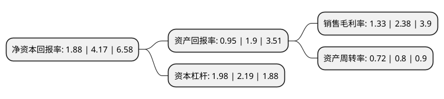

> 本页面由自动化程序生成于 2022年5月20日 01:11
> 内容可能存在错误，如有bug请提交issue至：https://github.com/Eroleice/doc-pi/issues
{.is-warning}

# 上市公司基本情况

## 基本资料

广东金莱特电器股份有限公司（以下简称“金莱特”）成立于2007年11月29日，江门市。于2014年01月29日在深交所中小板上市。

金莱特注册资本31,750.288万元，主营业务为可充电备用照明灯具及可充电交直流两用风扇的研发，生产和销售。主要产品为可充电备用照明与可充电交直流两用风扇，可充电备用照明包括可充电式手电筒，可充电室内外备用照明灯具，消防应急灯，其中可充电室内外备用照明灯具按照用途可分类为:商业备用照明，家庭备用照明，军工备用照明，户外休闲照明，工矿照明和户外作业照明。以下是详细信息：

- 公司名称: 广东金莱特电器股份有限公司
- 股票代码: 002723.SZ
- 所在地: 广东 - 江门市
- 成立日期: 2007年11月29日
- 注册资本: 31,750.288万元
- 法定代表人: 卢保山
- 主营业务: 主营业务为可充电备用照明灯具及可充电交直流两用风扇的研发，生产和销售主要产品为可充电备用照明与可充电交直流两用风扇，可充电备用照明包括可充电式手电筒，可充电室内外备用照明灯具，消防应急灯，其中可充电室内外备用照明灯具按照用途可分类为:商业备用照明，家庭备用照明，军工备用照明，户外休闲照明，工矿照明和户外作业照明
- 公司官网: www.kennede.com
- 公司介绍: 公司是一家专业开发、制造、销售可充电备用照明产品和可充电交直流两用风扇的民营企业。产品包括可充电式手电筒、可充电室内外备用照明灯具、消防应急灯、可充电交直流两用台扇及落地扇等五大类产品。公司掌握了包括LED驱动控制技术、散热控制技术、二次配光技术、直流永磁无刷电机有限元一体矢量控制技术等核心技术，在行业内已积累起较为明显的技术领先优势，是目前同行业内拥有专利技术最多的企业之一。同时，公司已经建立起覆盖全球大多国家和地区的市场营销网络。

## 股东及高管情况

上市公司第一大股东为深圳华欣创力科技实业发展有限公司，持股78,387,862股，占比24.69%，**疑似为**上市公司实际控制人。

截至2022年03月31日，上市公司的前十大股东中，共有6名自然人股东，2名机构股东，2个产品账户，其中5%以上大股东共有5名。上市公司前十大股东明细如下：

> 未能通过持股比例判定出上市公司实际控制人（持股30%以上）
> 可能存在通过间接持股、联合持股、协议控制等方式拥有实际控制权的主体，具体请参考上市公司定期公告！
{.is-warning}

> 截至2022年03月31日，上市公司前十大股东信息如下：

| 股东名称 | 持股数量（股） | 持股比例 |
| --- | --- | --- |
| 深圳华欣创力科技实业发展有限公司 | 78,387,862 | 24.69% |
| 蒋小荣 | 16,391,816 | 5.16% |
| 田甜 | 15,909,957 | 5.01% |
| 田野阳光 | 15,909,957 | 5.01% |
| 田一乐 | 15,909,957 | 5.01% |
| 蒋光勇 | 10,010,973 | 3.15% |
| 浙江宁聚投资管理有限公司-宁聚开阳2号私募证券投资基金 | 9,949,706 | 3.13% |
| 余运秀 | 6,811,776 | 2.15% |
| 江门市向日葵投资有限公司 | 5,673,000 | 1.79% |
| 财通基金-郑旭-财通基金乾坤88号单一资产管理计划 | 4,191,115 | 1.32% |

## 利润表分析

上市公司2021年总收入为13.2亿元，净利润为0.17亿元，实现盈利。

## 杜邦分析

> 数据列示周期：2021年 | 2020年 | 2019年
{.is-info}

上市公司的净资产收益率在近一年有所下降，下降幅度为-54.92%，其变化情况分解如下：
- 上市公司的销售毛利率在近一年下降了-44.12%，可能是生产效率的下降、商品原材料价格上涨或商品价格的下跌所致。
- 上市公司的资产周转率在近一年下降了-10%，可能是源自于更慢的销售回款或库存管理效果下降。
- 上市公司的财务杠杆比率在近一年下降了-9.59%，可能是减少负债降低财务费用。

