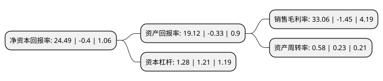

> 本页面由自动化程序生成于 2022年5月20日 01:11
> 内容可能存在错误，如有bug请提交issue至：https://github.com/Eroleice/doc-pi/issues
{.is-warning}

# 上市公司基本情况

## 基本资料

广东天际电器股份有限公司（以下简称“天际股份”）成立于1996年03月30日，汕头市。于2015年05月28日在深交所中小板上市。

天际股份注册资本40,215.257万元，主营业务为本公司致力于将现代科学技术与传统陶瓷烹饪相结合的陶瓷烹饪家电，电热水壶的研发，生产和销售。主要产品包括:1，陶瓷烹饪电器，包括:陶瓷隔水炖，陶瓷电炖盅，陶瓷电炖锅，陶瓷电饭煲，陶瓷煮粥锅，陶瓷养生煲等。2，电热水壶系列产品，包括:电水壶，电热水瓶和电茶具等。3，其他厨房小家电，包括电蒸锅，榨汁机，豆浆机，酸奶机等。以下是详细信息：

- 公司名称: 广东天际电器股份有限公司
- 股票代码: 002759.SZ
- 所在地: 广东 - 汕头市
- 成立日期: 1996年03月30日
- 注册资本: 40,215.257万元
- 法定代表人: 吴锡盾
- 主营业务: 主营业务为本公司致力于将现代科学技术与传统陶瓷烹饪相结合的陶瓷烹饪家电，电热水壶的研发，生产和销售主要产品包括:1，陶瓷烹饪电器，包括:陶瓷隔水炖，陶瓷电炖盅，陶瓷电炖锅，陶瓷电饭煲，陶瓷煮粥锅，陶瓷养生煲等2，电热水壶系列产品，包括:电水壶，电热水瓶和电茶具等3，其他厨房小家电，包括电蒸锅，榨汁机，豆浆机，酸奶机等
- 公司官网: www.tonze.com
- 公司介绍: 公司系专业研发、生产和销售家用小电器、电子产品、医疗器械的现代化企业。公司主要从事生产、销售六氟磷酸锂业务。六氟磷酸锂是锂电池的重要原材料。锂离子电池的原材料可分为正极、负极、隔膜和电解液四大类。锂离子电池主要依靠锂离子在正极和负极之间往返的嵌入和脱嵌来完成充放电的过程。作为四大材料之一的电解液，在电池正负极之间起到传导输送能量的作用。电解质是电解液的核心组成部分，六氟磷酸锂是主要电解质材料，目前从对电解质的性能要求来看，六氟磷酸锂综合性能最好。目前六氟磷酸锂主要应用于储能电池、动力电池及数码、照明系列锂电池等产品中。公司通过ISO9001质量管理体系认证和ISO14001环境管理体系认证。

## 股东及高管情况

上市公司第一大股东为汕头市天际有限公司，持股83,779,180股，占比20.83%，**疑似为**上市公司实际控制人。

截至2022年05月11日，上市公司的前十大股东中，共有4名自然人股东，6名机构股东，其中5%以上大股东共有5名。上市公司前十大股东明细如下：

> 未能通过持股比例判定出上市公司实际控制人（持股30%以上）
> 可能存在通过间接持股、联合持股、协议控制等方式拥有实际控制权的主体，具体请参考上市公司定期公告！
{.is-warning}

> 截至2022年05月11日，上市公司前十大股东信息如下：

| 股东名称 | 持股数量（股） | 持股比例 |
| --- | --- | --- |
| 汕头市天际有限公司 | 83,779,180 | 20.83% |
| 常熟市新华化工有限公司 | 45,665,410 | 11.36% |
| 常熟市新华化工有限公司 | 45,665,410 | 11.36% |
| 星嘉国际有限公司 | 30,148,940 | 7.5% |
| 星嘉国际有限公司 | 29,981,740 | 7.4553% |
| 深圳市兴创源投资有限公司 | 10,550,404 | 2.62% |
| 吴锭平 | 2,150,000 | 0.53% |
| 刘兴浩 | 1,845,000 | 0.46% |
| 刘颖卓 | 1,815,000 | 0.45% |
| 陶义锋 | 1,496,000 | 0.37% |

## 利润表分析

上市公司2021年总收入为22.52亿元，净利润为7.44亿元，实现盈利。

## 杜邦分析

> 数据列示周期：2021年 | 2020年 | 2019年
{.is-info}

上市公司的净资产收益率在近一年有所下降，下降幅度为-6222.5%，其变化情况分解如下：
- 上市公司的销售毛利率在近一年下降了-2380%，可能是生产效率的下降、商品原材料价格上涨或商品价格的下跌所致。
- 上市公司的资产周转率在近一年上升了152.17%，可能是源自于更快的销售回款或库存管理效果提升。
- 上市公司的财务杠杆比率在近一年上升了5.79%，可能是增加负债扩大生产规模。

