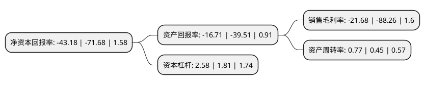

> 本页面由自动化程序生成于 2022年5月20日 01:12
> 内容可能存在错误，如有bug请提交issue至：https://github.com/Eroleice/doc-pi/issues
{.is-warning}

# 上市公司基本情况

## 基本资料

高斯贝尔数码科技股份有限公司（以下简称“高斯贝尔”）成立于2001年08月23日，郴州市。于2017年02月13日在深交所中小板上市。

高斯贝尔注册资本16,715万元，主要产品:数字电视前端设备，数字电视系统软件，数字电视终端产品，并能提供有线，地面数字电视系统工程建设及技术服务，为数字电视端到端全套系统解决方案服务商。主营业务:数字电视软硬件产品的研发，生产与销售。以下是详细信息：

- 公司名称: 高斯贝尔数码科技股份有限公司
- 股票代码: 002848.SZ
- 所在地: 湖南 - 郴州市
- 成立日期: 2001年08月23日
- 注册资本: 16,715万元
- 法定代表人: 邵红刚
- 主营业务: 主要产品:数字电视前端设备，数字电视系统软件，数字电视终端产品，并能提供有线，地面数字电视系统工程建设及技术服务，为数字电视端到端全套系统解决方案服务商主营业务:数字电视软硬件产品的研发，生产与销售
- 公司官网: www.gospell.com
- 公司介绍: 公司致力于数字电视软硬件产品的研发、生产、销售，是数字电视行业内以制造起家、坚持走自主化和国产化发展道路、具备丰富的研发设计、质量与成本控制、系统工程建设与技术服务经验的面向全球数字电视市场的产品制造商、系统集成商与技术服务商，综合实力在国内位居前列。公司系国家级高新技术企业，研发团队由众多业内专业人士组成，技术开发和工艺改进经验丰富。经过十余年的持续研发，公司在多个领域取得一系列国内先进或领先水平的科技创新成果。公司所开发的多种不同应用方案的数字电视接收设备具有创新性和实用性，满足国内外不同市场的需求，具有广阔应用前景。公司是国内为数不多的产品线丰富完整的数字电视产品生产企业之一，市场覆盖区域持续扩大。

## 股东及高管情况

上市公司第一大股东为潍坊滨城投资开发有限公司，持股48,473,500股，占比29%，**疑似为**上市公司实际控制人。

截至2022年03月31日，上市公司的前十大股东中，共有9名自然人股东，1名机构股东，其中5%以上大股东共有2名。上市公司前十大股东明细如下：

> 未能通过持股比例判定出上市公司实际控制人（持股30%以上）
> 可能存在通过间接持股、联合持股、协议控制等方式拥有实际控制权的主体，具体请参考上市公司定期公告！
{.is-warning}

> 截至2022年03月31日，上市公司前十大股东信息如下：

| 股东名称 | 持股数量（股） | 持股比例 |
| --- | --- | --- |
| 潍坊滨城投资开发有限公司 | 48,473,500 | 29% |
| 刘潭爱 | 9,039,400 | 5.41% |
| 游宗杰 | 3,261,600 | 1.95% |
| 孙二花 | 2,669,000 | 1.6% |
| 刘丙宇 | 2,358,600 | 1.41% |
| 谌晓文 | 2,285,600 | 1.37% |
| 王春 | 2,166,000 | 1.3% |
| 刘玮 | 1,995,000 | 1.19% |
| 马刚 | 1,941,800 | 1.16% |
| 欧阳健康 | 1,920,800 | 1.15% |

## 利润表分析

上市公司2021年总收入为5.76亿元，净利润为-1.26亿元，**未实现盈利**。

## 杜邦分析

> 数据列示周期：2021年 | 2020年 | 2019年
{.is-info}

上市公司的净资产收益率在近一年有所下降，下降幅度为-39.76%，其变化情况分解如下：
- 上市公司的销售毛利率在近一年下降了-75.44%，可能是生产效率的下降、商品原材料价格上涨或商品价格的下跌所致。
- 上市公司的资产周转率在近一年上升了71.11%，可能是源自于更快的销售回款或库存管理效果提升。
- 上市公司的财务杠杆比率在近一年上升了42.54%，可能是增加负债扩大生产规模。

