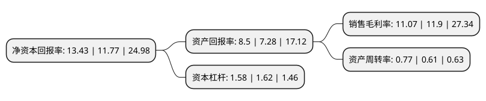

> 本页面由自动化程序生成于 2022年5月20日 01:12
> 内容可能存在错误，如有bug请提交issue至：https://github.com/Eroleice/doc-pi/issues
{.is-warning}

# 上市公司基本情况

## 基本资料

杭州星帅尔电器股份有限公司（以下简称“星帅尔”）成立于2002年05月15日，杭州市。于2017年04月12日在深交所中小板上市。

星帅尔注册资本21,926.466万元，主要产品:压缩机用热保护器，起动器，密封接线柱，以及小家电用温度控制器。以下是详细信息：

- 公司名称: 杭州星帅尔电器股份有限公司
- 股票代码: 002860.SZ
- 所在地: 浙江 - 杭州市
- 成立日期: 2002年05月15日
- 注册资本: 21,926.466万元
- 法定代表人: 楼月根
- 主营业务: 主要产品:压缩机用热保护器，起动器，密封接线柱，以及小家电用温度控制器
- 公司官网: www.hzstarshuaier.com
- 公司介绍: 公司是国内电动机热保护器、起动器行业的著名企业之一，是国内冰箱与冷柜压缩机热保护器、起动器和密封接线柱的骨干生产企业。公司的主要产品为各种类型的热保护器、起动器和密封接线柱，主要应用于冰箱、冷柜、空调、制冷饮水机等领域的制冷压缩机以及洗衣机烘干机上。目前，公司产品已覆盖国内外主要压缩机生产厂家，包括华意系公司、东贝系公司、美芝系公司、钱江公司、四川丹甫、LG电子、尼得科电机、恩布拉科等。公司生产的压缩机用热保护器、起动器在国内市场有较高的占有率，已成为国内压缩机两器生产和出口的主要基地，并拥有多项自主知识产权，产品销往欧美、中东、东南亚及国内的主要压缩机厂家。同时，公司具备完善的质量管理体系，通过ISO9001及ISO14000、UL、CUL、VDE、CB、CE、CQC、KC等认证，质量在同行中名列前茅，并不断提升软硬件设施，为公司的长期发展打下了坚实的基础。

## 股东及高管情况

上市公司第一大股东为楼月根，持股61,885,624股，占比28.22%，**疑似为**上市公司实际控制人。

截至2022年03月31日，上市公司的前十大股东中，共有9名自然人股东，1名机构股东，其中5%以上大股东共有2名。上市公司前十大股东明细如下：

> 未能通过持股比例判定出上市公司实际控制人（持股30%以上）
> 可能存在通过间接持股、联合持股、协议控制等方式拥有实际控制权的主体，具体请参考上市公司定期公告！
{.is-warning}

> 截至2022年03月31日，上市公司前十大股东信息如下：

| 股东名称 | 持股数量（股） | 持股比例 |
| --- | --- | --- |
| 楼月根 | 61,885,624 | 28.22% |
| 福鼎星帅尔投资有限公司 | 27,772,909 | 12.67% |
| 楼勇伟 | 5,120,160 | 2.34% |
| 王连益 | 4,242,495 | 1.93% |
| 俞杰 | 3,326,442 | 1.52% |
| 孙华民 | 3,289,348 | 1.5% |
| 夏启逵 | 2,472,252 | 1.13% |
| 胡毕霞 | 2,183,700 | 1% |
| 余荣琳 | 1,921,675 | 0.88% |
| 李樱 | 1,812,424 | 0.83% |

## 利润表分析

上市公司2021年总收入为13.68亿元，净利润为1.51亿元，实现盈利。

## 杜邦分析

> 数据列示周期：2021年 | 2020年 | 2019年
{.is-info}

上市公司的净资产收益率在近一年有所上升，上升幅度为14.1%，其变化情况分解如下：
- 上市公司的销售毛利率在近一年下降了-6.97%，可能是生产效率的下降、商品原材料价格上涨或商品价格的下跌所致。
- 上市公司的资产周转率在近一年上升了26.23%，可能是源自于更快的销售回款或库存管理效果提升。
- 上市公司的财务杠杆比率在近一年下降了-2.47%，可能是减少负债降低财务费用。

