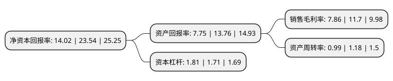

> 本页面由自动化程序生成于 2022年5月20日 01:13
> 内容可能存在错误，如有bug请提交issue至：https://github.com/Eroleice/doc-pi/issues
{.is-warning}

# 上市公司基本情况

## 基本资料

小熊电器股份有限公司（以下简称“小熊电器”）成立于2006年03月16日，佛山市。于2019年08月23日在深交所中小板上市。

小熊电器注册资本15,644.4万元，公司产品按应用方向分为厨房小家电，生活小家电和其他小家电，其中厨房小家电根据功能进一步划分为锅煲类，电热类，壶类，西式类和电动类五类产品。主营业务为创意小家电研发，设计，生产和销售。以下是详细信息：

- 公司名称: 小熊电器股份有限公司
- 股票代码: 002959.SZ
- 所在地: 广东 - 佛山市
- 成立日期: 2006年03月16日
- 注册资本: 15,644.4万元
- 法定代表人: 李一峰
- 主营业务: 公司产品按应用方向分为厨房小家电，生活小家电和其他小家电，其中厨房小家电根据功能进一步划分为锅煲类，电热类，壶类，西式类和电动类五类产品主营业务为创意小家电研发，设计，生产和销售
- 公司官网: www.bears.com.cn
- 公司介绍: 公司成立于2006年3月，是一家以自主品牌“小熊”为核心，运用互联网大数据进行创意小家电研发、设计、生产和销售，并在产品销售渠道与互联网深度融合的“创意小家电+互联网”企业。公司产品主要通过线上经销、电商平台入仓和线上直销方式在天猫商城、京东商城、唯品会和苏宁易购等主流电商平台和拼多多、平安好医生等新兴电商平台进行销售；同时，公司布局线下销售渠道以及出口销售，充分利用经销商或海外客户的资源和经验优势，将产品渗透至线下流通渠道，实施全渠道运营的销售模式，加速线上线下融合发展。公司创意小家电产品包括厨房小家电、生活小家电及其他小家电，其中细分产品酸奶机、电动打蛋器、电热饭盒、加湿器、多士炉、煮蛋器/蒸蛋器等产品2017年、2018年在天猫商城热销品牌榜排名第一。2017年，公司荣获浙江日报报业集团和淘宝天下联合颁发的“金麦奖-2017年度品质类大奖-家电类”和“金麦奖-最佳跨界合作品牌”；同年，公司获得了人民日报社颁发的“中国品牌奖”，此外，“小熊”注册商标被国家工商行政管理总局认定为驰名商标。

## 股东及高管情况

上市公司第一大股东为佛山市兆峰投资有限公司，持股69,287,400股，占比44.29%，为上市公司实际控制人。

截至2022年03月31日，上市公司的前十大股东中，共有4名自然人股东，2名机构股东，3个产品账户，1个海外主体，其中5%以上大股东共有3名。上市公司前十大股东明细如下：

> 截至2022年03月31日，上市公司前十大股东信息如下：

| 股东名称 | 持股数量（股） | 持股比例 |
| --- | --- | --- |
| 佛山市兆峰投资有限公司 | 69,287,400 | 44.29% |
| 施明泰 | 15,831,500 | 10.12% |
| 龙少柔 | 11,923,511 | 7.62% |
| 永新县吉顺资产管理合伙企业(有限合伙) | 7,020,000 | 4.49% |
| 龙少静 | 5,342,904 | 3.42% |
| 龙少宏 | 3,463,200 | 2.21% |
| 香港中央结算有限公司(陆股通) | 1,007,545 | 0.64% |
| 百年人寿保险股份有限公司-分红保险产品 | 1,000,000 | 0.64% |
| 上海浦东发展银行股份有限公司-交银施罗德成长动力一年持有期混合型证券投资基金 | 1,000,000 | 0.64% |
| 中国建设银行-宝康消费品证券投资基金 | 600,970 | 0.38% |

## 利润表分析

上市公司2021年总收入为36.06亿元，净利润为2.83亿元，实现盈利。

## 杜邦分析

> 数据列示周期：2021年 | 2020年 | 2019年
{.is-info}

上市公司的净资产收益率在近一年有所下降，下降幅度为-40.44%，其变化情况分解如下：
- 上市公司的销售毛利率在近一年下降了-32.82%，可能是生产效率的下降、商品原材料价格上涨或商品价格的下跌所致。
- 上市公司的资产周转率在近一年下降了-16.1%，可能是源自于更慢的销售回款或库存管理效果下降。
- 上市公司的财务杠杆比率在近一年上升了5.85%，可能是增加负债扩大生产规模。

