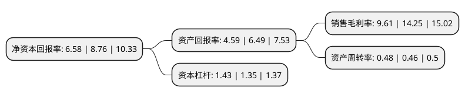

> 本页面由自动化程序生成于 2022年5月20日 01:16
> 内容可能存在错误，如有bug请提交issue至：https://github.com/Eroleice/doc-pi/issues
{.is-warning}

# 上市公司基本情况

## 基本资料

常熟市天银机电股份有限公司（以下简称“天银机电”）成立于2002年08月02日，苏州市。于2012年07月26日在深交所创业板上市。

天银机电注册资本42,503.511万元，主要产品包括起动器，过载保护器，吸气消音器和接线盒等。以下是详细信息：

- 公司名称: 常熟市天银机电股份有限公司
- 股票代码: 300342.SZ
- 所在地: 江苏 - 苏州市
- 成立日期: 2002年08月02日
- 注册资本: 42,503.511万元
- 法定代表人: 赵云文
- 主营业务: 主要产品包括起动器，过载保护器，吸气消音器和接线盒等
- 公司官网: www.tyjd.cc
- 公司介绍: 公司是拥有自主知识产权的冰箱压缩机零部件提供商，专注于节能节材型冰箱压缩机零部件的研发、生产和销售。主要产品包括起动器、过载保护器、吸气消音器和接线盒以及变频控制器等压缩机外围配套电气零部件，同时公司积极拓展了军工电子、工业机器人及自动化成套设备、智能家电零部件以及航天传感器业务。公司拥有国内外多项专利，并先后获得了“国家火炬计划重点高新技术企业”、“江苏名牌产品”等称号，通过了新标准认定的“高新技术企业”。公司已获得ISO9001质量体系、ISO14001环境体系以及OHSAS18001职业健康安全管理体系认证，体系健全而且运行有效。

## 股东及高管情况

上市公司第一大股东为佛山市澜海瑞兴股权投资合伙企业(有限合伙)，持股123,200,000股，占比28.99%，**疑似为**上市公司实际控制人。

截至2022年03月31日，上市公司的前十大股东中，共有3名自然人股东，7名机构股东，其中5%以上大股东共有2名。上市公司前十大股东明细如下：

> 未能通过持股比例判定出上市公司实际控制人（持股30%以上）
> 可能存在通过间接持股、联合持股、协议控制等方式拥有实际控制权的主体，具体请参考上市公司定期公告！
{.is-warning}

> 截至2022年03月31日，上市公司前十大股东信息如下：

| 股东名称 | 持股数量（股） | 持股比例 |
| --- | --- | --- |
| 佛山市澜海瑞兴股权投资合伙企业(有限合伙) | 123,200,000 | 28.99% |
| 常熟市天恒投资管理有限公司 | 31,734,413 | 7.47% |
| 赵云文 | 11,710,504 | 2.76% |
| 常熟市恒泰投资有限公司 | 9,134,765 | 2.15% |
| 常熟市发展投资有限公司 | 8,080,800 | 1.9% |
| 广东联塑博润股权投资管理有限公司-佛山市顺德区联塑山汇乐安居投资合伙企业(有限合伙) | 3,930,400 | 0.92% |
| 广东南海产业集团有限公司 | 3,451,525 | 0.81% |
| 常熟市天聚投资管理有限公司 | 2,956,900 | 0.7% |
| 孙亚光 | 2,372,366 | 0.56% |
| 李方慧 | 1,839,440 | 0.43% |

## 利润表分析

上市公司2021年总收入为10.39亿元，净利润为0.99亿元，实现盈利。

## 杜邦分析

> 数据列示周期：2021年 | 2020年 | 2019年
{.is-info}

上市公司的净资产收益率在近一年有所下降，下降幅度为-24.89%，其变化情况分解如下：
- 上市公司的销售毛利率在近一年下降了-32.56%，可能是生产效率的下降、商品原材料价格上涨或商品价格的下跌所致。
- 上市公司的资产周转率在近一年上升了4.35%，可能是源自于更快的销售回款或库存管理效果提升。
- 上市公司的财务杠杆比率在近一年上升了5.93%，可能是增加负债扩大生产规模。

