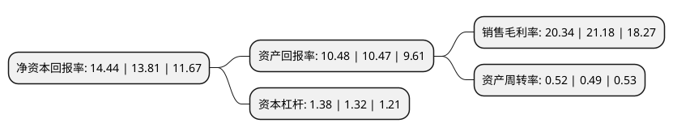

> 本页面由自动化程序生成于 2022年5月20日 01:17
> 内容可能存在错误，如有bug请提交issue至：https://github.com/Eroleice/doc-pi/issues
{.is-warning}

# 上市公司基本情况

## 基本资料

汉宇集团股份有限公司（以下简称“汉宇集团”）成立于2002年11月26日，江门市。于2014年10月30日在深交所创业板上市。

汉宇集团注册资本60,300万元，主要产品:家用电器排水泵，洗碗机用洗涤循环泵和少量气泡泵，进水阀，水洗机，迷你洗衣机等相关产品。主营业务:高效节能家用电器排水泵的研发，生产和销售。以下是详细信息：

- 公司名称: 汉宇集团股份有限公司
- 股票代码: 300403.SZ
- 所在地: 广东 - 江门市
- 成立日期: 2002年11月26日
- 注册资本: 60,300万元
- 法定代表人: 石华山
- 主营业务: 主要产品:家用电器排水泵，洗碗机用洗涤循环泵和少量气泡泵，进水阀，水洗机，迷你洗衣机等相关产品主营业务:高效节能家用电器排水泵的研发，生产和销售
- 公司官网: www.idearhanyu.com
- 公司介绍: 公司是专用排水泵供应商。主营业务为高效节能家用电器排水泵的研发、生产和销售。公司产品包括家用电器排水泵和少量气泡泵、进水阀、水洗机、迷你洗衣机等相关产品。产品获得了包括三星、LG、海尔、美的，东芝、夏普、伊莱克斯等国内外著名的家电制造企业的认可。公司铝漆包线代替铜漆包线技术及线圈塑封技术、叶轮启动机构技术和水冷技术创新均已获得专利。公司被认定为高新技术企业和广东省省级企业技术中心，高效全塑封铝漆包线永磁电机式排水泵产品被认定为广东省高新技术产品。

## 股东及高管情况

上市公司第一大股东为石华山，持股247,390,608股，占比41.03%，为上市公司实际控制人。

截至2022年03月31日，上市公司的前十大股东中，共有9名自然人股东，1名机构股东，其中5%以上大股东共有2名。上市公司前十大股东明细如下：

> 截至2022年03月31日，上市公司前十大股东信息如下：

| 股东名称 | 持股数量（股） | 持股比例 |
| --- | --- | --- |
| 石华山 | 247,390,608 | 41.03% |
| 泰安圣宇企业管理咨询服务中心(有限合伙) | 74,457,690 | 12.35% |
| 王大威 | 6,123,888 | 1.02% |
| 马春寿 | 4,473,000 | 0.74% |
| 夏煜 | 2,667,319 | 0.44% |
| 彭兆里 | 2,300,600 | 0.38% |
| 叶凡 | 2,267,500 | 0.38% |
| 黄桂良 | 2,207,722 | 0.37% |
| 陈峰 | 1,900,000 | 0.32% |
| 文清娥 | 1,897,200 | 0.31% |

## 利润表分析

上市公司2021年总收入为11.28亿元，净利润为2.29亿元，实现盈利。

## 杜邦分析

> 数据列示周期：2021年 | 2020年 | 2019年
{.is-info}

上市公司的净资产收益率在近一年有所上升，上升幅度为4.56%，其变化情况分解如下：
- 上市公司的销售毛利率在近一年下降了-3.97%，可能是生产效率的下降、商品原材料价格上涨或商品价格的下跌所致。
- 上市公司的资产周转率在近一年上升了6.12%，可能是源自于更快的销售回款或库存管理效果提升。
- 上市公司的财务杠杆比率在近一年上升了4.55%，可能是增加负债扩大生产规模。

