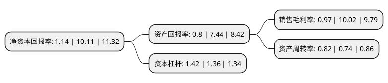

> 本页面由自动化程序生成于 2022年5月20日 01:19
> 内容可能存在错误，如有bug请提交issue至：https://github.com/Eroleice/doc-pi/issues
{.is-warning}

# 上市公司基本情况

## 基本资料

广东三雄极光照明股份有限公司（以下简称“三雄极光”）成立于2010年05月19日，广州市。于2017年03月17日在深交所创业板上市。

三雄极光注册资本28,000万元，主营业务:绿色照明灯具，照明光源及照明控制类产品的研发，生产和销售。主要产品:LED照明产品，传统照明产品和照明控制及其他产品等三大类产品。以下是详细信息：

- 公司名称: 广东三雄极光照明股份有限公司
- 股票代码: 300625.SZ
- 所在地: 广东 - 广州市
- 成立日期: 2010年05月19日
- 注册资本: 28,000万元
- 法定代表人: 张宇涛
- 主营业务: 主营业务:绿色照明灯具，照明光源及照明控制类产品的研发，生产和销售主要产品:LED照明产品，传统照明产品和照明控制及其他产品等三大类产品
- 公司官网: www.pak.com.cn
- 公司介绍: 公司一直致力于研发、生产、推广高品质的绿色节能照明产品，为客户提供全方位的照明解决方案和专业服务。产品品类包括LED、HID、荧光灯、卤素灯等配套光源、电器和灯具，全方位涵盖商业照明、办公照明、工业照明、户外照明、家居照明等领域，成为国内最具综合竞争实力的照明品牌之一。多年来，三雄·极光始终奉行“倡科学管理，求质量效益，创卓越品牌，让客户满意”的质量方针，通过中国节能认证、3C认证、国家消防认证、CE、VDE、TUV认证、ISO14001：2004环境管理体系、ISO9001国际质量体系等认证，被认定为“广东省高新技术企业”、“中国优秀民营科技企业”。

## 股东及高管情况

上市公司第一大股东为张宇涛，持股62,270,297股，占比22.24%，**疑似为**上市公司实际控制人。

截至2022年05月18日，上市公司的前十大股东中，共有10名自然人股东，其中5%以上大股东共有6名。上市公司前十大股东明细如下：

> 未能通过持股比例判定出上市公司实际控制人（持股30%以上）
> 可能存在通过间接持股、联合持股、协议控制等方式拥有实际控制权的主体，具体请参考上市公司定期公告！
{.is-warning}

> 截至2022年05月18日，上市公司前十大股东信息如下：

| 股东名称 | 持股数量（股） | 持股比例 |
| --- | --- | --- |
| 张宇涛 | 62,270,297 | 22.24% |
| 张宇涛 | 62,270,297 | 22.24% |
| 林岩 | 50,965,843 | 18.2% |
| 林岩 | 50,965,843 | 18.2% |
| 张贤庆 | 45,965,743 | 16.4163% |
| 陈松辉 | 24,540,417 | 8.76% |
| 王展鸿 | 3,750,000 | 1.34% |
| 黄建中 | 3,231,900 | 1.15% |
| 黄伟坚 | 1,557,098 | 0.56% |
| 王进南 | 1,410,000 | 0.5% |

## 利润表分析

上市公司2021年总收入为27.08亿元，净利润为0.26亿元，实现盈利。

## 杜邦分析

> 数据列示周期：2021年 | 2020年 | 2019年
{.is-info}

上市公司的净资产收益率在近一年有所下降，下降幅度为-88.72%，其变化情况分解如下：
- 上市公司的销售毛利率在近一年下降了-90.32%，可能是生产效率的下降、商品原材料价格上涨或商品价格的下跌所致。
- 上市公司的资产周转率在近一年上升了10.81%，可能是源自于更快的销售回款或库存管理效果提升。
- 上市公司的财务杠杆比率在近一年上升了4.41%，可能是增加负债扩大生产规模。

