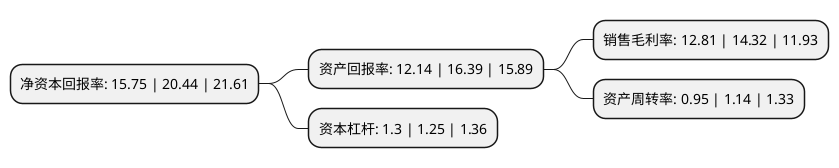

> 本页面由自动化程序生成于 2022年5月20日 01:20
> 内容可能存在错误，如有bug请提交issue至：https://github.com/Eroleice/doc-pi/issues
{.is-warning}

# 上市公司基本情况

## 基本资料

深圳市北鼎晶辉科技股份有限公司（以下简称“北鼎股份”）成立于2003年05月09日，深圳市。于2020年06月19日在深交所创业板上市。

北鼎股份注册资本21,740万元，厨房小家电产品，如养生壶，烤箱，饮水机，开水煲，多士炉，蒸锅等;养生食材，烘焙周边以下是详细信息：

- 公司名称: 深圳市北鼎晶辉科技股份有限公司
- 股票代码: 300824.SZ
- 所在地: 广东 - 深圳市
- 成立日期: 2003年05月09日
- 注册资本: 21,740万元
- 法定代表人: GEORGE MOHAN ZHANG
- 主营业务: 厨房小家电产品，如养生壶，烤箱，饮水机，开水煲，多士炉，蒸锅等;养生食材，烘焙周边
- 公司官网: www.buydeem.com
- 公司介绍: 公司创立于1988年的晶辉集团，是全球最专业的厨房小家电研发基地及生产厂家之一。是一个集技术专利，市场调研，工业设计，半成品加工，产品装配，产品认证，自主品牌以及售后服务为一体的现代化集团。公司厂房面积55000平方米左右，年销售额为4-5亿人民币。公司主力研发，设计，生产高品质多士炉，电子水煲，电蒸锅以及电烤炉。多年来，北鼎晶辉与Groupe SEB,Walmart,GE,Whirlpool,Delonghi，Kenwood，Sunbeam，Breville等世界著名品牌合作，每年生产各式产品约四百万台，畅销于欧洲，美洲，澳洲，中东等70多个国家和地区，全球市场覆盖率高达60%。多年来与国际知名品牌的合作，奠定了北鼎晶辉坚实的团队基础。北鼎晶辉具备国际一流的市场、研发和设计团队。公司到目前为止共申请了各种专利计135件，其中已授权的专利有94件，其中发明专利13件，实用新型47件，外观设计23件。更拥有PCT国际申请11件。目前公司申请专利平均每月2项。北鼎晶辉的产品在国际上屡获大奖，其中包括设计界的“奥斯卡”–德国红点和IF设计大奖。

## 股东及高管情况

上市公司第一大股东为晶辉电器集团有限公司，持股61,000,000股，占比28.06%，**疑似为**上市公司实际控制人。

截至2022年03月31日，上市公司的前十大股东中，共有7名自然人股东，1名机构股东，2个产品账户，其中5%以上大股东共有2名。上市公司前十大股东明细如下：

> 未能通过持股比例判定出上市公司实际控制人（持股30%以上）
> 可能存在通过间接持股、联合持股、协议控制等方式拥有实际控制权的主体，具体请参考上市公司定期公告！
{.is-warning}

> 截至2022年03月31日，上市公司前十大股东信息如下：

| 股东名称 | 持股数量（股） | 持股比例 |
| --- | --- | --- |
| 晶辉电器集团有限公司 | 61,000,000 | 28.06% |
| 张北 | 53,286,054 | 24.51% |
| 张席中夏 | 9,602,000 | 4.42% |
| 席冰 | 7,580,000 | 3.49% |
| 方镇 | 7,429,000 | 3.42% |
| 广东广垦太证现代农业股权投资基金(有限合伙) | 3,620,000 | 1.67% |
| 广州市玄元投资管理有限公司-玄元元君1号私募证券投资基金 | 3,000,000 | 1.38% |
| 管杰 | 2,348,000 | 1.08% |
| 杜长喜 | 2,000,100 | 0.92% |
| 王初阳 | 1,740,200 | 0.8% |

## 利润表分析

上市公司2021年总收入为8.46亿元，净利润为1.08亿元，实现盈利。

## 杜邦分析

> 数据列示周期：2021年 | 2020年 | 2019年
{.is-info}

上市公司的净资产收益率在近一年有所下降，下降幅度为-22.95%，其变化情况分解如下：
- 上市公司的销售毛利率在近一年下降了-10.54%，可能是生产效率的下降、商品原材料价格上涨或商品价格的下跌所致。
- 上市公司的资产周转率在近一年下降了-16.67%，可能是源自于更慢的销售回款或库存管理效果下降。
- 上市公司的财务杠杆比率在近一年上升了4%，可能是增加负债扩大生产规模。

