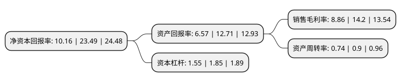

> 本页面由自动化程序生成于 2022年5月20日 01:22
> 内容可能存在错误，如有bug请提交issue至：https://github.com/Eroleice/doc-pi/issues
{.is-warning}

# 上市公司基本情况

## 基本资料

浙江宏昌电器科技股份有限公司（以下简称“宏昌科技”）成立于1996年05月03日，金华市。于2021年06月11日在深交所创业板上市。

宏昌科技注册资本6,666.667万元，主营业务为流体电磁阀，传感器及其他电器配件的研发，生产和销售。主要产品包括流体电磁阀，模块化组件及水位传感器以下是详细信息：

- 公司名称: 浙江宏昌电器科技股份有限公司
- 股票代码: 301008.SZ
- 所在地: 浙江 - 金华市
- 成立日期: 1996年05月03日
- 注册资本: 6,666.667万元
- 法定代表人: 陆宝宏
- 主营业务: 主营业务为流体电磁阀，传感器及其他电器配件的研发，生产和销售主要产品包括流体电磁阀，模块化组件及水位传感器
- 公司官网: www.hongchang.com.cn
- 公司介绍: 公司主营业务为流体电磁阀、传感器及其他电器配件的研发、生产和销售。公司主要产品包括流体电磁阀、模块化组件及水位传感器，是生产各类家用电器的重要构件。公司的电磁阀产品可通过电磁驱动控制流体的进出通断和流量，广泛应用于洗衣机、净水器、智能坐便器、洗碗机等家电厨卫领域。公司是国内较早从事流体电磁阀研发生产的企业之一，在二十余年的发展历程中，公司伴随着国内洗衣机等家电行业的发展而不断产品创新和技术积累，逐步发展成为一家生产规模领先、产品种类丰富、研发实力雄厚的磁感控制产品专业制造企业。

## 股东及高管情况

上市公司第一大股东为浙江宏昌控股有限公司，持股23,578,550股，占比35.37%，为上市公司实际控制人。

截至2022年03月31日，上市公司的前十大股东中，共有6名自然人股东，4名机构股东，其中5%以上大股东共有3名。上市公司前十大股东明细如下：

> 截至2022年03月31日，上市公司前十大股东信息如下：

| 股东名称 | 持股数量（股） | 持股比例 |
| --- | --- | --- |
| 浙江宏昌控股有限公司 | 23,578,550 | 35.37% |
| 陆宝宏 | 10,285,700 | 15.43% |
| 周慧明 | 6,651,450 | 9.98% |
| 浙江省创业投资集团有限公司 | 3,250,000 | 4.87% |
| 陆灿 | 1,714,300 | 2.57% |
| 金华宏盛企业管理合伙企业(有限合伙) | 1,700,000 | 2.55% |
| 金华宏合企业管理合伙企业(有限合伙) | 1,300,000 | 1.95% |
| 陆宝明 | 722,500 | 1.08% |
| 许旭红 | 452,500 | 0.68% |
| 邹英姿 | 347,189 | 0.52% |

## 利润表分析

上市公司2021年总收入为7.67亿元，净利润为0.68亿元，实现盈利。

## 杜邦分析

> 数据列示周期：2021年 | 2020年 | 2019年
{.is-info}

上市公司的净资产收益率在近一年有所下降，下降幅度为-56.75%，其变化情况分解如下：
- 上市公司的销售毛利率在近一年下降了-37.61%，可能是生产效率的下降、商品原材料价格上涨或商品价格的下跌所致。
- 上市公司的资产周转率在近一年下降了-17.78%，可能是源自于更慢的销售回款或库存管理效果下降。
- 上市公司的财务杠杆比率在近一年下降了-16.22%，可能是减少负债降低财务费用。

