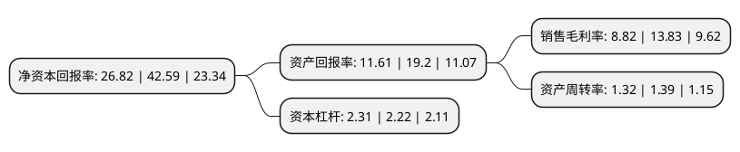

> 本页面由自动化程序生成于 2022年5月20日 01:23
> 内容可能存在错误，如有bug请提交issue至：https://github.com/Eroleice/doc-pi/issues
{.is-warning}

## 股东及高管情况

上市公司第一大股东为Santa Barbara Investment LLC，持股123,269,439股，占比67.51%，为上市公司实际控制人。

截至2022年04月22日，上市公司的前十大股东中，共有1名自然人股东，3名机构股东，4个产品账户，2个海外主体，其中5%以上大股东共有1名。上市公司前十大股东明细如下：

> 截至2022年04月22日，上市公司前十大股东信息如下：

| 股东名称 | 持股数量（股） | 持股比例 |
| --- | --- | --- |
| Santa Barbara Investment LLC | 123,269,439 | 67.51% |
| WEIDONG LU | 6,487,865 | 3.55% |
| 苏州市熙坤投资中心(有限合伙) | 2,635,785 | 1.44% |
| 苏州腾恒投资中心(有限合伙) | 2,340,350 | 1.28% |
| 孙莉 | 2,222,222 | 1.22% |
| 中泰证券股份有限公司 | 456,873 | 0.25% |
| 中国石油天然气集团公司企业年金计划-中国工商银行股份有限公司 | 61,313 | 0.03% |
| 中国建设银行股份有限公司企业年金计划-中国工商银行股份有限公司 | 52,554 | 0.03% |
| 浙江省叁号职业年金计划-建设银行 | 52,554 | 0.03% |
| 中国工商银行股份有限公司企业年金计划-中国建设银行股份有限公司 | 43,795 | 0.02% |

## 利润表分析

上市公司2021年总收入为13.14亿元，净利润为1.15亿元，实现盈利。

## 杜邦分析

> 数据列示周期：2021年 | 2020年 | 2019年
{.is-info}

上市公司的净资产收益率在近一年有所下降，下降幅度为-37.03%，其变化情况分解如下：
- 上市公司的销售毛利率在近一年下降了-36.23%，可能是生产效率的下降、商品原材料价格上涨或商品价格的下跌所致。
- 上市公司的资产周转率在近一年下降了-5.04%，可能是源自于更慢的销售回款或库存管理效果下降。
- 上市公司的财务杠杆比率在近一年上升了4.05%，可能是增加负债扩大生产规模。

