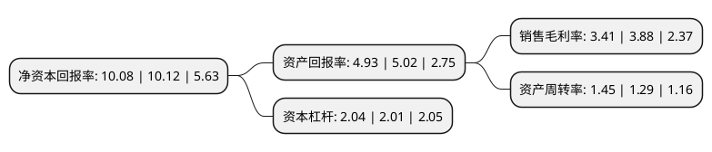

> 本页面由自动化程序生成于 2022年5月20日 01:24
> 内容可能存在错误，如有bug请提交issue至：https://github.com/Eroleice/doc-pi/issues
{.is-warning}

# 上市公司基本情况

## 基本资料

海信视像科技股份有限公司（以下简称“海信视像”）成立于1997年04月17日，青岛市。于1997年04月22日在上交所主板上市。

海信视像注册资本130,826.122万元，主要产品:电视产品。主营业务:电视产品的研发，生产和销售。以下是详细信息：

- 公司名称: 海信视像科技股份有限公司
- 股票代码: 600060.SH
- 所在地: 山东 - 青岛市
- 成立日期: 1997年04月17日
- 注册资本: 130,826.122万元
- 法定代表人: 程开训
- 主营业务: 主要产品:电视产品主营业务:电视产品的研发，生产和销售
- 公司官网: visual.hisense.com
- 公司介绍: 公司主要从事电视产品的研发、生产和销售。公司秉承技术立企、稳健经营的发展战略，深耕研发，在全球范围内率先推出ULED超画质电视、4K激光电视等高端差异化产品，成为电视行业的领跑者,同时发展互联网运营业务，打造领先的智能云平台。公司已形成了以数字多媒体技术、智能信息系统技术、现代通信技术、绿色节能制冷技术、城市智能交通技术、光通讯技术、医疗电子技术、激光显示技术为支撑，涵盖多媒体、家电、IT智能信息系统和现代地产的产业格局。

## 股东及高管情况

上市公司第一大股东为海信集团控股股份有限公司，持股392,505,971股，占比30.002%，为上市公司实际控制人。

截至2022年03月31日，上市公司的前十大股东中，共有2名机构股东，8个产品账户，其中5%以上大股东共有2名。上市公司前十大股东明细如下：

> 截至2022年03月31日，上市公司前十大股东信息如下：

| 股东名称 | 持股数量（股） | 持股比例 |
| --- | --- | --- |
| 海信集团控股股份有限公司 | 392,505,971 | 30.002% |
| 海信集团有限公司 | 216,293,231 | 16.53% |
| 中国银行股份有限公司-嘉实价值驱动一年持有期混合型证券投资基金 | 19,657,824 | 1.5% |
| 全国社保基金一零三组合 | 15,999,899 | 1.22% |
| 中国银行股份有限公司-嘉实价值精选股票型证券投资基金 | 14,983,867 | 1.15% |
| 交通银行股份有限公司-嘉实价值发现三个月定期开放混合型发起式证券投资基金 | 13,157,285 | 1.01% |
| 中国银行股份有限公司-嘉实领先优势混合型证券投资基金 | 13,150,197 | 1.01% |
| 中国工商银行股份有限公司-东方红新动力灵活配置混合型证券投资基金 | 8,696,300 | 0.66% |
| 中国农业银行股份有限公司-嘉实新兴产业股票型证券投资基金 | 6,778,208 | 0.52% |
| 中国银行股份有限公司-嘉实价值优势混合型证券投资基金 | 6,373,730 | 0.49% |

## 利润表分析

上市公司2021年总收入为468.01亿元，净利润为15.95亿元，实现盈利。

## 杜邦分析

> 数据列示周期：2021年 | 2020年 | 2019年
{.is-info}

上市公司的净资产收益率在近一年有所下降，下降幅度为-0.4%，其变化情况分解如下：
- 上市公司的销售毛利率在近一年下降了-12.11%，可能是生产效率的下降、商品原材料价格上涨或商品价格的下跌所致。
- 上市公司的资产周转率在近一年上升了12.4%，可能是源自于更快的销售回款或库存管理效果提升。
- 上市公司的财务杠杆比率在近一年上升了1.49%，可能是增加负债扩大生产规模。

