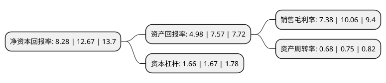

> 本页面由自动化程序生成于 2022年5月20日 01:25
> 内容可能存在错误，如有bug请提交issue至：https://github.com/Eroleice/doc-pi/issues
{.is-warning}

# 上市公司基本情况

## 基本资料

浙江阳光照明电器集团股份有限公司（以下简称“阳光照明”）成立于1997年07月16日，绍兴市。于2000年07月20日在上交所主板上市。

阳光照明注册资本141,465.963万元，主要产品:一体化电子节能灯，T5大功率节能荧光灯及配套灯具，特种光源及灯具。以下是详细信息：

- 公司名称: 浙江阳光照明电器集团股份有限公司
- 股票代码: 600261.SH
- 所在地: 浙江 - 绍兴市
- 成立日期: 1997年07月16日
- 注册资本: 141,465.963万元
- 法定代表人: 陈卫
- 主营业务: 主要产品:一体化电子节能灯，T5大功率节能荧光灯及配套灯具，特种光源及灯具
- 公司官网: www.yankon.com
- 公司介绍: 公司是中国最大的节能灯生产和出口基地之一，国家级高新技术企业。主要生产紧凑型节能荧光灯、电子节能灯、直管型荧光灯、T5大功率节能荧光灯及配套灯具、CCFL荧光屏背景光源及各类台灯系列，是公认的“中国主要的节能灯生产和出口基地”。公司的产品已获得了美国UL、FCC、ENERGYSTAR、欧洲EMC、CE、GS、TUV、VDE、加拿大CSA、巴西PROCEL、北欧五国等近40项国际标准认证，产品远销欧美、东南亚、中东、港澳台等40多个国家和地区。

## 股东及高管情况

上市公司第一大股东为世纪阳光控股集团有限公司，持股466,695,661股，占比32.99%，为上市公司实际控制人。

截至2022年03月31日，上市公司的前十大股东中，共有1名自然人股东，4名机构股东，3个产品账户，2个海外主体，其中5%以上大股东共有2名。上市公司前十大股东明细如下：

> 截至2022年03月31日，上市公司前十大股东信息如下：

| 股东名称 | 持股数量（股） | 持股比例 |
| --- | --- | --- |
| 世纪阳光控股集团有限公司 | 466,695,661 | 32.99% |
| 陈森洁 | 115,439,778 | 8.16% |
| 招商银行股份有限公司-上证红利交易型开放式指数证券投资基金 | 65,344,681 | 4.62% |
| 浙江桢利信息科技有限公司 | 30,748,393 | 2.17% |
| 中央汇金资产管理有限责任公司 | 30,235,600 | 2.14% |
| 绍兴市滨海新城沥海镇集体资产经营公司 | 21,825,055 | 1.54% |
| UBS   AG | 11,748,230 | 0.83% |
| 中国工商银行股份有限公司-富国中证红利指数增强型证券投资基金 | 8,339,900 | 0.59% |
| 香港中央结算有限公司(陆股通) | 8,055,967 | 0.57% |
| 广发基金-农业银行-广发中证金融资产管理计划 | 7,963,500 | 0.56% |

## 利润表分析

上市公司2021年总收入为42.64亿元，净利润为3.14亿元，实现盈利。

## 杜邦分析

> 数据列示周期：2021年 | 2020年 | 2019年
{.is-info}

上市公司的净资产收益率在近一年有所下降，下降幅度为-34.65%，其变化情况分解如下：
- 上市公司的销售毛利率在近一年下降了-26.64%，可能是生产效率的下降、商品原材料价格上涨或商品价格的下跌所致。
- 上市公司的资产周转率在近一年下降了-9.33%，可能是源自于更慢的销售回款或库存管理效果下降。
- 上市公司的财务杠杆比率在近一年下降了-0.6%，可能是减少负债降低财务费用。

