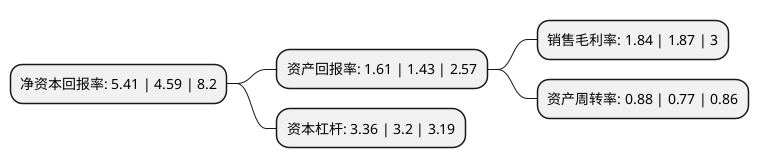

> 本页面由自动化程序生成于 2022年5月20日 01:27
> 内容可能存在错误，如有bug请提交issue至：https://github.com/Eroleice/doc-pi/issues
{.is-warning}

# 上市公司基本情况

## 基本资料

上海海立(集团)股份有限公司（以下简称“海立股份”）成立于1993年03月26日，上海市。于1992年11月16日在上交所主板上市。

海立股份注册资本108,441.991万元，主营业务:主营经营业务为研发，生产和销售空调压缩机，热泵及热泵热水器压缩机以下是详细信息：

- 公司名称: 上海海立(集团)股份有限公司
- 股票代码: 600619.SH
- 所在地: 上海 - 上海市
- 成立日期: 1993年03月26日
- 注册资本: 108,441.991万元
- 法定代表人: 庄华
- 主营业务: 主营业务:主营经营业务为研发，生产和销售空调压缩机，热泵及热泵热水器压缩机
- 公司官网: www.highly.cc
- 公司介绍: 公司于1992年在上海市证交所成功上市，此后携手外资进军空调压缩机产业，并逐步向制冷关联产业领域延伸，如今海立已成长为全球领先的空调压缩机、电机及驱动控制、以及冷暖关联产品研发制造商，形成了“压缩机、电机、驱动控制、冷暖关联”四大关联产业板块业务，产品遍及全球165个国家和地区的亿万家庭。公司主营业务空调压缩机拥有国家级企业技术中心和国家认可实验室、博士后工作站、现代制造技术中心、以及国际先进水平的工艺技术装备和智能制造系统，能够生产各种冷媒、不同电压和频率的9大系列1000多个高效节能机种，产能2000万台，占有全球1/7的市场份额，在全球拥有5家世界级绿色工厂(上海东、上海西、南昌、绵阳、印度)和7个技术服务中心(上海、南昌、广东、米兰、德里、东京、芝加哥)，为全球客户提供属地化的产品、优质的服务和技术支持。

## 股东及高管情况

上市公司第一大股东为上海电气(集团)总公司，持股283,433,348股，占比26.14%，**疑似为**上市公司实际控制人。

截至2022年03月31日，上市公司的前十大股东中，共有3名自然人股东，3名机构股东，2个产品账户，2个海外主体，其中5%以上大股东共有3名。上市公司前十大股东明细如下：

> 未能通过持股比例判定出上市公司实际控制人（持股30%以上）
> 可能存在通过间接持股、联合持股、协议控制等方式拥有实际控制权的主体，具体请参考上市公司定期公告！
{.is-warning}

> 截至2022年03月31日，上市公司前十大股东信息如下：

| 股东名称 | 持股数量（股） | 持股比例 |
| --- | --- | --- |
| 上海电气(集团)总公司 | 283,433,348 | 26.14% |
| 上海电气控股集团有限公司 | 283,433,348 | 26.14% |
| 珠海格力电器股份有限公司 | 90,223,164 | 8.32% |
| GUOTAI JUNAN SECURITIES (HONGKONG) LIMITED | 29,333,688 | 2.71% |
| HAITONG INTERNATIONAL SECURITIES COMPANY LIMITED-ACCOUNT CLIENT | 23,648,460 | 2.18% |
| 李焕云 | 15,304,600 | 1.41% |
| 华一渢 | 14,890,348 | 1.37% |
| 中国银行股份有限公司-华夏行业景气混合型证券投资基金 | 14,580,277 | 1.34% |
| 葛明 | 13,098,380 | 1.21% |
| 汇添富基金-东方国际(集团)有限公司-汇添富东方国际定增1号单一资产管理计划 | 12,658,227 | 1.17% |

## 杜邦分析

> 数据列示周期：2021年 | 2020年 | 2019年
{.is-info}

上市公司的净资产收益率在近一年有所上升，上升幅度为17.86%，其变化情况分解如下：
- 上市公司的销售毛利率在近一年下降了-1.6%，可能是生产效率的下降、商品原材料价格上涨或商品价格的下跌所致。
- 上市公司的资产周转率在近一年上升了14.29%，可能是源自于更快的销售回款或库存管理效果提升。
- 上市公司的财务杠杆比率在近一年上升了5%，可能是增加负债扩大生产规模。

