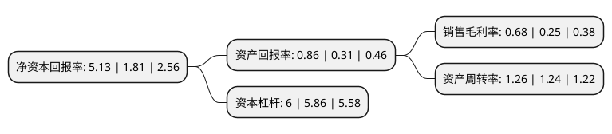

> 本页面由自动化程序生成于 2022年5月20日 01:29
> 内容可能存在错误，如有bug请提交issue至：https://github.com/Eroleice/doc-pi/issues
{.is-warning}

# 上市公司基本情况

## 基本资料

四川长虹电器股份有限公司（以下简称“四川长虹”）成立于1993年04月08日，绵阳市。于1994年03月11日在上交所主板上市。

四川长虹注册资本461,624.422万元，公司主要从事电视机，冰箱，空调，压缩机，视听产品，电池，手机等产品的生产销售，IT产品的销售以及房地产开发等生产经营活动。以下是详细信息：

- 公司名称: 四川长虹电器股份有限公司
- 股票代码: 600839.SH
- 所在地: 四川 - 绵阳市
- 成立日期: 1993年04月08日
- 注册资本: 461,624.422万元
- 法定代表人: 赵勇
- 主营业务: 公司主要从事电视机，冰箱，空调，压缩机，视听产品，电池，手机等产品的生产销售，IT产品的销售以及房地产开发等生产经营活动
- 公司官网: www.changhong.com
- 公司介绍: 公司是一家具有全球竞争力的消费电子系统供应商和内容服务提供商。公司已经实现了从单纯的家电制造商向标准制定商、内容提供商的转变，形成了集数字电视、空调、冰箱、IT、通讯、数码、网络、电源、商用系统电子、小家电等产业研发、生产、销售为一体的多元化、综合型跨国企业集团。公司建立起了开放式的自主技术创新体系，成功构建起完善的全球消费类电子技术创新平台，使公司由传统的家电企业向3C融合的信息家电企业转型，并成功构架跨越广电网、通讯网及互联网的3C产业体系。目前，长虹拥有遍及全国的30000余个营销网络和8000余个服务网点。同时在美洲、澳洲、东南亚、欧洲设立了子公司，经贸往来遍及全球100多个国家和地区。

## 股东及高管情况

上市公司第一大股东为四川长虹电子控股集团有限公司，持股1,071,813,562股，占比23.22%，**疑似为**上市公司实际控制人。

截至2022年03月31日，上市公司的前十大股东中，共有2名自然人股东，1名机构股东，7个产品账户，其中5%以上大股东共有1名。上市公司前十大股东明细如下：

> 未能通过持股比例判定出上市公司实际控制人（持股30%以上）
> 可能存在通过间接持股、联合持股、协议控制等方式拥有实际控制权的主体，具体请参考上市公司定期公告！
{.is-warning}

> 截至2022年03月31日，上市公司前十大股东信息如下：

| 股东名称 | 持股数量（股） | 持股比例 |
| --- | --- | --- |
| 四川长虹电子控股集团有限公司 | 1,071,813,562 | 23.22% |
| 陶爱民 | 19,048,010 | 0.41% |
| 徐爱云 | 13,657,400 | 0.3% |
| 大成基金-农业银行-大成中证金融资产管理计划 | 13,656,810 | 0.3% |
| 工银瑞信基金-农业银行-工银瑞信中证金融资产管理计划 | 13,656,810 | 0.3% |
| 广发基金-农业银行-广发中证金融资产管理计划 | 13,656,810 | 0.3% |
| 银华基金-农业银行-银华中证金融资产管理计划 | 13,656,810 | 0.3% |
| 中欧基金-农业银行-中欧中证金融资产管理计划 | 13,656,810 | 0.3% |
| 易方达基金-农业银行-易方达中证金融资产管理计划 | 13,656,810 | 0.3% |
| 博时基金-农业银行-博时中证金融资产管理计划 | 13,656,810 | 0.3% |

## 利润表分析

上市公司2021年总收入为996.31亿元，净利润为6.75亿元，实现盈利。

## 杜邦分析

> 数据列示周期：2021年 | 2020年 | 2019年
{.is-info}

上市公司的净资产收益率在近一年有所上升，上升幅度为183.43%，其变化情况分解如下：
- 上市公司的销售毛利率在近一年上升了172%，可能是生产效率的提升、商品原材料价格下跌或商品价格的上涨所致。
- 上市公司的资产周转率在近一年上升了1.61%，可能是源自于更快的销售回款或库存管理效果提升。
- 上市公司的财务杠杆比率在近一年上升了2.39%，可能是增加负债扩大生产规模。

