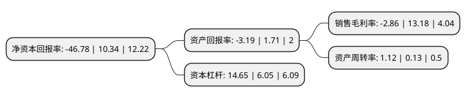

> 本页面由自动化程序生成于 2022年5月20日 01:29
> 内容可能存在错误，如有bug请提交issue至：https://github.com/Eroleice/doc-pi/issues
{.is-warning}

# 上市公司基本情况

## 基本资料

厦门华侨电子股份有限公司（以下简称“*ST厦华”）成立于1993年12月31日，厦门市。于1995年02月28日在上交所主板上市。

*ST厦华注册资本52,319.967万元，代采贸易业务，进口贸易业务，教育信息化服务业务以下是详细信息：

- 公司名称: 厦门华侨电子股份有限公司
- 股票代码: 600870.SH
- 所在地: 福建 - 厦门市
- 成立日期: 1993年12月31日
- 注册资本: 52,319.967万元
- 法定代表人: 陈诗毅
- 主营业务: 代采贸易业务，进口贸易业务，教育信息化服务业务
- 公司官网: null
- 公司介绍: 公司原是一家专业的彩电生产企业，致力于液晶电视、等离子电视和数字高清晰度电视等高端产品的自主创新、研发与制造，目前服务内容主要为为其代采产品，即根据客户提出的采购委托，以自身名义购入商品，最终将商品销售给客户或客户指定的购买商，并通过赚取商品价差获得利润。公司开展进口贸易业务主要系从中国台湾进口花王产品在大陆地区销售给唯品会(中国)有限公司、上海丽婴房婴童用品有限公司等客户。2018年5月，公司与上海富轶信息科技有限公司共同设立控股子公司春申厦华，通过与专业运营团队在教育信息化建设方面的合作，开展教育信息化工程建设、软硬件销售等业务。

## 股东及高管情况

上市公司第一大股东为深圳市力信达科技有限公司，持股72,416,000股，占比13.84%，**疑似为**上市公司实际控制人。

截至2022年03月31日，上市公司的前十大股东中，共有7名自然人股东，2名机构股东，1名其他股东，其中5%以上大股东共有2名。上市公司前十大股东明细如下：

> 未能通过持股比例判定出上市公司实际控制人（持股30%以上）
> 可能存在通过间接持股、联合持股、协议控制等方式拥有实际控制权的主体，具体请参考上市公司定期公告！
{.is-warning}

> 截至2022年03月31日，上市公司前十大股东信息如下：

| 股东名称 | 持股数量（股） | 持股比例 |
| --- | --- | --- |
| 深圳市力信达科技有限公司 | 72,416,000 | 13.84% |
| 赣州鑫域投资管理有限公司 | 59,173,696 | 11.31% |
| 王春芳 | 26,170,000 | 5% |
| 朱文 | 10,530,969 | 2.01% |
| 孟慧娟 | 8,379,300 | 1.6% |
| 唐资江 | 7,506,023 | 1.43% |
| 唐建平 | 6,685,220 | 1.28% |
| 朱向军 | 6,238,457 | 1.19% |
| 王锦山 | 5,530,400 | 1.06% |
| 法国兴业银行 | 5,383,802 | 1.03% |

## 利润表分析

上市公司2021年总收入为1.52亿元，净利润为-0.05亿元，**未实现盈利**。

## 杜邦分析

> 数据列示周期：2021年 | 2020年 | 2019年
{.is-info}

上市公司的净资产收益率在近一年有所下降，下降幅度为-552.42%，其变化情况分解如下：
- 上市公司的销售毛利率在近一年下降了-121.7%，可能是生产效率的下降、商品原材料价格上涨或商品价格的下跌所致。
- 上市公司的资产周转率在近一年上升了761.54%，可能是源自于更快的销售回款或库存管理效果提升。
- 上市公司的财务杠杆比率在近一年上升了142.15%，可能是增加负债扩大生产规模。

