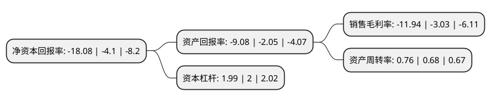

> 本页面由自动化程序生成于 2022年5月20日 01:30
> 内容可能存在错误，如有bug请提交issue至：https://github.com/Eroleice/doc-pi/issues
{.is-warning}

# 上市公司基本情况

## 基本资料

惠而浦(中国)股份有限公司（以下简称“惠而浦”）成立于2000年03月30日，合肥市。于2004年07月27日在上交所主板上市。

惠而浦注册资本76,643.9万元，全自动洗衣机，微波炉以下是详细信息：

- 公司名称: 惠而浦(中国)股份有限公司
- 股票代码: 600983.SH
- 所在地: 安徽 - 合肥市
- 成立日期: 2000年03月30日
- 注册资本: 76,643.9万元
- 法定代表人: 梁惠强
- 主营业务: 全自动洗衣机，微波炉
- 公司官网: www.whirlpool.com.cn
- 公司介绍: 公司坐落在合肥高新技术产业开发区，公司旗下拥有惠而浦、三洋、帝度、荣事达四大品牌，业务遍及全球40多个国家和地区，涵盖冰箱、洗衣机等白色家电，以及厨房电器、生活电器等系列产品线，公司先后被评为“全国优秀外商投资企业”、“全国轻工业先进集体”。公司前身为合肥荣事达三洋电器股份有限公司(合肥三洋)，2014年与惠而浦集团战略合作，成功变身为“惠而浦(中国)股份有限公司”，开始新一轮跨越发展的征程。惠而浦集团是世界上最大的大型家用电器制造商之一，创立于1911年，总部位于美国密歇根州的奔腾港，旗下拥有惠而浦、美泰克、阿曼纳等诸多知名国际品牌，业务遍及全球，在世界各地拥有共计70多家个生产基地、研发中心和设计中心。

## 股东及高管情况

上市公司第一大股东为广东格兰仕家用电器制造有限公司，持股437,707,900股，占比57.11%，为上市公司实际控制人。

截至2022年03月31日，上市公司的前十大股东中，共有5名自然人股东，5名机构股东，其中5%以上大股东共有2名。上市公司前十大股东明细如下：

> 截至2022年03月31日，上市公司前十大股东信息如下：

| 股东名称 | 持股数量（股） | 持股比例 |
| --- | --- | --- |
| 广东格兰仕家用电器制造有限公司 | 437,707,900 | 57.11% |
| 惠而浦(中国)投资有限公司 | 152,521,361 | 19.9% |
| 合肥市国有资产控股有限公司 | 25,566,600 | 3.34% |
| 东莞市东联投资有限公司 | 8,510,200 | 1.11% |
| 吴丽芳 | 7,750,000 | 1.01% |
| 吴国彪 | 4,783,794 | 0.62% |
| 张珩 | 4,177,061 | 0.54% |
| 罗日全 | 3,755,000 | 0.49% |
| 连俊亮 | 1,680,306 | 0.22% |
| 广东省东莞市东联进出口有限公司 | 1,479,910 | 0.19% |

## 利润表分析

上市公司2021年总收入为49.31亿元，净利润为-5.89亿元，**未实现盈利**。

## 杜邦分析

> 数据列示周期：2021年 | 2020年 | 2019年
{.is-info}

上市公司的净资产收益率在近一年有所上升，上升幅度为340.98%，其变化情况分解如下：
- 上市公司的销售毛利率在近一年上升了294.06%，可能是生产效率的提升、商品原材料价格下跌或商品价格的上涨所致。
- 上市公司的资产周转率在近一年上升了11.76%，可能是源自于更快的销售回款或库存管理效果提升。
- 上市公司的财务杠杆比率在近一年下降了-0.5%，可能是减少负债降低财务费用。

