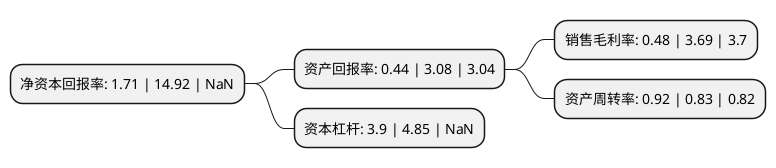

> 本页面由自动化程序生成于 2022年5月20日 01:31
> 内容可能存在错误，如有bug请提交issue至：https://github.com/Eroleice/doc-pi/issues
{.is-warning}

# 上市公司基本情况

## 基本资料

湖北东贝机电集团股份有限公司（以下简称“东贝集团”）成立于2002年01月18日，黄石市。于2020年12月25日在上交所主板上市。

东贝集团注册资本51,132万元，研发，生产制冷压缩机，商用制冷器具以下是详细信息：

- 公司名称: 湖北东贝机电集团股份有限公司
- 股票代码: 601956.SH
- 所在地: 湖北 - 黄石市
- 成立日期: 2002年01月18日
- 注册资本: 51,132万元
- 法定代表人: 杨百昌
- 主营业务: 研发，生产制冷压缩机，商用制冷器具
- 公司官网: www.donper.com
- 公司介绍: 公司是目前国内最大、规格品种最全的商用制冷器具制造商，其研发中心为国家级技术研发中心，公司拥有从日本、美国和意大利引进的全套生产线和技术软件，以研发、生产制冷压缩机、商用制冷机械、各类铸件、太阳能产品(光伏产品)为主营业务，产品包括冷(热)饮机、冰淇淋机、制冰机、雪融机、现调机、炒冰机、扎啤机、展示柜和厨房冰箱等9大系列200余种。公司建立了完善的质量管理体系，通过了ISO9001质量体系、ISO14001环境体系和OHSAS18001职业健康安全体系认证。部分产品分别获得了国内的CCC认证、出口欧盟的CE认证和出口美国及南、北美的UL认证。“东贝”“好乐”作为全国知名品牌，不仅畅销国内，而且远销世界各地。

## 股东及高管情况

上市公司第一大股东为黄石汇智投资合伙企业(有限合伙)，持股293,190,042股，占比57.34%，为上市公司实际控制人。

截至2022年03月31日，上市公司的前十大股东中，共有4名自然人股东，5名机构股东，1个海外主体，其中5%以上大股东共有1名。上市公司前十大股东明细如下：

> 截至2022年03月31日，上市公司前十大股东信息如下：

| 股东名称 | 持股数量（股） | 持股比例 |
| --- | --- | --- |
| 黄石汇智投资合伙企业(有限合伙) | 293,190,042 | 57.34% |
| 江苏洛克电气集团有限公司 | 8,249,958 | 1.61% |
| 中国银河证券股份有限公司客户信用交易担保证券账户 | 1,952,050 | 0.38% |
| 李国风 | 1,184,073 | 0.23% |
| 朱锋 | 1,000,000 | 0.2% |
| 姚维舫 | 948,100 | 0.19% |
| 国信证券股份有限公司客户信用交易担保证券账户 | 947,080 | 0.19% |
| JIASHAN SHEN | 825,660 | 0.16% |
| 贺碧凤 | 801,540 | 0.16% |
| 招商证券香港有限公司 | 777,355 | 0.15% |

## 利润表分析

上市公司2021年总收入为60.59亿元，净利润为0.28亿元，实现盈利。

## 杜邦分析

> 数据列示周期：2021年 | 2020年 | 2019年
{.is-info}

上市公司的净资产收益率在近一年有所下降，下降幅度为-88.54%，其变化情况分解如下：
- 上市公司的销售毛利率在近一年下降了-86.99%，可能是生产效率的下降、商品原材料价格上涨或商品价格的下跌所致。
- 上市公司的资产周转率在近一年上升了10.84%，可能是源自于更快的销售回款或库存管理效果提升。
- 上市公司的财务杠杆比率在近一年下降了-19.59%，可能是减少负债降低财务费用。

