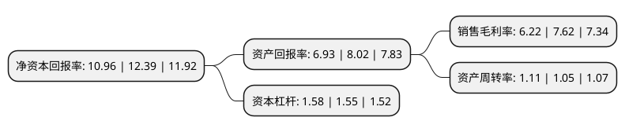

> 本页面由自动化程序生成于 2022年5月20日 01:33
> 内容可能存在错误，如有bug请提交issue至：https://github.com/Eroleice/doc-pi/issues
{.is-warning}

# 上市公司基本情况

## 基本资料

横店集团得邦照明股份有限公司（以下简称“得邦照明”）成立于1996年12月30日，金华市。于2017年03月30日在上交所主板上市。

得邦照明注册资本47,694.458万元，主要从事绿色照明产品的研发，生产，销售。主要产品包括节能灯，LED灯泡和LED室内应用灯具，照明电子产品，户外照明灯具四大类绿色照明产品。以下是详细信息：

- 公司名称: 横店集团得邦照明股份有限公司
- 股票代码: 603303.SH
- 所在地: 浙江 - 金华市
- 成立日期: 1996年12月30日
- 注册资本: 47,694.458万元
- 法定代表人: 倪强
- 主营业务: 主要从事绿色照明产品的研发，生产，销售主要产品包括节能灯，LED灯泡和LED室内应用灯具，照明电子产品，户外照明灯具四大类绿色照明产品
- 公司官网: www.tospolighting.com.cn
- 公司介绍: 公司主营光源、室内灯具、专业灯具、照明控制和工程塑料五大系列产品的研究开发、生产制造和国内外销售，并配套实施照明工程的设计和安装，近年来逐步涉及智慧照明领域。经过多年的发展，公司已形成杭州进出口公司(国际市场)、电商公司及横店公共照明公司(国内市场)为销售机构，杭州与横店两大研发中心为研发前沿，以横店总部为制造基地，以江西瑞金照明公司为支撑和配套的整体格局。公司是国家高新技术企业，国家知识产权示范企业和中国出口质量安全示范企业，被认定为浙江省企业技术中心，获批省级企业研究院，设立了省级院士专家工作站和省级博士后工作站。

## 股东及高管情况

上市公司第一大股东为横店集团控股有限公司，持股235,008,000股，占比49.27%，为上市公司实际控制人。

截至2022年03月31日，上市公司的前十大股东中，共有1名自然人股东，4名机构股东，5个产品账户，其中5%以上大股东共有3名。上市公司前十大股东明细如下：

> 截至2022年03月31日，上市公司前十大股东信息如下：

| 股东名称 | 持股数量（股） | 持股比例 |
| --- | --- | --- |
| 横店集团控股有限公司 | 235,008,000 | 49.27% |
| 浙江横店进出口有限公司 | 91,800,000 | 19.25% |
| 金华德明投资合伙企业(有限合伙) | 30,514,320 | 6.4% |
| 中国银行股份有限公司-华夏行业景气混合型证券投资基金 | 11,396,212 | 2.39% |
| 倪强 | 5,155,300 | 1.08% |
| 浙江埃森化学有限公司 | 4,877,116 | 1.02% |
| 中国建设银行股份有限公司-博时军工主题股票型证券投资基金 | 4,597,512 | 0.96% |
| 北京银行股份有限公司-广发盛锦混合型证券投资基金 | 2,810,371 | 0.59% |
| 华夏基金-信泰人寿保险股份有限公司-分红产品-华夏基金-信泰人寿1号单-资产管理计划 | 2,469,044 | 0.52% |
| 中国建设银行股份有限公司-博时产业新趋势灵活配置混合型证券投资基金 | 1,722,469 | 0.36% |

## 利润表分析

上市公司2021年总收入为52.73亿元，净利润为3.27亿元，实现盈利。

## 杜邦分析

> 数据列示周期：2021年 | 2020年 | 2019年
{.is-info}

上市公司的净资产收益率在近一年有所下降，下降幅度为-11.54%，其变化情况分解如下：
- 上市公司的销售毛利率在近一年下降了-18.37%，可能是生产效率的下降、商品原材料价格上涨或商品价格的下跌所致。
- 上市公司的资产周转率在近一年上升了5.71%，可能是源自于更快的销售回款或库存管理效果提升。
- 上市公司的财务杠杆比率在近一年上升了1.94%，可能是增加负债扩大生产规模。

