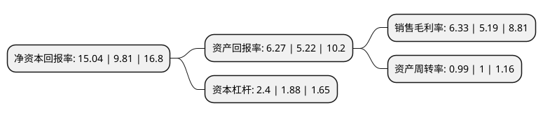

> 本页面由自动化程序生成于 2022年5月20日 01:33
> 内容可能存在错误，如有bug请提交issue至：https://github.com/Eroleice/doc-pi/issues
{.is-warning}

# 上市公司基本情况

## 基本资料

莱克电气股份有限公司（以下简称“莱克电气”）成立于2001年12月26日，苏州市。于2015年05月13日在上交所主板上市。

莱克电气注册资本57,469.09万元，公司主营业务为高端家居清洁健康电器的设计，研发，制造和销售业务，核心业务体系包括规模领先的以吸尘器为代表的家居清洁业务，快速发展的以空气净化器为代表的室内空气清洁业务，以及正在大力开拓的以高端智能净水器为代表的家庭水净化业务。以下是详细信息：

- 公司名称: 莱克电气股份有限公司
- 股票代码: 603355.SH
- 所在地: 江苏 - 苏州市
- 成立日期: 2001年12月26日
- 注册资本: 57,469.09万元
- 法定代表人: 倪祖根
- 主营业务: 公司主营业务为高端家居清洁健康电器的设计，研发，制造和销售业务，核心业务体系包括规模领先的以吸尘器为代表的家居清洁业务，快速发展的以空气净化器为代表的室内空气清洁业务，以及正在大力开拓的以高端智能净水器为代表的家庭水净化业务
- 公司官网: www.lexy.cn
- 公司介绍: 公司致力于自主研发高效节能电机技术，公司主营业务为高端家居清洁健康电器的设计、研发、制造和销售业务，核心业务体系包括规模领先的以吸尘器为代表的家居清洁业务，快速发展的以空气净化器为代表的室内空气清洁业务，以及以高端智能净水器为代表的家庭水净化业务。公司一直专注于微特电机及以微特电机为核心部件的家用电器的技术研究，拥有包括发明专利、实用新型专利、外观专利等在内的国内专利多项，以及国外专利，为国内同行业拥有自主知识产权最多的企业之一。公司重视产品质量控制，先后通过了ISO9001质量管理体系认证、ISO/TS16949质量管理体系认证和ISO14001环境管理体系认证。公司产品通过诸多国际标准的测试和认证，拥有行销全球的通行证，通过了欧盟CE、德国GS、TüV、英国BEAB、美国UL、澳大利亚RCM、中国CCC、CQC、日本PSE等认证。

## 股东及高管情况

上市公司第一大股东为莱克电气投资集团有限公司，持股205,632,000股，占比35.78%，为上市公司实际控制人。

截至2022年03月31日，上市公司的前十大股东中，共有5名自然人股东，3名机构股东，2个海外主体，其中5%以上大股东共有3名。上市公司前十大股东明细如下：

> 截至2022年03月31日，上市公司前十大股东信息如下：

| 股东名称 | 持股数量（股） | 持股比例 |
| --- | --- | --- |
| 莱克电气投资集团有限公司 | 205,632,000 | 35.78% |
| GOLDVAC TRADING LIMITED | 157,220,000 | 27.36% |
| 倪祖根 | 91,685,929 | 15.95% |
| 闵耀平 | 11,784,256 | 2.05% |
| 苏州立达投资有限公司 | 8,960,000 | 1.56% |
| 香港中央结算有限公司(陆股通) | 5,255,255 | 0.91% |
| 黄永清 | 3,674,858 | 0.64% |
| 江月明 | 2,802,380 | 0.49% |
| 李群 | 2,112,960 | 0.37% |
| 华夏人寿保险股份有限公司-自有资金 | 1,567,300 | 0.27% |

## 利润表分析

上市公司2021年总收入为79.45亿元，净利润为5.02亿元，实现盈利。

## 杜邦分析

> 数据列示周期：2021年 | 2020年 | 2019年
{.is-info}

上市公司的净资产收益率在近一年有所上升，上升幅度为53.31%，其变化情况分解如下：
- 上市公司的销售毛利率在近一年上升了21.97%，可能是生产效率的提升、商品原材料价格下跌或商品价格的上涨所致。
- 上市公司的资产周转率在近一年下降了-1%，可能是源自于更慢的销售回款或库存管理效果下降。
- 上市公司的财务杠杆比率在近一年上升了27.66%，可能是增加负债扩大生产规模。

