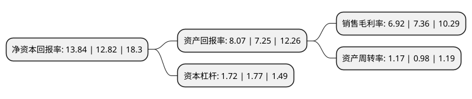

> 本页面由自动化程序生成于 2022年5月20日 01:34
> 内容可能存在错误，如有bug请提交issue至：https://github.com/Eroleice/doc-pi/issues
{.is-warning}

# 上市公司基本情况

## 基本资料

江苏立霸实业股份有限公司（以下简称“立霸股份”）成立于1994年01月19日，无锡市。于2015年03月19日在上交所主板上市。

立霸股份注册资本26,632.784万元，主营业务为家电用复合材料的研发，生产和销售。公司主导产品分为覆膜板(VCM)系列和有机涂层板(PCM)系列两大类。以下是详细信息：

- 公司名称: 江苏立霸实业股份有限公司
- 股票代码: 603519.SH
- 所在地: 江苏 - 无锡市
- 成立日期: 1994年01月19日
- 注册资本: 26,632.784万元
- 法定代表人: 蒋达伟
- 主营业务: 主营业务为家电用复合材料的研发，生产和销售公司主导产品分为覆膜板(VCM)系列和有机涂层板(PCM)系列两大类
- 公司官网: www.jsliba.com
- 公司介绍: 公司主要为国内外知名家电整机企业提供家电外壳用复合材料产品，是国内最具竞争力的专业生产家电用复合材料的企业之一，公司于被认定为江苏省高新技术企业。公司拥有先进的流水线设备、强大的技术研发及生产队伍，专注于家电外观用复合材料的研发、生产和销售。公司产品主要为覆膜板(VCM)系列产品和涂层板(PCM)系列产品，广泛应用于冰箱、洗衣机、热水器、微波炉、空调、高档建筑门板等领域。多年来，公司凭借优秀的产品，优质的服务赢得了国内外客户的信任，与海尔、美菱、美的、海信、小天鹅、康佳、澳柯玛、格力电器、荣事达三洋、LG、三星、西门子、伊莱克斯、阿里斯顿、霍曼门业等国内外知名家电企业建立了长期稳定的合作关系，并多次获得客户颁发的各项荣誉。未来，公司将利用新材料产业加速发展和家电消费结构升级的重大机遇，以各类高质量的家电用复合材料为主导产品，充分发挥技术优势，增强研发能力，提升产品档次，丰富产品种类，使公司发展成为具有国际竞争力的大型专业复合材料提供商。

## 股东及高管情况

上市公司第一大股东为卢凤仙，持股69,039,049股，占比25.92%，**疑似为**上市公司实际控制人。

截至2022年03月31日，上市公司的前十大股东中，共有8名自然人股东，1名机构股东，1个产品账户，其中5%以上大股东共有3名。上市公司前十大股东明细如下：

> 未能通过持股比例判定出上市公司实际控制人（持股30%以上）
> 可能存在通过间接持股、联合持股、协议控制等方式拥有实际控制权的主体，具体请参考上市公司定期公告！
{.is-warning}

> 截至2022年03月31日，上市公司前十大股东信息如下：

| 股东名称 | 持股数量（股） | 持股比例 |
| --- | --- | --- |
| 卢凤仙 | 69,039,049 | 25.92% |
| 盐城东方投资开发集团有限公司 | 58,813,319 | 22.08% |
| 伊犁苏新投资基金合伙企业(有限合伙) | 13,440,000 | 5.05% |
| 蒋达伟 | 11,789,904 | 4.43% |
| 储一平 | 5,040,000 | 1.89% |
| 陈有舵 | 3,943,968 | 1.48% |
| 朱大建 | 1,476,376 | 0.55% |
| 邹本新 | 1,466,200 | 0.55% |
| 闵丽群 | 1,360,118 | 0.51% |
| 谈翼鹏 | 1,219,300 | 0.46% |

## 利润表分析

上市公司2021年总收入为15.86亿元，净利润为1.09亿元，实现盈利。

## 杜邦分析

> 数据列示周期：2021年 | 2020年 | 2019年
{.is-info}

上市公司的净资产收益率在近一年有所上升，上升幅度为7.96%，其变化情况分解如下：
- 上市公司的销售毛利率在近一年下降了-5.98%，可能是生产效率的下降、商品原材料价格上涨或商品价格的下跌所致。
- 上市公司的资产周转率在近一年上升了19.39%，可能是源自于更快的销售回款或库存管理效果提升。
- 上市公司的财务杠杆比率在近一年下降了-2.82%，可能是减少负债降低财务费用。

