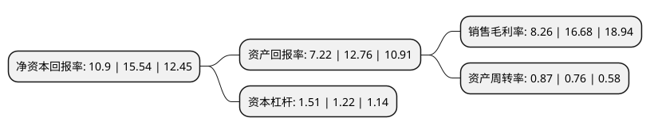

> 本页面由自动化程序生成于 2022年5月20日 01:34
> 内容可能存在错误，如有bug请提交issue至：https://github.com/Eroleice/doc-pi/issues
{.is-warning}

# 上市公司基本情况

## 基本资料

金华春光橡塑科技股份有限公司（以下简称“春光科技”）成立于2000年07月11日，金华市。于2018年07月30日在上交所主板上市。

春光科技注册资本13,440万元，公司主要从事清洁电器软管及配件产品的研发，生产和销售，通过在原料开发，结构方案设计，专用设备研制，模具开发，产品供应，售后服务等方面形成的完善服务体系，致力于为清洁电器制造商提供多元化，系统化，定制化的软管及配件集成解决方案。公司已形成以软管为主，配件为辅的产品体系，其中软管产品主要包括伸缩软管，挤出软管，吹塑软管，吸塑软管和复合缠绕软管等五大类，配件产品主要包括水箱，卷线器，地刷，弯管，水袋，接头和手柄等。此外，接头，手柄，手柄下连接管等配件可与软管组成整套的软管组件系列产品。以下是详细信息：

- 公司名称: 金华春光橡塑科技股份有限公司
- 股票代码: 603657.SH
- 所在地: 浙江 - 金华市
- 成立日期: 2000年07月11日
- 注册资本: 13,440万元
- 法定代表人: 陈正明
- 主营业务: 公司主要从事清洁电器软管及配件产品的研发，生产和销售，通过在原料开发，结构方案设计，专用设备研制，模具开发，产品供应，售后服务等方面形成的完善服务体系，致力于为清洁电器制造商提供多元化，系统化，定制化的软管及配件集成解决方案公司已形成以软管为主，配件为辅的产品体系，其中软管产品主要包括伸缩软管，挤出软管，吹塑软管，吸塑软管和复合缠绕软管等五大类，配件产品主要包括水箱，卷线器，地刷，弯管，水袋，接头和手柄等此外，接头，手柄，手柄下连接管等配件可与软管组成整套的软管组件系列产品
- 公司官网: www.chinacgh.com
- 公司介绍: 公司是专业研发和生产清洁电器软管组件系列产品的国家高新技术企业。公司以“做专、做精、做强，打造中国精品软管”为企业目标，先后开发出伸缩管、锥形管、电子管等创新产品，以满足市场的不同需求。其吸尘器软管的年产量和销售额均列业内领先，迄今已获得多项发明专利和实用新型专利。公司重视产品环保，所生产的产品均符合ROHS、PAHs和REACH环保要求。春光坚持走科技创新之路，不仅为客户提供了优质的产品、合理的价格和完善的服务，更重要的是把为客户提供软管系统整体解决方案作为企业核心竞争力，雄厚的研发和生产能力让春光能够满足客户对产品的并行开发需求，提供最为方便、可靠的软管整体解决方案。

## 股东及高管情况

上市公司第一大股东为浙江春光控股有限公司，持股63,000,000股，占比46.88%，为上市公司实际控制人。

截至2022年03月31日，上市公司的前十大股东中，共有5名自然人股东，2名机构股东，3个产品账户，其中5%以上大股东共有2名。上市公司前十大股东明细如下：

> 截至2022年03月31日，上市公司前十大股东信息如下：

| 股东名称 | 持股数量（股） | 持股比例 |
| --- | --- | --- |
| 浙江春光控股有限公司 | 63,000,000 | 46.88% |
| 陈正明 | 8,400,000 | 6.25% |
| 金华市凯弘投资合伙企业(有限合伙) | 6,458,440 | 4.81% |
| 陈凯 | 6,300,000 | 4.69% |
| 陈弘旋 | 4,200,000 | 3.13% |
| 杭州亘曦资产管理有限公司-亘曦1号私募证券投资基金 | 2,288,000 | 1.7% |
| 袁鑫芳 | 2,100,000 | 1.56% |
| 张春霞 | 2,100,000 | 1.56% |
| 中国建设银行股份有限公司-交银施罗德启道混合型证券投资基金 | 1,800,000 | 1.34% |
| 中国民生银行股份有限公司-光大保德信信用添益债券型证券投资基金 | 1,757,740 | 1.31% |

## 利润表分析

上市公司2021年总收入为12.94亿元，净利润为1.06亿元，实现盈利。

## 杜邦分析

> 数据列示周期：2021年 | 2020年 | 2019年
{.is-info}

上市公司的净资产收益率在近一年有所下降，下降幅度为-29.86%，其变化情况分解如下：
- 上市公司的销售毛利率在近一年下降了-50.48%，可能是生产效率的下降、商品原材料价格上涨或商品价格的下跌所致。
- 上市公司的资产周转率在近一年上升了14.47%，可能是源自于更快的销售回款或库存管理效果提升。
- 上市公司的财务杠杆比率在近一年上升了23.77%，可能是增加负债扩大生产规模。

