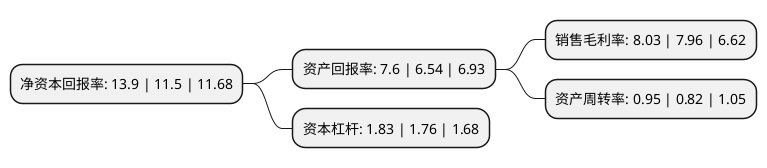

> 本页面由自动化程序生成于 2022年5月20日 01:35
> 内容可能存在错误，如有bug请提交issue至：https://github.com/Eroleice/doc-pi/issues
{.is-warning}

# 上市公司基本情况

## 基本资料

浙江朗迪集团股份有限公司（以下简称“朗迪集团”）成立于1998年03月09日，宁波市。于2016年04月21日在上交所主板上市。

朗迪集团注册资本18,565.12万元，主营业务为空调风叶，风机产品的研发，生产和销售;主要产品:塑料贯流风叶，塑料轴流风叶，塑料离心风叶，金属暖通风机，金属盘管风机，金属离心风机等各种风叶，风机。以下是详细信息：

- 公司名称: 浙江朗迪集团股份有限公司
- 股票代码: 603726.SH
- 所在地: 浙江 - 宁波市
- 成立日期: 1998年03月09日
- 注册资本: 18,565.12万元
- 法定代表人: 高炎康
- 主营业务: 主营业务为空调风叶，风机产品的研发，生产和销售;主要产品:塑料贯流风叶，塑料轴流风叶，塑料离心风叶，金属暖通风机，金属盘管风机，金属离心风机等各种风叶，风机
- 公司官网: www.langdi.com
- 公司介绍: 公司是一家专业生产家用空调类风叶、暖通类风机、工业装备类风机、商用类风机的集团化企业。公司主营空调风叶，生产空调送风系统中的各类风叶、风机，是专业的空调风叶、风机设计制造企业，在行业中占有较高的市场份额。公司产品线丰富，拥有应用于家用空调的塑料贯流、轴流、离心、斜流风叶产品，也拥有应用于商用空调的金属风叶、风机产品，是业内为数不多的能够同时生产塑料风叶和金属风叶、风机产品的专业厂家之一。公司借助塑料风叶已经建立的良好渠道，为客户提供一站式的风叶、风机服务，提高客户的黏性。公司产业链完整，拥有从材料研发、风叶设计、模具开发、生产和检测到最终销售的能力。公司是格力、美的、海尔、开利、日本三菱、韩国LG等知名品牌空调风叶、风机产品的核心供应商，也与长虹、春兰、科龙等大型空调厂商建立了稳定的合作关系，产品出口韩国、日本。公司拥有市级工程技术中心，小型实验测试中心，拥有设备精良的模具厂，有较强的模具设计和开发优势。

## 股东及高管情况

上市公司第一大股东为高炎康，持股98,708,232股，占比53.17%，为上市公司实际控制人。

截至2022年03月31日，上市公司的前十大股东中，共有10名自然人股东，其中5%以上大股东共有2名。上市公司前十大股东明细如下：

> 截至2022年03月31日，上市公司前十大股东信息如下：

| 股东名称 | 持股数量（股） | 持股比例 |
| --- | --- | --- |
| 高炎康 | 98,708,232 | 53.17% |
| 李逢泉 | 12,040,920 | 6.49% |
| 干玲娟 | 2,399,040 | 1.29% |
| 陈思涵 | 2,300,000 | 1.24% |
| 陈赛球 | 2,145,740 | 1.16% |
| 高文铭 | 1,960,000 | 1.06% |
| 杨增权 | 1,620,040 | 0.87% |
| 徐国海 | 1,231,647 | 0.66% |
| 杨春 | 1,150,000 | 0.62% |
| 邓志刚 | 1,044,000 | 0.56% |

## 利润表分析

上市公司2021年总收入为18.19亿元，净利润为1.46亿元，实现盈利。

## 杜邦分析

> 数据列示周期：2021年 | 2020年 | 2019年
{.is-info}

上市公司的净资产收益率在近一年有所上升，上升幅度为20.87%，其变化情况分解如下：
- 上市公司的销售毛利率在近一年上升了0.88%，可能是生产效率的提升、商品原材料价格下跌或商品价格的上涨所致。
- 上市公司的资产周转率在近一年上升了15.85%，可能是源自于更快的销售回款或库存管理效果提升。
- 上市公司的财务杠杆比率在近一年上升了3.98%，可能是增加负债扩大生产规模。

