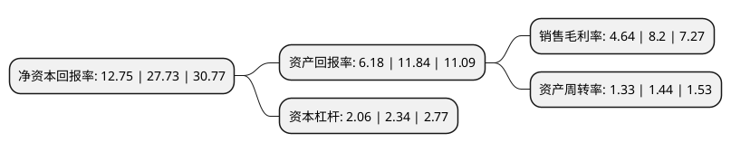

> 本页面由自动化程序生成于 2022年5月20日 01:37
> 内容可能存在错误，如有bug请提交issue至：https://github.com/Eroleice/doc-pi/issues
{.is-warning}

# 上市公司基本情况

## 基本资料

立达信物联科技股份有限公司（以下简称“立达信”）成立于2015年04月07日，厦门市。于2021年07月20日在上交所主板上市。

立达信注册资本50,000万元，主要从事LED照明产品，智能家居和智慧建筑等物联网领域产品的研发，制造，销售及服务以下是详细信息：

- 公司名称: 立达信物联科技股份有限公司
- 股票代码: 605365.SH
- 所在地: 福建 - 厦门市
- 成立日期: 2015年04月07日
- 注册资本: 50,000万元
- 法定代表人: 李江淮
- 主营业务: 主要从事LED照明产品，智能家居和智慧建筑等物联网领域产品的研发，制造，销售及服务
- 公司官网: www.leedarson.com.cn
- 公司介绍: 公司是一家专注于绿色照明和智能家居(Smart Home)及智慧建筑(SmartBuilding)等物联网领域的高新技术企业，是中国照明电器行业十强企业和中国轻工业科技百强企业，是全国LED照明行业的领军企业之一，主要从事LED照明产品、智能家居和智慧建筑等物联网领域产品的研发、制造、销售及服务，致力于成为一流的家居和商业空间综合物联解决方案提供商。公司利用在物联网(IoT)领域的深度布局，将物联网(IoT)板块打造成为未来重点发展的业务板块,公司建有国家认定企业技术中心、中国轻工业重点实验室，承担完成了“国家火炬计划”、“国家重点新产品”等一系列国家级科研项目，已成为家得宝(The Home Depot)、宜家(IKEA)、库珀照明、欧司朗/朗德万斯、昕诺飞(原飞利浦照明)、通用电气(GE)、亚马逊等全球知名厂商的重要合作伙伴，LED照明产品和物联网智能硬件产品主要销往北美、欧洲、亚太、中东等地区。

## 股东及高管情况

上市公司第一大股东为李江淮，持股121,500,000股，占比24.3%，**疑似为**上市公司实际控制人。

截至2022年03月31日，上市公司的前十大股东中，共有10名自然人股东，其中5%以上大股东共有4名。上市公司前十大股东明细如下：

> 未能通过持股比例判定出上市公司实际控制人（持股30%以上）
> 可能存在通过间接持股、联合持股、协议控制等方式拥有实际控制权的主体，具体请参考上市公司定期公告！
{.is-warning}

> 截至2022年03月31日，上市公司前十大股东信息如下：

| 股东名称 | 持股数量（股） | 持股比例 |
| --- | --- | --- |
| 李江淮 | 121,500,000 | 24.3% |
| 李潇帆 | 119,560,950 | 23.91% |
| 李永川 | 90,918,900 | 18.18% |
| 李潇宇 | 72,809,550 | 14.56% |
| 李春华 | 10,815,750 | 2.16% |
| 米莉 | 10,027,350 | 2.01% |
| 杨进美 | 8,550,000 | 1.71% |
| 李冬敏 | 8,550,000 | 1.71% |
| 杨其龙 | 3,420,000 | 0.68% |
| 吴世强 | 3,206,250 | 0.64% |

## 利润表分析

上市公司2021年总收入为64.77亿元，净利润为3亿元，实现盈利。

## 杜邦分析

> 数据列示周期：2021年 | 2020年 | 2019年
{.is-info}

上市公司的净资产收益率在近一年有所下降，下降幅度为-54.02%，其变化情况分解如下：
- 上市公司的销售毛利率在近一年下降了-43.41%，可能是生产效率的下降、商品原材料价格上涨或商品价格的下跌所致。
- 上市公司的资产周转率在近一年下降了-7.64%，可能是源自于更慢的销售回款或库存管理效果下降。
- 上市公司的财务杠杆比率在近一年下降了-11.97%，可能是减少负债降低财务费用。

