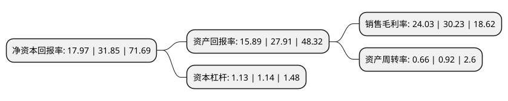

> 本页面由自动化程序生成于 2022年5月20日 01:38
> 内容可能存在错误，如有bug请提交issue至：https://github.com/Eroleice/doc-pi/issues
{.is-warning}

# 上市公司基本情况

## 基本资料

北京石头世纪科技股份有限公司（以下简称“石头科技”）成立于2014年07月04日，北京市。于2020年02月21日在上交所科创板上市。

石头科技注册资本6,680.631万元，主要产品为智能扫地机器人及相关配件，主营业务为智能清洁机器人等智能硬件的设计，研发，生产和销售。以下是详细信息：

- 公司名称: 北京石头世纪科技股份有限公司
- 股票代码: 688169.SH
- 所在地: 北京 - 北京市
- 成立日期: 2014年07月04日
- 注册资本: 6,680.631万元
- 法定代表人: 昌敬
- 主营业务: 主要产品为智能扫地机器人及相关配件，主营业务为智能清洁机器人等智能硬件的设计，研发，生产和销售
- 公司官网: www.roborock.com
- 公司介绍: 公司是一家专注于家用智能清洁机器人及其他清洁电器研发和生产的公司。公司是国际上将激光雷达技术及相关算法大规模应用于智能扫地机器人领域的领先企业。智能扫地机器人在通过基于激光测距传感器、惯性测量单元等传感器的SLAM算法构建出户型地图后，再根据户型地图进行定位，同时通过AI算法规划出智能、高效的清扫路径，可以有效避免漏扫重扫。服务器端通过对联网产品数据进行深度学习、算法优化从而不断迭代升级机器人算法。公司在研发与产品设计方面处于行业前列。公司分别被授予“国家高新技术企业”、“中关村高新技术企业”、“北京市知识产权试点企业”、“中国机器人产业联盟会员”、“中关村企业信用促进会会员”、“北京半导体行业协会会员”等资质，公司产品曾被授予“北京市新技术新产品(服务)”、“国际IF设计大奖”、“台湾金点奖”、“中国优秀工业设计奖”等多项荣誉。

## 股东及高管情况

上市公司第一大股东为昌敬，持股15,495,785股，占比23.2%，**疑似为**上市公司实际控制人。

截至2022年04月21日，上市公司的前十大股东中，共有4名自然人股东，2名机构股东，4个海外主体，其中5%以上大股东共有4名。上市公司前十大股东明细如下：

> 未能通过持股比例判定出上市公司实际控制人（持股30%以上）
> 可能存在通过间接持股、联合持股、协议控制等方式拥有实际控制权的主体，具体请参考上市公司定期公告！
{.is-warning}

> 截至2022年04月21日，上市公司前十大股东信息如下：

| 股东名称 | 持股数量（股） | 持股比例 |
| --- | --- | --- |
| 昌敬 | 15,495,785 | 23.2% |
| Shunwei Ventures III (Hong Kong) Limited | 5,925,500 | 8.87% |
| 天津金米投资合伙企业(有限合伙) | 4,592,167 | 6.87% |
| 丁迪 | 3,712,585 | 5.56% |
| 天津石头时代企业管理咨询合伙企业(有限合伙) | 3,340,248 | 5% |
| BANYANCONSULTINGLIMITED | 2,647,956 | 3.96% |
| 毛国华 | 2,071,806 | 3.1% |
| QM27LIMITED | 2,018,072 | 3.02% |
| 香港中央结算有限公司(陆股通) | 1,238,462 | 1.85% |
| 吴震 | 1,195,198 | 1.79% |

## 利润表分析

上市公司2021年总收入为58.37亿元，净利润为14.02亿元，实现盈利。

## 杜邦分析

> 数据列示周期：2021年 | 2020年 | 2019年
{.is-info}

上市公司的净资产收益率在近一年有所下降，下降幅度为-43.58%，其变化情况分解如下：
- 上市公司的销售毛利率在近一年下降了-20.51%，可能是生产效率的下降、商品原材料价格上涨或商品价格的下跌所致。
- 上市公司的资产周转率在近一年下降了-28.26%，可能是源自于更慢的销售回款或库存管理效果下降。
- 上市公司的财务杠杆比率在近一年下降了-0.88%，可能是减少负债降低财务费用。

