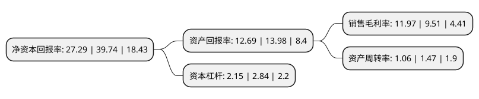

> 本页面由自动化程序生成于 2022年5月20日 01:40
> 内容可能存在错误，如有bug请提交issue至：https://github.com/Eroleice/doc-pi/issues
{.is-warning}

# 上市公司基本情况

## 基本资料

成都极米科技股份有限公司（以下简称“极米科技”）成立于2013年11月18日，成都市。于2021年03月03日在上交所科创板上市。

极米科技注册资本5,000万元，主营业务是智能投影产品的研发，生产及销售，同时向消费者提供围绕智能投影的配件产品及互联网增值服务。以下是详细信息：

- 公司名称: 成都极米科技股份有限公司
- 股票代码: 688696.SH
- 所在地: 四川 - 成都市
- 成立日期: 2013年11月18日
- 注册资本: 5,000万元
- 法定代表人: 钟波
- 主营业务: 主营业务是智能投影产品的研发，生产及销售，同时向消费者提供围绕智能投影的配件产品及互联网增值服务
- 公司官网: www.xgimi.com
- 公司介绍: 公司是国内投影设备行业龙头企业，公司主营业务是智能投影产品的研发、生产及销售，同时向消费者提供围绕智能投影的配件产品及互联网增值服务。公司专注于智能投影领域，构建了以整机、算法及软件系统为核心的战略发展模式。整机层面，公司将投影、音响及智能电视相互融合，开创了全新的智能投影产品形态，并推出一系列智能投影产品。经过多年开发积累，目前公司已具备涵盖光机设计、硬件电路设计及结构设计的完整投影产品整机开发能力，同时具备较强的工业设计能力。凭借出色的工业设计与产品体验，公司屡次获得国际权威工业设计大奖。公司共获得31项国际权威奖项，涵盖世界四大工业设计奖项，包括德国红点产品设计奖、德国iF设计奖、日本Good Design Award和美国Idea设计奖，并多次获得美国CES创新奖。

## 股东及高管情况

上市公司第一大股东为钟波，持股9,381,110股，占比18.76%，**疑似为**上市公司实际控制人。

截至2022年05月12日，上市公司的前十大股东中，共有5名自然人股东，4名机构股东，1个产品账户，其中5%以上大股东共有4名。上市公司前十大股东明细如下：

> 未能通过持股比例判定出上市公司实际控制人（持股30%以上）
> 可能存在通过间接持股、联合持股、协议控制等方式拥有实际控制权的主体，具体请参考上市公司定期公告！
{.is-warning}

> 截至2022年05月12日，上市公司前十大股东信息如下：

| 股东名称 | 持股数量（股） | 持股比例 |
| --- | --- | --- |
| 钟波 | 9,381,110 | 18.76% |
| 钟波 | 9,381,110 | 18.76% |
| 北京百度网讯科技有限公司 | 4,090,224 | 8.1804% |
| 北京百度网讯科技有限公司 | 4,090,224 | 8.1804% |
| 肖适 | 2,184,659 | 4.37% |
| 四川文化产业股权投资基金合伙企业(有限合伙) | 2,061,836 | 4.12% |
| 钟超 | 1,699,145 | 3.4% |
| 芒果传媒有限公司 | 1,282,907 | 2.57% |
| 成都极米企业管理咨询合伙企业(有限合伙) | 1,243,928 | 2.49% |
| 刘帅 | 1,047,088 | 2.09% |

## 利润表分析

上市公司2021年总收入为40.37亿元，净利润为4.83亿元，实现盈利。

## 杜邦分析

> 数据列示周期：2021年 | 2020年 | 2019年
{.is-info}

上市公司的净资产收益率在近一年有所下降，下降幅度为-31.33%，其变化情况分解如下：
- 上市公司的销售毛利率在近一年上升了25.87%，可能是生产效率的提升、商品原材料价格下跌或商品价格的上涨所致。
- 上市公司的资产周转率在近一年下降了-27.89%，可能是源自于更慢的销售回款或库存管理效果下降。
- 上市公司的财务杠杆比率在近一年下降了-24.3%，可能是减少负债降低财务费用。

