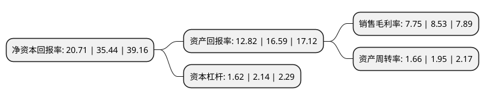

> 本页面由自动化程序生成于 2022年5月20日 01:40
> 内容可能存在错误，如有bug请提交issue至：https://github.com/Eroleice/doc-pi/issues
{.is-warning}

# 上市公司基本情况

## 基本资料

深圳市倍轻松科技股份有限公司（以下简称“倍轻松”）成立于2000年07月05日，深圳市。于2021年07月15日在上交所科创板上市。

倍轻松注册资本6,164万元，主要从事智能便携按摩器的设计，研发，生产，销售及服务。以下是详细信息：

- 公司名称: 深圳市倍轻松科技股份有限公司
- 股票代码: 688793.SH
- 所在地: 广东 - 深圳市
- 成立日期: 2000年07月05日
- 注册资本: 6,164万元
- 法定代表人: 马学军
- 主营业务: 主要从事智能便携按摩器的设计，研发，生产，销售及服务
- 公司官网: www.breo.com
- 公司介绍: 公司是一家专注于健康产品创新研发的高新技术企业，主要从事智能便携按摩器的设计、研发、生产、销售及服务。公司智能便携按摩器产品是能够随时随地为用户提供个人健康护理与按摩保健的智能硬件，由现代按摩器具融合驱动技术、仿生技术、信息技术等领域前沿科技成果以及传统中医理论发展而来。公司主要产品为智能便携按摩器，能够针对现代人普遍出现的眼睛、颈肩、头部等疲劳不舒适，在工作、学习、生活和旅行等多元化场景下为用户提供个人健康护理和按摩保健，用户使用产品后可及时缓解身体的不适状况。公司产品以自主品牌“breo”和“倍轻松”系列产品为主，同时还为其他知名品牌企业提供ODM定制产品。公司在技术研发与产品设计方面处于行业领军地位，先后获评国家高新技术企业、国家知识产权优势企业、广东省知识产权优势企业、广东省知识产权示范企业、深圳市知识产权优势企业。

## 股东及高管情况

上市公司第一大股东为马学军，持股24,848,471股，占比40.31%，为上市公司实际控制人。

截至2022年03月31日，上市公司的前十大股东中，共有3名自然人股东，5名机构股东，2个产品账户，其中5%以上大股东共有4名。上市公司前十大股东明细如下：

> 截至2022年03月31日，上市公司前十大股东信息如下：

| 股东名称 | 持股数量（股） | 持股比例 |
| --- | --- | --- |
| 马学军 | 24,848,471 | 40.31% |
| 青岛赫廷科技有限公司 | 4,600,000 | 7.46% |
| 深圳市鼎元宏投资有限公司 | 3,896,785 | 6.32% |
| 汪荞青 | 3,436,786 | 5.58% |
| 莘县日松企业管理咨询中心(有限合伙) | 2,689,500 | 4.36% |
| 蔚叁投资(上海)有限公司 | 1,839,996 | 2.99% |
| 安信资管倍轻松高管参与科创板战略配售集合资产管理计划 | 1,541,000 | 2.5% |
| 珠海欢乐世纪股权投资基金(有限合伙) | 1,355,857 | 2.2% |
| 太平人寿保险有限公司-分红-个险分红 | 1,255,004 | 2.04% |
| 李践 | 974,299 | 1.58% |

## 利润表分析

上市公司2021年总收入为11.89亿元，净利润为0.92亿元，实现盈利。

## 杜邦分析

> 数据列示周期：2021年 | 2020年 | 2019年
{.is-info}

上市公司的净资产收益率在近一年有所下降，下降幅度为-41.56%，其变化情况分解如下：
- 上市公司的销售毛利率在近一年下降了-9.14%，可能是生产效率的下降、商品原材料价格上涨或商品价格的下跌所致。
- 上市公司的资产周转率在近一年下降了-14.87%，可能是源自于更慢的销售回款或库存管理效果下降。
- 上市公司的财务杠杆比率在近一年下降了-24.3%，可能是减少负债降低财务费用。

