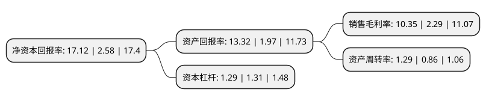

> 本页面由自动化程序生成于 2022年5月20日 01:02
> 内容可能存在错误，如有bug请提交issue至：https://github.com/Eroleice/doc-pi/issues
{.is-warning}

# 上市公司基本情况

## 基本资料

攀钢集团钒钛资源股份有限公司（以下简称“攀钢钒钛”）成立于1993年03月27日，攀枝花市。于1996年11月15日在深交所主板上市。

攀钢钒钛注册资本860,302.62万元，主要产品:氧化钒，钒铁，钒氮合金，钛白粉，钛渣等。主营业务:钒钛制品生产和加工，钒钛延伸产品的研发和应用。以下是详细信息：

- 公司名称: 攀钢集团钒钛资源股份有限公司
- 股票代码: 000629.SZ
- 所在地: 四川 - 攀枝花市
- 成立日期: 1993年03月27日
- 注册资本: 860,302.62万元
- 法定代表人: 谢俊勇
- 主营业务: 主要产品:氧化钒，钒铁，钒氮合金，钛白粉，钛渣等主营业务:钒钛制品生产和加工，钒钛延伸产品的研发和应用
- 公司官网: www.pgvt.cn
- 公司介绍: 公司是国内最大的产钒企业之一，在国内钛领域也拥有重要地位。公司的钒钛产业独具特色，拥有五氧化二钒、三氧化二钒、中钒铁、高钒铁、钒氮合金和钛精矿、钛白粉、高钛渣等系列产品，在国内钒钛行业具有较强的竞争力公司产品广泛应用于钢铁工业、电子工业、有色金属及涂料油墨、航空航天、国防军工等领域，畅销国内外市场。公司以科技创效为根本，以科研项目、科技攻关等为载体，积极推动公司技术创新工作，最大限度发挥科技投入的作用，着力提高钒钛资源综合利用水平。公司依靠自主创新形成了一批国内外领先和拥有自主知识产权的专有技术。钒氮合金生产工艺技术获国家技术发明奖，三氧化二钒和钒氮合金项目获中国工业大奖项目表彰奖。面对国家大力推进供给侧结构性改革、合作推进“一带一路”、攀西国家级战略资源创新开发试验区建设等战略的实施，公司将抢抓机遇，加快发展，振兴民族钒钛工业，为客户、为员工、为股东、为社会创造价值。

## 股东及高管情况

上市公司第一大股东为攀钢集团有限公司，持股2,533,068,341股，占比29.44%，**疑似为**上市公司实际控制人。

截至2022年03月31日，上市公司的前十大股东中，共有2名自然人股东，5名机构股东，2个产品账户，1个海外主体，其中5%以上大股东共有5名。上市公司前十大股东明细如下：

> 未能通过持股比例判定出上市公司实际控制人（持股30%以上）
> 可能存在通过间接持股、联合持股、协议控制等方式拥有实际控制权的主体，具体请参考上市公司定期公告！
{.is-warning}

> 截至2022年03月31日，上市公司前十大股东信息如下：

| 股东名称 | 持股数量（股） | 持股比例 |
| --- | --- | --- |
| 攀钢集团有限公司 | 2,533,068,341 | 29.44% |
| 鞍山钢铁集团有限公司 | 928,946,141 | 10.8% |
| 攀钢集团四川长城特殊钢有限责任公司 | 561,494,871 | 6.53% |
| 营口港务集团有限公司 | 515,384,772 | 5.99% |
| 攀钢集团成都钢铁有限责任公司 | 502,013,022 | 5.84% |
| 香港中央结算有限公司(陆股通) | 245,996,195 | 2.86% |
| 王琴英 | 198,869,256 | 2.31% |
| 全国社保基金五零三组合 | 165,000,000 | 1.92% |
| 刘玮巍 | 152,365,346 | 1.77% |
| 中国农业银行股份有限公司-富国成长领航混合型证券投资基金 | 34,096,585 | 0.4% |

## 利润表分析

上市公司2021年总收入为140.6亿元，净利润为14.55亿元，实现盈利。

## 杜邦分析

> 数据列示周期：2021年 | 2020年 | 2019年
{.is-info}

上市公司的净资产收益率在近一年有所上升，上升幅度为563.57%，其变化情况分解如下：
- 上市公司的销售毛利率在近一年上升了351.97%，可能是生产效率的提升、商品原材料价格下跌或商品价格的上涨所致。
- 上市公司的资产周转率在近一年上升了50%，可能是源自于更快的销售回款或库存管理效果提升。
- 上市公司的财务杠杆比率在近一年下降了-1.53%，可能是减少负债降低财务费用。

