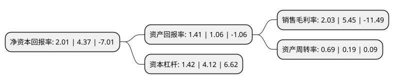

> 本页面由自动化程序生成于 2022年5月20日 01:02
> 内容可能存在错误，如有bug请提交issue至：https://github.com/Eroleice/doc-pi/issues
{.is-warning}

# 上市公司基本情况

## 基本资料

新疆合金投资股份有限公司（以下简称“合金投资”）成立于1990年03月12日，和田地区。于1996年11月12日在深交所主板上市。

合金投资注册资本38,510.637万元，主营业务:镍基合金材料的生产与销售，PPP项目以下是详细信息：

- 公司名称: 新疆合金投资股份有限公司
- 股票代码: 000633.SZ
- 所在地: 新疆 - 和田地区
- 成立日期: 1990年03月12日
- 注册资本: 38,510.637万元
- 法定代表人: 甘霖
- 主营业务: 主营业务:镍基合金材料的生产与销售，PPP项目
- 公司官网: www.xjhjtz.net
- 公司介绍: 公司前身为隶属于沈阳市冶金局的国有大型企业沈阳合金厂，目前为投资控股型公司，公司的全资子公司合金材料是我国生产镍基合金材料的骨干企业之一，也是我国最早的电真空材料、火花塞电极材料、高强度耐蚀材料的研发与生产基地。合金材料具有真空熔炼、电渣熔炼、轧制、拉拔、热处理等现代化生产线，具有完善的质量保证体系，是中国功能材料、有色金属合金材料的重点生产企业。合金材料经过多年的发展，积累了一批优秀的专业技术人才，是沈阳市首批高新技术企业之一，通过了ISO9001国际质量体系认证，产品有三项被国家科委等五个部门评为国家级重点新产品。公司目前主要产品为镍基合金材料，包括线材产品和棒材产品，如焊接材料、电真空材料、电阻电热材料、火花塞电极材料、测温材料等线材系列产品和K500、I718、R405等棒材系列产品，其应用涉及多项领域，产品覆盖面广。

## 股东及高管情况

上市公司第一大股东为霍尔果斯通海股权投资有限公司，持股77,021,275股，占比20%，**疑似为**上市公司实际控制人。

截至2022年03月31日，上市公司的前十大股东中，共有8名自然人股东，2名机构股东，其中5%以上大股东共有2名。上市公司前十大股东明细如下：

> 未能通过持股比例判定出上市公司实际控制人（持股30%以上）
> 可能存在通过间接持股、联合持股、协议控制等方式拥有实际控制权的主体，具体请参考上市公司定期公告！
{.is-warning}

> 截至2022年03月31日，上市公司前十大股东信息如下：

| 股东名称 | 持股数量（股） | 持股比例 |
| --- | --- | --- |
| 霍尔果斯通海股权投资有限公司 | 77,021,275 | 20% |
| 共青城招银叁号投资合伙企业(有限合伙) | 52,600,000 | 13.66% |
| 吴景珍 | 1,969,100 | 0.51% |
| 孙东军 | 1,422,800 | 0.37% |
| 朱和安 | 1,254,339 | 0.33% |
| 徐华民 | 1,246,300 | 0.32% |
| 张晏维 | 1,228,600 | 0.32% |
| 徐琳 | 1,178,300 | 0.31% |
| 张鸥 | 1,127,300 | 0.29% |
| 吴彩华 | 1,083,400 | 0.28% |

## 利润表分析

上市公司2021年总收入为1.64亿元，净利润为0.03亿元，实现盈利。

## 杜邦分析

> 数据列示周期：2021年 | 2020年 | 2019年
{.is-info}

上市公司的净资产收益率在近一年有所下降，下降幅度为-54%，其变化情况分解如下：
- 上市公司的销售毛利率在近一年下降了-62.75%，可能是生产效率的下降、商品原材料价格上涨或商品价格的下跌所致。
- 上市公司的资产周转率在近一年上升了263.16%，可能是源自于更快的销售回款或库存管理效果提升。
- 上市公司的财务杠杆比率在近一年下降了-65.53%，可能是减少负债降低财务费用。

