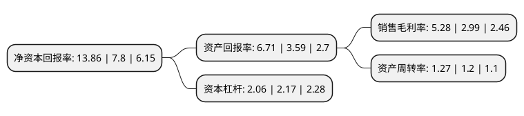

> 本页面由自动化程序生成于 2022年5月20日 01:02
> 内容可能存在错误，如有bug请提交issue至：https://github.com/Eroleice/doc-pi/issues
{.is-warning}

# 上市公司基本情况

## 基本资料

中钨高新材料股份有限公司（以下简称“中钨高新”）成立于1993年03月18日，海口市。于1996年12月05日在深交所主板上市。

中钨高新注册资本107,386.384万元，主要业务:硬质合金和钨，钼，钽，铌等有色金属及其深加工产品和装备的研制，开发，生产，销售及贸易业务等。以下是详细信息：

- 公司名称: 中钨高新材料股份有限公司
- 股票代码: 000657.SZ
- 所在地: 海南 - 海口市
- 成立日期: 1993年03月18日
- 注册资本: 107,386.384万元
- 法定代表人: 李仲泽
- 主营业务: 硬质合金和钨，钼，钽，铌等有色金属及其深加工产品和装备的研制，开发，生产，销售及贸易业务等
- 公司官网: www.minmetalstungsten.com
- 公司介绍: 公司依托完整的产业链竞争优势，着力建设从矿山、冶炼、精深加工于一体的产业体系，打造中国第一、世界一流的钨产业集团。旗下主力矿山有全国首批矿产资源综合利用示范基地柿竹园公司，“全国矿产资源开发整合先进矿山”香炉山钨业、新田岭钨业，中国钨工业的发源地瑶岗仙矿业公司等。硬质合金企业拥有“我国硬质合金工业的摇篮”株硬公司，国内领先的硬质合金切削刀具综合供应商株钻公司，中国最大的设计和生产PCB用精密微型钻头、刀具和高精密级进模具的金洲公司，中国钨基硬面材料领域的领导者自硬公司，以及管理着国内最大的钨冶炼与粉末制品基地之一南硬公司。公司还拥有行业内唯一一家硬质合金国家重点实验室，已有授权专利1000余项。株洲钻石切削不等螺旋角立铣刀获湖南省专利奖一等奖、切削刀具用纳米复合硬质涂层设计及产业化获湖南省科学技术进步奖二等奖。

## 股东及高管情况

上市公司第一大股东为中国五矿股份有限公司，持股536,317,548股，占比49.94%，为上市公司实际控制人。

截至2022年03月31日，上市公司的前十大股东中，共有2名机构股东，7个产品账户，1个海外主体，其中5%以上大股东共有1名。上市公司前十大股东明细如下：

> 截至2022年03月31日，上市公司前十大股东信息如下：

| 股东名称 | 持股数量（股） | 持股比例 |
| --- | --- | --- |
| 中国五矿股份有限公司 | 536,317,548 | 49.94% |
| 香港中央结算有限公司(陆股通) | 18,952,892 | 1.76% |
| 中国工商银行股份有限公司-华安动态灵活配置混合型证券投资基金 | 10,088,760 | 0.94% |
| 中国建设银行股份有限公司-华安成长先锋混合型证券投资基金 | 9,152,630 | 0.85% |
| 中国银行股份有限公司-华夏行业景气混合型证券投资基金 | 7,557,400 | 0.7% |
| 国寿养老策略4号股票型养老金产品-中国工商银行股份有限公司 | 7,106,200 | 0.66% |
| 湖南国企改革发展基金管理有限公司-中央企业贫困地区湖南产业投资私募股权基金企业(有限合伙) | 7,021,190 | 0.65% |
| 海南金元投资控股有限公司 | 6,790,000 | 0.63% |
| 兴业银行股份有限公司-万家成长优选灵活配置混合型证券投资基金 | 6,509,160 | 0.61% |
| 中国工商银行股份有限公司-华安制造升级一年持有期混合型证券投资基金 | 5,974,300 | 0.56% |

## 利润表分析

上市公司2021年总收入为120.93亿元，净利润为6.38亿元，实现盈利。

## 杜邦分析

> 数据列示周期：2021年 | 2020年 | 2019年
{.is-info}

上市公司的净资产收益率在近一年有所上升，上升幅度为77.69%，其变化情况分解如下：
- 上市公司的销售毛利率在近一年上升了76.59%，可能是生产效率的提升、商品原材料价格下跌或商品价格的上涨所致。
- 上市公司的资产周转率在近一年上升了5.83%，可能是源自于更快的销售回款或库存管理效果提升。
- 上市公司的财务杠杆比率在近一年下降了-5.07%，可能是减少负债降低财务费用。

