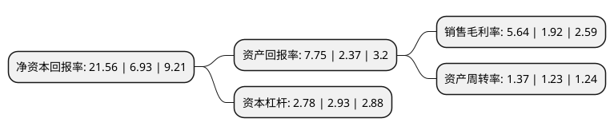

> 本页面由自动化程序生成于 2022年5月20日 01:04
> 内容可能存在错误，如有bug请提交issue至：https://github.com/Eroleice/doc-pi/issues
{.is-warning}

# 上市公司基本情况

## 基本资料

云南锡业股份有限公司（以下简称“锡业股份”）成立于1998年11月23日，昆明市。于2000年02月21日在深交所主板上市。

锡业股份注册资本166,877.638万元，主要产品:锡锭，阴极铜，锡铅焊料及无铅焊料，锡材，锡基合金，有机锡化工，无机锡化工产品及锌精矿含锌等。主要业务:锡，铜，锌，铟等有色金属的采，选，锡，铜金属的冶炼及锡，铜，锌等金属产品的贸易，同时还有锡材和锡化工等锡深加工业务。以下是详细信息：

- 公司名称: 云南锡业股份有限公司
- 股票代码: 000960.SZ
- 所在地: 云南 - 昆明市
- 成立日期: 1998年11月23日
- 注册资本: 166,877.638万元
- 法定代表人: 程睿涵
- 主营业务: 主要产品:锡锭，阴极铜，锡铅焊料及无铅焊料，锡材，锡基合金，有机锡化工，无机锡化工产品及锌精矿含锌等锡，铜，锌，铟等有色金属的采，选，锡，铜金属的冶炼及锡，铜，锌等金属产品的贸易，同时还有锡材和锡化工等锡深加工业务
- 公司官网: www.ytl.com.cn
- 公司介绍: 公司是一家以锡为主的综合性有色金属企业，是世界锡行业的龙头企业，主要从事锡、铜、锌、铟等有色金属的采、选，锡、铜金属的冶炼及锡、铜、锌等金属产品的贸易，同时还有锡材和锡化工等锡深加工业务，形成了公司矿山、冶炼、贸易三大业务板块。公司主要产品有锡锭、阴极铜、锡铅焊料及无铅焊料、锡材、锡基合金、有机锡化工、无机锡化工产品及锌精矿含锌等系列产品。公司拥有世界上最先进的采、选、冶、深加工成套技术，拥有世界上最完整的锡采选冶及深加工产业链，拥有矿山勘探、采掘、选冶、锡化工、锡、铜、铅及其他有色金属深加工纵向一体化的产业格局。主导产品“云锡牌”精锡是“中国名牌产品”、国家质量免检产品，公司“云锡牌YT”商标是“中国驰名商标”、国际知名品牌。

## 股东及高管情况

上市公司第一大股东为云南锡业集团有限责任公司，持股542,607,311股，占比32.52%，为上市公司实际控制人。

截至2022年03月31日，上市公司的前十大股东中，共有2名自然人股东，4名机构股东，3个产品账户，1个海外主体，其中5%以上大股东共有2名。上市公司前十大股东明细如下：

> 截至2022年03月31日，上市公司前十大股东信息如下：

| 股东名称 | 持股数量（股） | 持股比例 |
| --- | --- | --- |
| 云南锡业集团有限责任公司 | 542,607,311 | 32.52% |
| 云南锡业集团(控股)有限责任公司 | 177,922,654 | 10.66% |
| 中国工商银行股份有限公司-广发多因子灵活配置混合型证券投资基金 | 39,481,685 | 2.37% |
| 香港中央结算有限公司(陆股通) | 38,693,944 | 2.32% |
| 华融瑞通股权投资管理有限公司 | 26,271,906 | 1.57% |
| 陆贵新 | 10,500,000 | 0.63% |
| 中国工商银行股份有限公司-海富通改革驱动灵活配置混合型证券投资基金 | 10,210,396 | 0.61% |
| 许建红 | 6,191,850 | 0.37% |
| 北京久阳润泉资本管理中心(有限合伙)-润泉东方2期私募证券投资基金 | 5,965,017 | 0.36% |
| 个旧锡都实业有限责任公司 | 5,909,801 | 0.35% |

## 利润表分析

上市公司2021年总收入为538.44亿元，净利润为30.38亿元，实现盈利。

## 杜邦分析

> 数据列示周期：2021年 | 2020年 | 2019年
{.is-info}

上市公司的净资产收益率在近一年有所上升，上升幅度为211.11%，其变化情况分解如下：
- 上市公司的销售毛利率在近一年上升了193.75%，可能是生产效率的提升、商品原材料价格下跌或商品价格的上涨所致。
- 上市公司的资产周转率在近一年上升了11.38%，可能是源自于更快的销售回款或库存管理效果提升。
- 上市公司的财务杠杆比率在近一年下降了-5.12%，可能是减少负债降低财务费用。

