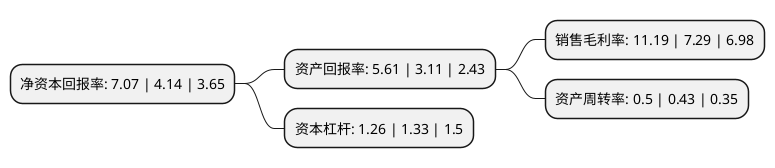

> 本页面由自动化程序生成于 2022年5月20日 01:04
> 内容可能存在错误，如有bug请提交issue至：https://github.com/Eroleice/doc-pi/issues
{.is-warning}

# 上市公司基本情况

## 基本资料

宁夏东方钽业股份有限公司（以下简称“东方钽业”）成立于1999年04月30日，石嘴山市。于2000年01月20日在深交所主板上市。

东方钽业注册资本44,083.264万元，主要产品:钽金属及合金制品，铌金属及合金制品，铍合金材料，钛金属及合金材料，光伏材料和能源材料六大类产品。主要业务:从事稀有金属钽，铌，铍，钛及合金等的研发，生产，销售和进出口业务。以下是详细信息：

- 公司名称: 宁夏东方钽业股份有限公司
- 股票代码: 000962.SZ
- 所在地: 宁夏 - 石嘴山市
- 成立日期: 1999年04月30日
- 注册资本: 44,083.264万元
- 法定代表人: 王战宏
- 主营业务: 主要产品:钽金属及合金制品，铌金属及合金制品，铍合金材料，钛金属及合金材料，光伏材料和能源材料六大类产品从事稀有金属钽，铌，铍，钛及合金等的研发，生产，销售和进出口业务
- 公司官网: www.otic.com.cn
- 公司介绍: 公司是全球知名的钽﹑铌冶炼及加工生产商，稀有金属钽、铌、铍、钛及合金等的研发、生产、销售和进出口业务。目前已形成钽金属及合金制品、铌金属及合金制品、铍合金材料、钛金属及合金材料、光伏材料和能源材料六大类产品，被广泛应用于电子、通讯、航空、航天、冶金、石油、化工、照明、原子能、太阳能等领域。公司行业地位稳定，具有较强的市场竞争优势。公司与美国、德国、日本、韩国等国际主要钽铌电容器制造商建立了广泛的合作关系。钽、铌及其合金制品等系列产品多次荣获“对外贸易出口名牌”、“中国名牌产品”称号。公司目前是国内最大的钽、铌产品生产基地、科技先导型钽、铌研究中心之一；是国家重点高新技术企业、国家首批创新型企业、国家863成果产业化基地、全国专利工作试点企业、博士后科研工作站和国家级企业技术中心，通过了ISO9001质量管理体系、ISO14001环境管理体系、OHSAS18001职业健康安全管理体系认证。

## 股东及高管情况

上市公司第一大股东为中色(宁夏)东方集团有限公司，持股201,916,800股，占比45.8%，为上市公司实际控制人。

截至2022年03月31日，上市公司的前十大股东中，共有8名自然人股东，2名机构股东，其中5%以上大股东共有1名。上市公司前十大股东明细如下：

> 截至2022年03月31日，上市公司前十大股东信息如下：

| 股东名称 | 持股数量（股） | 持股比例 |
| --- | --- | --- |
| 中色(宁夏)东方集团有限公司 | 201,916,800 | 45.8% |
| 郑文宝 | 18,660,000 | 4.23% |
| 辜佳伟 | 4,035,392 | 0.92% |
| 陈国玲 | 2,500,600 | 0.57% |
| 西安天厚滤清技术有限责任公司 | 2,492,065 | 0.57% |
| 王武海 | 2,229,125 | 0.51% |
| 胡乾眷 | 1,803,000 | 0.41% |
| 庄小华 | 1,605,956 | 0.36% |
| 孙洪贵 | 1,531,301 | 0.35% |
| 李广欣 | 1,350,000 | 0.31% |

## 利润表分析

上市公司2021年总收入为7.94亿元，净利润为0.88亿元，实现盈利。

## 杜邦分析

> 数据列示周期：2021年 | 2020年 | 2019年
{.is-info}

上市公司的净资产收益率在近一年有所上升，上升幅度为70.77%，其变化情况分解如下：
- 上市公司的销售毛利率在近一年上升了53.5%，可能是生产效率的提升、商品原材料价格下跌或商品价格的上涨所致。
- 上市公司的资产周转率在近一年上升了16.28%，可能是源自于更快的销售回款或库存管理效果提升。
- 上市公司的财务杠杆比率在近一年下降了-5.26%，可能是减少负债降低财务费用。

