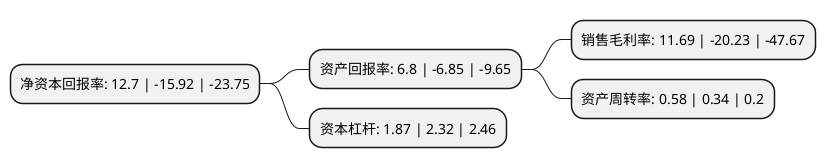

> 本页面由自动化程序生成于 2022年5月20日 01:06
> 内容可能存在错误，如有bug请提交issue至：https://github.com/Eroleice/doc-pi/issues
{.is-warning}

# 上市公司基本情况

## 基本资料

广东东方锆业科技股份有限公司（以下简称“东方锆业”）成立于1995年11月10日，汕头市。于2007年09月13日在深交所中小板上市。

东方锆业注册资本77,513.4万元，主要产品:锆矿砂，硅酸锆，氯氧化锆，电熔锆，二氧化锆，复合氧化锆，氧化锆陶瓷结构件及海绵锆八大系列。主营业务:锆系列制品的研究，开发，生产和销售。以下是详细信息：

- 公司名称: 广东东方锆业科技股份有限公司
- 股票代码: 002167.SZ
- 所在地: 广东 - 汕头市
- 成立日期: 1995年11月10日
- 注册资本: 77,513.4万元
- 法定代表人: 冯立明
- 主营业务: 主要产品:锆矿砂，硅酸锆，氯氧化锆，电熔锆，二氧化锆，复合氧化锆，氧化锆陶瓷结构件及海绵锆八大系列主营业务:锆系列制品的研究，开发，生产和销售
- 公司官网: www.orientzr.com
- 公司介绍: 公司是专业从事锆及锆系列制品的研发、生产和经营的重点高新技术企业，公司产品包括锆矿砂、硅酸锆、氯氧化锆、电熔锆、二氧化锆、复合氧化锆、氧化锆陶瓷结构件及海绵锆八大系列多个品种规格；应用领域涵盖核电能源、特种陶瓷、生物陶瓷、光通讯器件、固体燃料电池、航天领域、电子陶瓷、人造宝石、陶瓷色釉料、高级耐火材料等诸多新材料、新工业行业。公司一直秉承着“做强做大，做精做细”的发展策略，不断延伸、拓展产业链，完善产业链，公司已成为国内锆行业中技术领先、规模居前，最具核心竞争力和综合竞争力的知名企业，更是全球锆产品品种最齐全的制造商之一。

## 股东及高管情况

上市公司第一大股东为龙佰集团股份有限公司，持股182,210,818股，占比23.51%，**疑似为**上市公司实际控制人。

截至2022年04月28日，上市公司的前十大股东中，共有7名自然人股东，3名机构股东，其中5%以上大股东共有3名。上市公司前十大股东明细如下：

> 未能通过持股比例判定出上市公司实际控制人（持股30%以上）
> 可能存在通过间接持股、联合持股、协议控制等方式拥有实际控制权的主体，具体请参考上市公司定期公告！
{.is-warning}

> 截至2022年04月28日，上市公司前十大股东信息如下：

| 股东名称 | 持股数量（股） | 持股比例 |
| --- | --- | --- |
| 龙佰集团股份有限公司 | 182,210,818 | 23.51% |
| 龙佰集团股份有限公司 | 182,210,818 | 23.51% |
| 陈潮钿 | 48,625,000 | 6.2731% |
| 黄锐富 | 11,850,000 | 1.53% |
| 冯立明 | 7,000,000 | 0.9% |
| 黄超华 | 7,000,000 | 0.9% |
| 乔竹青 | 7,000,000 | 0.9% |
| 金华市穗丰农资有限公司 | 5,790,000 | 0.75% |
| 吴锦鹏 | 5,460,000 | 0.7% |
| 刘志强 | 5,001,050 | 0.65% |

## 利润表分析

上市公司2021年总收入为12.86亿元，净利润为1.5亿元，实现盈利。

## 杜邦分析

> 数据列示周期：2021年 | 2020年 | 2019年
{.is-info}

上市公司的净资产收益率在近一年有所下降，下降幅度为-179.77%，其变化情况分解如下：
- 上市公司的销售毛利率在近一年下降了-157.79%，可能是生产效率的下降、商品原材料价格上涨或商品价格的下跌所致。
- 上市公司的资产周转率在近一年上升了70.59%，可能是源自于更快的销售回款或库存管理效果提升。
- 上市公司的财务杠杆比率在近一年下降了-19.4%，可能是减少负债降低财务费用。

