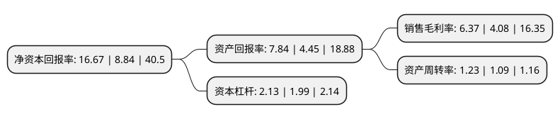

> 本页面由自动化程序生成于 2022年5月20日 01:06
> 内容可能存在错误，如有bug请提交issue至：https://github.com/Eroleice/doc-pi/issues
{.is-warning}

# 上市公司基本情况

## 基本资料

南京云海特种金属股份有限公司（以下简称“云海金属”）成立于1993年11月30日，南京市。于2007年11月13日在深交所中小板上市。

云海金属注册资本64,642.254万元，主要产品:镁合金，铝合金，中间合金，压铸件，挤压件和金属锶等。主营业务:有色金属的压延和加工。以下是详细信息：

- 公司名称: 南京云海特种金属股份有限公司
- 股票代码: 002182.SZ
- 所在地: 江苏 - 南京市
- 成立日期: 1993年11月30日
- 注册资本: 64,642.254万元
- 法定代表人: 梅小明
- 主营业务: 主要产品:镁合金，铝合金，中间合金，压铸件，挤压件和金属锶等主营业务:有色金属的压延和加工
- 公司官网: www.rsm.com.cn
- 公司介绍: 公司的主要业务为有色金属的冶炼和压延加工业务；主要产品为铝合金、镁合金、中间合金、压铸件和金属锶等。公司的产品主要应用于3C行业和汽车行业。公司是镁合金的龙头企业，镁合金产销量规模始终保持行业第一。目前公司已经形成了“白云石开采—原镁冶炼—镁合金铸造—镁合金加工—镁合金回收”的完整镁产业链。近年来，公司积极向镁铝合金下游深加工拓展，镁铝合金压铸件和挤压件等业务快速增长。公司具有较强的研究开发能力，为江苏省科技创新百强企业，拥有“江苏省镁合金材料工程技术研究中心”、“江苏省先进金属材料重点实验室”，设立了“江苏省硕士研究生工作站”，培养了一批长期从事轻金属研究开发的工程技术人员。先后承担了国家科技支撑计划项目课题，引领行业的节能减排和科技创新。拥有多项有自主知识产权的发明专利和实用新型专利。

## 股东及高管情况

上市公司第一大股东为梅小明，持股116,559,895股，占比18.03%，**疑似为**上市公司实际控制人。

截至2022年03月31日，上市公司的前十大股东中，共有8名自然人股东，1名机构股东，1个海外主体，其中5%以上大股东共有2名。上市公司前十大股东明细如下：

> 未能通过持股比例判定出上市公司实际控制人（持股30%以上）
> 可能存在通过间接持股、联合持股、协议控制等方式拥有实际控制权的主体，具体请参考上市公司定期公告！
{.is-warning}

> 截至2022年03月31日，上市公司前十大股东信息如下：

| 股东名称 | 持股数量（股） | 持股比例 |
| --- | --- | --- |
| 梅小明 | 116,559,895 | 18.03% |
| 宝钢金属有限公司 | 90,499,155 | 14% |
| 香港中央结算有限公司(陆股通) | 9,293,728 | 1.44% |
| 徐辉 | 8,005,000 | 1.24% |
| 卜桂平 | 3,737,000 | 0.58% |
| 陈玉忠 | 3,700,000 | 0.57% |
| 张子立 | 2,854,000 | 0.44% |
| 余放 | 2,670,000 | 0.41% |
| 刘剑辉 | 2,592,572 | 0.4% |
| 吴剑飞 | 2,395,408 | 0.37% |

## 利润表分析

上市公司2021年总收入为81.16亿元，净利润为5.17亿元，实现盈利。

## 杜邦分析

> 数据列示周期：2021年 | 2020年 | 2019年
{.is-info}

上市公司的净资产收益率在近一年有所上升，上升幅度为88.57%，其变化情况分解如下：
- 上市公司的销售毛利率在近一年上升了56.13%，可能是生产效率的提升、商品原材料价格下跌或商品价格的上涨所致。
- 上市公司的资产周转率在近一年上升了12.84%，可能是源自于更快的销售回款或库存管理效果提升。
- 上市公司的财务杠杆比率在近一年上升了7.04%，可能是增加负债扩大生产规模。

