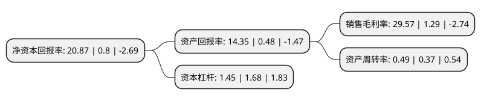

> 本页面由自动化程序生成于 2022年5月20日 01:07
> 内容可能存在错误，如有bug请提交issue至：https://github.com/Eroleice/doc-pi/issues
{.is-warning}

# 上市公司基本情况

## 基本资料

盛新锂能集团股份有限公司（以下简称“盛新锂能”）成立于2001年12月29日，成都市。于2008年05月23日在深交所中小板上市。

盛新锂能注册资本86,534.996万元，主营业务为基础锂盐和稀土产品的生产与销售;中(高)密度纤维板的生产与销售，林木种植与销售以下是详细信息：

- 公司名称: 盛新锂能集团股份有限公司
- 股票代码: 002240.SZ
- 所在地: 四川 - 成都市
- 成立日期: 2001年12月29日
- 注册资本: 86,534.996万元
- 法定代表人: 周祎
- 主营业务: 主营业务为基础锂盐和稀土产品的生产与销售;中(高)密度纤维板的生产与销售，林木种植与销售
- 公司官网: www.cxlithium.com
- 公司介绍: 公司致力于成为全球锂电新能源材料领先企业，主要产品为碳酸锂、氢氧化锂、氯化锂、锂精矿、金属锂和稀土产品。公司锂盐产品主要应用于新能源汽车动力电池、储能等领域；稀土产品主要应用于永磁材料、催化剂、玻璃、陶瓷、硬质合金等领域。公司目前已经成为上游在国内有资源保障、中游有优质产能、下游有一流客户的国内一线锂产品供应商。未来，公司一方面将继续聚焦新能源锂电材料领域，紧紧围绕“资源、规模、品质、客户”开展各项工作，增强资源储备、扩大产能规模、提升产品品质、服务核心客户；另一方面将通过不断加强研发和技术创新，扩大优质锂盐产能，保障战略客户的供应链安全，力争成为全球领先的锂产品供应商。

## 股东及高管情况

上市公司第一大股东为深圳盛屯集团有限公司，持股88,978,815股，占比10.28%，**疑似为**上市公司实际控制人。

截至2022年03月31日，上市公司的前十大股东中，共有3名自然人股东，5名机构股东，1个产品账户，1个海外主体，其中5%以上大股东共有2名。上市公司前十大股东明细如下：

> 未能通过持股比例判定出上市公司实际控制人（持股30%以上）
> 可能存在通过间接持股、联合持股、协议控制等方式拥有实际控制权的主体，具体请参考上市公司定期公告！
{.is-warning}

> 截至2022年03月31日，上市公司前十大股东信息如下：

| 股东名称 | 持股数量（股） | 持股比例 |
| --- | --- | --- |
| 深圳盛屯集团有限公司 | 88,978,815 | 10.28% |
| 深圳市盛屯汇泽贸易有限公司 | 54,282,267 | 6.27% |
| 深圳市盛屯益兴科技有限公司 | 36,188,178 | 4.18% |
| 四川省先进材料产业投资集团有限公司 | 35,340,158 | 4.08% |
| 李建华 | 27,790,300 | 3.21% |
| 中国建设银行股份有限公司-华夏能源革新股票型证券投资基金 | 25,913,196 | 2.99% |
| 厦门屯濋投资合伙企业(有限合伙) | 24,125,452 | 2.79% |
| 李晓奇 | 22,067,600 | 2.55% |
| 姚娟英 | 18,000,000 | 2.08% |
| 香港中央结算有限公司(陆股通) | 15,125,196 | 1.75% |

## 利润表分析

上市公司2021年总收入为29.34亿元，净利润为8.67亿元，实现盈利。

## 杜邦分析

> 数据列示周期：2021年 | 2020年 | 2019年
{.is-info}

上市公司的净资产收益率在近一年有所上升，上升幅度为2508.75%，其变化情况分解如下：
- 上市公司的销售毛利率在近一年上升了2192.25%，可能是生产效率的提升、商品原材料价格下跌或商品价格的上涨所致。
- 上市公司的资产周转率在近一年上升了32.43%，可能是源自于更快的销售回款或库存管理效果提升。
- 上市公司的财务杠杆比率在近一年下降了-13.69%，可能是减少负债降低财务费用。

