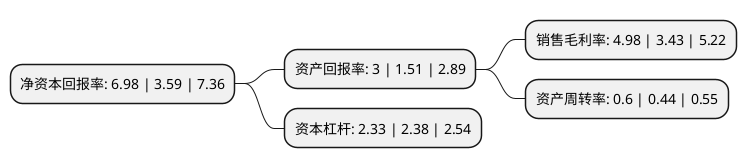

> 本页面由自动化程序生成于 2022年5月20日 01:08
> 内容可能存在错误，如有bug请提交issue至：https://github.com/Eroleice/doc-pi/issues
{.is-warning}

# 上市公司基本情况

## 基本资料

格林美股份有限公司（以下简称“格林美”）成立于2001年12月28日，深圳市。于2010年01月22日在深交所中小板上市。

格林美注册资本478,352.226万元，主要产品:超细钴粉，超细镍粉，镍合金。主营业务:回收，利用废弃钴镍资源，生产，销售超细钴镍粉体材料等产品。以下是详细信息：

- 公司名称: 格林美股份有限公司
- 股票代码: 002340.SZ
- 所在地: 广东 - 深圳市
- 成立日期: 2001年12月28日
- 注册资本: 478,352.226万元
- 法定代表人: 许开华
- 主营业务: 主要产品:超细钴粉，超细镍粉，镍合金主营业务:回收，利用废弃钴镍资源，生产，销售超细钴镍粉体材料等产品
- 公司官网: www.gem.com.cn
- 公司介绍: 公司是中国开采“城市矿山”资源第一支股票、再生资源行业和电子废弃物回收利用行业的第一支股票。公司一直坚持“资源有限、循环无限”的产业理念，积极倡导开采“城市矿山”，以“城市矿山+新能源材料”为发展战略，建成废旧电池与动力电池大循环产业链，钴镍钨资源回收与硬质合金产业链，电子废弃物循环利用产业链，报废汽车综合利用产业链，废渣、废泥、废水循环利用产业链等五大产业链，循环再造钴、镍、铜、钨、金、银、钯、铑、锗、稀土等25种稀缺资源以及超细粉末、新能源汽车用动力电池原料和材料、塑木型材等多种高技术产品。公司形成了中国最完整的稀有金属资源化循环产业链，是世界最大钴镍钨资源循环利用基地、世界最大超细钴粉制造基地、世界最大三元动力原料再制造基地、世界领先的废旧电池、电子废物与报废汽车循环利用基地，成为国内一流、国际先进的国家城市矿山循环利用示范基地，被国家部委先后授予国家循环经济试点企业、全国循环经济工作先进单位、国家循环经济教育示范基地、国家“城市矿产”示范基地、国家技术创新示范企业、国家知识产权示范企业、全国中小学生环境教育社会实践基地等荣誉称号，成为践行中国绿色发展理念的优秀实践者。

## 股东及高管情况

上市公司第一大股东为深圳市汇丰源投资有限公司，持股432,840,263股，占比9.05%，**疑似为**上市公司实际控制人。

截至2022年03月31日，上市公司的前十大股东中，共有1名自然人股东，3名机构股东，5个产品账户，1个海外主体，其中5%以上大股东共有1名。上市公司前十大股东明细如下：

> 未能通过持股比例判定出上市公司实际控制人（持股30%以上）
> 可能存在通过间接持股、联合持股、协议控制等方式拥有实际控制权的主体，具体请参考上市公司定期公告！
{.is-warning}

> 上市公司第一大股东持股不超过10%，请检查是否存在公司控制权风险！
{.is-danger}

> 截至2022年03月31日，上市公司前十大股东信息如下：

| 股东名称 | 持股数量（股） | 持股比例 |
| --- | --- | --- |
| 深圳市汇丰源投资有限公司 | 432,840,263 | 9.05% |
| 香港中央结算有限公司(陆股通) | 171,230,434 | 3.58% |
| 北京京能同鑫投资管理有限公司-北京京能能源科技并购投资基金(有限合伙) | 99,476,439 | 2.08% |
| 中国工商银行股份有限公司-汇添富中证新能源汽车产业指数型发起式证券投资基金(LOF) | 36,550,700 | 0.76% |
| 广东省科技风险投资有限公司 | 26,723,555 | 0.56% |
| 中国农业银行股份有限公司-中证500交易型开放式指数证券投资基金 | 22,873,358 | 0.48% |
| 中国银行股份有限公司-华夏中证新能源汽车交易型开放式指数证券投资基金 | 22,700,667 | 0.47% |
| 中国建设银行股份有限公司-富国中证新能源汽车指数型证券投资基金 | 21,684,238 | 0.45% |
| 秦皇岛宏兴钢铁有限公司 | 21,405,889 | 0.45% |
| 王爱军 | 21,131,000 | 0.44% |

## 杜邦分析

> 数据列示周期：2021年 | 2020年 | 2019年
{.is-info}

上市公司的净资产收益率在近一年有所上升，上升幅度为94.43%，其变化情况分解如下：
- 上市公司的销售毛利率在近一年上升了45.19%，可能是生产效率的提升、商品原材料价格下跌或商品价格的上涨所致。
- 上市公司的资产周转率在近一年上升了36.36%，可能是源自于更快的销售回款或库存管理效果提升。
- 上市公司的财务杠杆比率在近一年下降了-2.1%，可能是减少负债降低财务费用。

